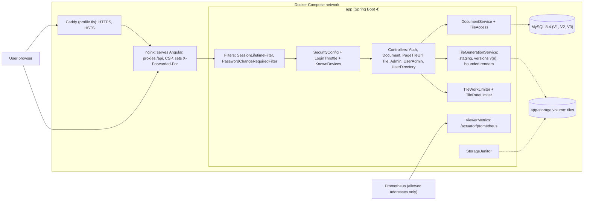

<!-- chapter: 31 | part: IV | owner: writer-app | tag: book-m6-final | status: expanded -->
# Chapter 31: Milestone 6: The final state and keeping it healthy

## Learning objectives

- Explain what changed between `book-m5-platform` and `book-m6-final`, and why the change is small on purpose.
- Read a version range such as `^5.0.1` or `~6.0.2` and say which updates it allows.
- Explain why a test that checks state at the wrong instant is flaky, and fix it with a bounded wait.
- Read the project's Dependabot policy and explain why it stays on long-term-support (LTS) lines.
- Explain why an update can be refused because of a peer dependency.
- Describe how the last review rounds worked (probe, fix, prove) and what each round found.
- Say what "keeping an application healthy" means in concrete, checkable terms.

## Prerequisites

Chapter 30 (the platform), Chapter 18 (backend testing) and Chapter 24 (frontend and end-to-end
testing). The code is at `book-m6-final`, the tip of `main` after pull
requests #9 to #12. The difference from `book-m5-platform` touches only four paths:
`.github/dependabot.yml`, `frontend/package.json`, its lock file and `TileGenerationServiceTest`.
At `book-m6-final` (commit `a27e069`) the repository has 38 commits and pull requests 1 to 12. A later documentation-only pull request, #13, corrected the README's mention of a canvas and a code comment; at the tag itself, trust the code (Chapter 21) over that README sentence. Versions at this tag: Spring Boot 4.1.1, Java 25, and, only from this tag, Vitest 5.0.1 and jsdom
30.0.1 in the frontend (earlier tags use Vitest 4).
<!-- source: git diff --stat book-m5-platform book-m6-final; PR #9-#12; coordinator correction in requests.md -->

## Beginner tier: What "done" looks like

### 31.1 A milestone with almost no code

The first six milestones each added something you could point at: tiles, accounts, sharing, limits,
a nicer reading experience, containers. The last one adds no feature at all. If you count lines,
it is the smallest chapter of Part IV, and that is the point of it.

Software is never finished the day it ships. The libraries it uses publish fixes and new versions.
Attackers publish new methods. Tests that passed a hundred times fail once for no visible reason.
A project that is "done" in the sense of "we stopped looking" will slowly rot. A healthy project has
a small set of automatic mechanisms that keep looking for it, and a set of written rules for what
to do when they speak.

This chapter tells the story of the moment those mechanisms started talking. Within minutes of the
big platform pull request (PR #5) merging, CI on `main` failed once, and Dependabot opened three
pull requests. Each needed a decision. The decisions, and the rules that came out of them, are the
final state of the project.
<!-- source: PR #9 body; PR #6, #7, #8 bodies and closing comments; timeline (merge 06:12Z, Dependabot PRs 06:13-06:14Z) -->

### 31.2 The vocabulary of a healthy project

A dependency is a library your project uses but did not write. The backend depends on Spring,
PDFBox and a MySQL driver; the frontend depends on Angular, Vitest and dozens more. Your project
inherits every feature of a dependency, and every flaw.

**Dependabot** is a GitHub service that reads your dependency files and opens a pull request when a
newer version exists. The pull request changes the version number and lets your tests run against
it. Someone still decides whether to merge.

**Continuous integration (CI)** means running your build and tests automatically on every change,
on a clean machine, so "it works on my computer" stops being an excuse. The project's CI is defined
in `.github/workflows/ci.yml`.

A **CVE** (Common Vulnerabilities and Exposures entry) is a public identifier for a known security
flaw in some software. A tool that scans your dependencies compares their versions with lists of
such flaws.

LTS means long-term support: a release line that its maintainers promise to keep fixing for a
stated period. Not every release line gets that promise. Node.js, for example, promotes only its
even-numbered major versions to LTS.

A flaky test passes and fails on the same code, depending on timing or luck. Section 31.5
takes one apart.

**Analogy.** Think of a car. Selling it doesn't end the work: it needs oil changes, recalls and
inspections. Dependabot is the recall notice in your mailbox, CI is the inspection, and the LTS rule
is choosing a model whose manufacturer promises parts for years. **Where the analogy breaks
down:** a car's parts wear out on their own, while software wears out only because the world around
it moves. Left completely alone, a program still runs, but the systems it depends on do not stand
still, and neither do the attackers.

### 31.3 What was already watching at milestone 5

By the end of Chapter 30 the project had five kinds of automatic watchers, all described in the
description of PR #5:

- **Backend build and tests:** the Maven command `./mvnw verify` runs the whole backend suite,
  including the Testcontainers tests against a real MySQL 8.4.
- **Frontend tests and production build:** the Angular unit tests, then a production build.
- **End-to-end run:** Playwright drives a browser against a freshly built Docker stack with
  throwaway secrets, including accessibility checks. The report is uploaded when the run fails.
- **Dependency scan:** an OSV scan of the dependencies.
- **Image scan:** Trivy scans both built container images, and a fixable HIGH or CRITICAL finding
  fails the build.

On top of that, Dependabot was configured to open grouped update pull requests weekly for Maven,
npm, Docker, Compose and GitHub Actions.
<!-- source: PR #5 body (CI and dependencies; Supply chain in CI) -->

This is the "healthy" machinery. What follows are the first things it caught.

### 31.4 Worked example: reading a version range

Before the story of the Dependabot pull requests, you need to read the version numbers in
`frontend/package.json`. Here is the part that changed in milestone 6, as a diff.

**Listing 31.1 — `frontend/package.json` (a diff from book-m5-platform to book-m6-final: `-` lines removed, `+` lines added)**

```diff
-    "jsdom": "^28.0.0",
+    "jsdom": "^30.0.1",
     "prettier": "^3.8.1",
     "typescript": "~6.0.2",
-    "vitest": "^4.0.8"
+    "vitest": "^5.0.1"
```

*Path: `frontend/package.json`*

A version such as `5.0.1` has three parts: major, minor and patch. This convention is called
semantic versioning: a patch release fixes bugs, a minor release adds features without
breaking existing use, and a major release is allowed to break things.

The characters in front of the number say which updates `npm install` may pick:

- `^5.0.1` (caret) allows anything from 5.0.1 up to, but not including, 6.0.0: new minors and
  patches, never a new major.
- `~6.0.2` (tilde) is narrower: 6.0.2 up to, but not including, 6.1.0: patches only.

Now the diff reads like a sentence. The frontend moved its test runner from the Vitest 4 line to
the Vitest 5 line, and its browser simulator jsdom from 28 to 30. Both are major jumps that the
caret would not allow by itself: someone had to edit the file, and here Dependabot did, in two
separate pull requests (#11 and #12). TypeScript stays on `~6.0.2` on purpose. Section 31.7
explains why.
<!-- source: git diff book-m5-platform book-m6-final -- frontend/package.json; PR #10-#12 -->

## Intermediate tier: A flaky test and a policy

*Assumes the beginner tier. This tier covers the two things CI and Dependabot handed the project
in its first minutes, and the reasoning behind each response.*

### 31.5 The test that failed once

After PR #5 merged, CI on `main` failed once. The failing test was
`aRenderThatTakesTooLongIsAbandonedAndFreesItsSlot` in `TileGenerationServiceTest`. The pull
request's own CI run had been green.

To see why, you need a picture of what the code under test does. Recall from Chapter 30 that
rendering a PDF is limited to a small number of concurrent **render slots**. A render that takes
too long is abandoned, and its slot must come back. The test asserted that every render slot is
free again at the same instant the second render returned.

The trap is the order of events on two threads. The thread that runs a render gives its slot back
in a `finally` block, which runs immediately after the caller has received its result. **Table 31.1**
shows the two orders.

**Table 31.1 — Two possible orders of events in the flaky test**

| Step | Usual order | Rare order (the failure) |
|---|---|---|
| 1 | Render thread finishes the render | Render thread finishes the render |
| 2 | Render thread frees its slot in `finally` | Caller receives its result |
| 3 | Caller receives its result | Test asserts "all slots are free" |
| 4 | Test asserts "all slots are free": passes | Render thread frees its slot: too late |

In the rare order the assertion runs in the gap between the caller getting its result and the slot
being freed. It reads 0 free slots where it expected 1. Nothing in the production code is wrong: the
slot does come back, microseconds later. The test asserted on state that another thread changes
after the result was handed over.

This is a race condition: the outcome depends on which of two threads gets there first. Races
are the classic cause of flaky tests, and they are hard to find by staring at a test, because
running it under a debugger slows one side and hides the problem. On a fast machine, though, the
gap can be hit, which is what the pull request description records.
<!-- source: PR #9 body; TileGenerationServiceTest.java at book-m5-platform and book-m6-final -->

### 31.6 The fix: wait for the condition, with a limit

PR #9 changed only the test. Instead of asserting at once, it waits, up to a limit, for the state to
become true.

**Listing 31.2 — `TileGenerationServiceTest` (book-m6-final, the added lines)**

```java
// The render thread frees its slot in a finally that runs just after the caller
// has its result, so allow a moment rather than checking at the same instant.
long slotsDeadline = System.currentTimeMillis() + 5_000;
while ((service.availableRenderSlots() != 1 || service.abandonedRendersRunning() != 0)
        && System.currentTimeMillis() < slotsDeadline) {
    Thread.sleep(10);
}
assertEquals(1, service.availableRenderSlots(), "every render slot is free again");
assertEquals(0, service.abandonedRendersRunning(), "no abandoned render still running");
```

*Path: `src/test/java/com/example/securedocviewer/service/TileGenerationServiceTest.java`*

Read it line by line.

1. `slotsDeadline` is "now plus 5,000 milliseconds": a moment 5 seconds from now.
2. The `while` loop keeps going as long as two things are true: the state is not yet what the test
   wants (`availableRenderSlots() != 1 || abandonedRendersRunning() != 0`), and the deadline has
   not passed.
3. Inside the loop, the test sleeps 10 milliseconds and looks again.
4. After the loop, the original assertions run exactly as before. If the state became right, they
   pass. If 5 seconds went by, they fail with the same clear messages as before.

Three properties make this a good fix. It doesn't slow a passing run: in the usual case the state
is right on the first look or after one 10 ms sleep. It has a limit, so a real bug still fails, in 5
seconds instead of never. And it keeps the assertion messages, so a failure still says what was
wrong. The pull request records that the changed test passed five times in a row locally, and that
production behavior did not change: in production the slot frees microseconds after the upload
returns.
<!-- source: PR #9 body; TileGenerationServiceTest.java diff book-m5-platform..book-m6-final -->

**What not to do.** Two tempting fixes are worse. Adding a fixed `Thread.sleep(1000)` before the
assertion makes every run slower and only shrinks the gap, not closes it. Removing the assertion
makes the failure go away by removing the test. A bounded wait is the honest middle: it says what
you expect to become true, and how long you are willing to wait for it.

### 31.7 The three pull requests from Dependabot

Right after the merge, Dependabot opened three pull requests. All three were closed without
merging, each with a written reason. That is a decision process, not neglect.

- **Pull request #6: MySQL 8.4 to 26.7.** MySQL 26.7 is an Innovation release, not a
  long-term-support one. The project stays on the 8.4 LTS line. Moving to the next LTS, 9.7, is to
  be a deliberate upgrade with a migration test, not an automatic bump.
- **Pull request #7: Node 24 to 25.** Odd-numbered Node major versions never become LTS. The
  project stays on Node 24 LTS until Node 26 LTS.
- **Pull request #8: a group of three updates (TypeScript 7, Vitest 5, jsdom 30).** The group
  could not install at all. Angular 22 declares that it works only with TypeScript at least 6.0
  and less than 6.1, in a **peer dependency** entry of `@angular/build`.
<!-- source: PR #6, #7, #8 closing comments; PR #10 body -->

A peer dependency is a package saying "I need my neighbor to be within this range, but I won't
install it for you." When you bump TypeScript to 7, the range `>=6.0 <6.1` no longer contains it. The install then stops with an error. The lesson is that a toolchain moves as a set: TypeScript,
Angular, the test runner and the build tool are released against each other. An automatic bump of
one member can conflict with a neighbor.

Notice what the third pull request combined. Vitest 5 and jsdom 30 were fine on their own (they
were merged later as #11 and #12); the group failed because TypeScript 7 was in it. One breaking
upgrade held two good ones hostage. That observation shaped the policy in the next section.

### 31.8 Writing the policy down

Closing three pull requests by hand each week would be its own kind of neglect. So pull request #10
turned the decisions into rules in `.github/dependabot.yml`. The product owner approved the
implementer's proposal.
<!-- source: PR #10 body; decisions D13 -->

**Listing 31.3 — `.github/dependabot.yml` (book-m6-final, simplified: added lines only, from the `ignore` blocks of four different ecosystems shown together)**

```yaml
# Angular pins the TypeScript range it supports; TypeScript moves with Angular upgrades.
- dependency-name: typescript
  update-types: ['version-update:semver-major', 'version-update:semver-minor']
# Odd-numbered Node releases never become LTS (24 and 26 are LTS lines).
- dependency-name: node
  versions: ['25.x', '27.x', '29.x']
# Java LTS releases are 25, then 29: skip the non-LTS releases in between.
- dependency-name: eclipse-temurin
  versions: ['26.x', '27.x', '28.x']
# Stay on the MySQL 8.4 LTS line (patches only). ...
- dependency-name: mysql
  update-types: ['version-update:semver-major']
```

*Path: `.github/dependabot.yml`*

Each block is an **ignore rule**: it names a dependency and says which versions or kinds of update
Dependabot must not propose. The comments are as important as the rules. A rule without its reason
is a mystery to the next person, who will delete it the first time it annoys them.

Table 31.2 summarizes the policy in one place.

**Table 31.2 — The Dependabot policy at book-m6-final**

| Ecosystem | Rule | Reason |
|---|---|---|
| Docker `node` | ignore 25.x, 27.x, 29.x | Odd Node majors never become LTS |
| Docker `eclipse-temurin` | ignore 26.x to 28.x | Java LTS is 25, next is 29 |
| Compose `mysql` | ignore major bumps | Stay on the 8.4 LTS line; move to 9.7 deliberately |
| npm `typescript` | ignore minor and major | Angular 22 accepts only TypeScript `>=6.0 <6.1` |
| npm `npm-other` group | minor and patch only | Majors arrive as separate pull requests |

The last row fixes the "one bad update blocks two good ones" problem. With the group limited to
minor and patch updates, a major version arrives as its own pull request. That is why Vitest 5 (#11)
and jsdom 30 (#12) merged separately, each after CI ran on it alone.
<!-- source: .github/dependabot.yml at book-m6-final; PR #10 body; PR #11, #12 -->

**Analogy.** An LTS rule is like buying tires by the model the manufacturer still stocks. You give
up the newest tread pattern; you gain a shop that can still fit them in five years. **Where the
analogy breaks down:** you can always drive to another shop, but a database major version is a
migration of your data. The cost of skipping the LTS rule is paid once, at the worst moment.

## Advanced tier: How the last rounds of review worked

*Assumes the earlier tiers. This tier looks backward at the last review rounds of PR #5, because
they are what "keeping an application healthy" looked like before the pull requests of this
chapter. The stories are real; each ends in a lesson that applies beyond this app.*

### 31.9 The method: probe, fix, prove

Chapter 30 told the early review rounds. The last ones, which led up to the merge, had a different
flavor. The technical manager and product owner reviewers, which were AI review agents, were asked
how likely an ultrareview (a deep cloud multi-agent review, described in Section 31.15) was to
pass. Each round's answer was a list of things found by running probes: small scripts that
exercised the running system in ways the tests didn't.

Every finding then followed the same three steps. **Probe:** reproduce the problem against the
real stack. **Fix:** change the code. **Prove:** add a test that fails without the fix and passes
with it. The stories in Sections 31.10 to 31.14 each show the steps that the record preserves.
<!-- source: PR #5 body ("Ultrareview preparation" section); bugs-and-findings G -->

### 31.10 The sign-in race: nine guesses through a limit of five

**The problem.** The sign-in throttle from Chapter 26 allows 5 failed attempts per account and
address. A probe sent nine wrong passwords for one account, in parallel, from one address. All nine
got the ordinary "wrong password" answer. Only the next single attempt was refused.

**How it was found.** The reviewer asked whether the project would pass an ultrareview and ran a
live probe. The cause is a classic **check-then-act race**. The code first asked "is this address
locked?" and then, only after checking the password, recorded the failure. A password check takes
about 100 milliseconds (BCrypt is slow on purpose), so nine parallel requests all asked the question
before any of them had recorded an answer.

**The fix.** Ask and count in one step, before the slow work. Each attempt is counted as a failure
in advance and handed back if the password turns out to be right. The Javadoc of the fixed class
says so: attempts are counted "before the password is checked and handed back on success, so a burst
of parallel guesses can't all pass the check before any of them is counted."

**Listing 31.4 — `LoginThrottle` reserve and succeeded (book-m5-platform, simplified: two methods)**

```java
public synchronized Instant reserve(String username, String clientIp, boolean recognisedDevice) {
    checkAllowed(username, clientIp, recognisedDevice);
    Instant at = clock.instant();
    recordFailure(username, clientIp, at);
    return at;
}

/** The reserved attempt succeeded: hand back its provisional failure and clear this address's account counter. */
public synchronized void succeeded(String username, String clientIp, Instant reservation) {
    failures.remove(accountKey(username, clientIp));
    removeOne(ipKey(clientIp), reservation);
    removeOne(anyIpKey(username), reservation);
}
```

*Path: `src/main/java/com/example/securedocviewer/security/LoginThrottle.java`*

`synchronized` means only one thread at a time may run a synchronized method of this object.
Because `reserve` performs the check and the count inside one synchronized method, no other request
can slip between them. The design is: reserve first, check the password, and call `succeeded` only
when the password is right. The measured result after the fix is exactly 5 accepted attempts.

**The lesson.** Whenever you write "check, then do", ask what happens if two requests arrive
between the check and the do. Put the check and the reservation in one atomic step, and test with
real parallelism, not only sequential calls.
<!-- source: bugs-and-findings G1; commit 1ce2c8b; LoginThrottle.java at book-m5-platform -->

### 31.11 Characters are not bytes: the 72-byte password

**The problem.** Creating a user with a 100-character password returned an HTTP 500, an internal
error, where a clean 400 "invalid input" was expected.

**How it was found.** By the same round of probes. The password rules allowed 12 to 128 characters.
BCrypt, the hashing algorithm from Chapter 26, reads at most **72 bytes** of a password and refuses
longer input. In plain ASCII a character is one byte, so 72 characters is the limit. But in UTF-8 a
character outside plain English letters can take two, three or four bytes, so 30 emoji can already
exceed 72 bytes while counting as only 30 characters.

**The fix.** Validate the length in bytes, not characters, and explain it to the user.

**Listing 31.5 — `UserAccountService` password limits (book-m5-platform, simplified: excerpt)**

```java
static final int MIN_PASSWORD_LENGTH = 12;
static final int MAX_PASSWORD_LENGTH = 128;
/** BCrypt uses at most 72 bytes of a password and refuses longer ones. */
public static final int MAX_PASSWORD_BYTES = 72;

public static boolean fitsBcrypt(String password) {
    return password == null || password.getBytes(java.nio.charset.StandardCharsets.UTF_8).length <= MAX_PASSWORD_BYTES;
}
...
if (!fitsBcrypt(password)) {
    throw new BadRequestException("Password is too long: at most " + MAX_PASSWORD_BYTES
            + " bytes (fewer characters if it uses accents, non-Latin letters or emoji).");
}
```

*Path: `src/main/java/com/example/securedocviewer/account/UserAccountService.java`*

The method converts the string to UTF-8 bytes and measures the byte array. The error message tells
the user the truth about the limit, including why it can be lower than the number of characters
they typed. The commit adds a test for it.

**The lesson.** A limit written in one unit ("characters") and enforced by a library in another
("bytes") is a bug waiting for an unusual input. Read the documentation for the unit your
dependency actually counts.
<!-- source: bugs-and-findings G2; commit 1ce2c8b; UserAccountService.java at book-m5-platform -->

### 31.12 The critical advisories in the framework itself

**The problem.** The project had upgraded to Spring Boot 4.1.1 on purpose, to leave an unsupported
version behind (Chapter 30). Yet this Spring Boot release shipped Tomcat 11.0.24, and that version
carried three advisories rated critical.

**The fix.** Maven lets you override a version that a parent manages, using a property. The commit
in the second ultrareview-preparation round (`f682716`) pinned Tomcat to a fixed release and left a
comment that says when to remove the pin. The dependency and image scans in CI, which the pull
request lists among its supply-chain measures, check for this kind of problem.

**Listing 31.6 — `pom.xml` properties (book-m5-platform, excerpt)**

```xml
<pdfbox.version>3.0.8</pdfbox.version>
<!-- Boot 4.1.1 ships Tomcat 11.0.24 (GHSA-9xv2-5v5q-p794, GHSA-gcx9-497g-6cp6,
     GHSA-h3x4-894j-xpx5, all critical). Drop this once Boot manages 11.0.25+. -->
<tomcat.version>11.0.26</tomcat.version>
```

*Path: `pom.xml`*

The identifiers beginning with `GHSA` are GitHub Security Advisory numbers, one per flaw. The
comment names them so the next person can look each one up, and it states the exit condition:
"drop this once Boot manages 11.0.25+".

**The lesson.** Using the newest framework release doesn't guarantee that its dependencies are
patched, because a framework can lag the security fixes of the libraries inside it. Scan your
dependency tree in CI, and when you override a managed version, write down why and when to stop.
<!-- source: bugs-and-findings G9, G7; commit f682716; PR #5 body; pom.xml at book-m5-platform -->

### 31.13 The admin page that would never let itself expire

**The problem.** The admin page refreshed its list of live sessions every few seconds. Every request
to the server counted as activity, so the admin's own session never went idle and never timed out,
on the account with the most power in the app.

**The fix.** Poll only while somebody is actually there. The final round (commit `6cf17fa`) made the
decision a small pure function that the tests can call directly, and the technical reviewer verified
the result.

**Listing 31.7 — `shouldPoll` (book-m5-platform)**

```ts
/** Background refreshes stop after this long without any input on the page. */
export const POLL_IDLE_MS = 2 * 60_000;

/**
 * Whether to refresh the sessions list in the background. An unattended admin
 * page must not keep polling: every poll would count as activity and keep the
 * most privileged session alive past its idle timeout.
 */
export function shouldPoll(now: number, lastInputAt: number, hidden: boolean): boolean {
  return !hidden && now - lastInputAt < POLL_IDLE_MS;
}
```

*Path: `frontend/src/app/features/admin/admin-dashboard.component.ts`*

The function returns true only if the tab is visible and the last keypress or click was less than
two minutes ago. The spec file tests the boundaries: 30 seconds since input, exactly the limit, and
a hidden tab.

**The lesson.** Two features that are each reasonable (live refresh, idle timeout) can cancel each
other out. When a mechanism observes activity, check that your own background traffic does not count
as activity.
<!-- source: bugs-and-findings G12; PR #5 body; commit 6cf17fa; admin-dashboard.component.ts and spec at book-m5-platform -->

### 31.14 The retry loop with no end

**The problem.** When a document's current tile was missing on the server, the viewer reloaded its
page again and again without stopping. The pull request lists it as "a missing current-render tile
caused an endless 410 reload loop in the viewer."

**How it was found.** By a local run of the `/code-review high` command over the code, which the
pull request describes as a dry run for the ultrareview.

**The fix, on both sides.** The server now re-reads the document's current version and answers 410
(Gone) only if the document really has moved on. Otherwise it logs a generic 500 and releases the
render slot. The viewer stops and says "Some parts of this page could not be loaded" if a reload triggered by a 410 finds the same version again. It also tracks its reload subscription against a `loadGeneration` counter, so stale reloads are ignored.

**The lesson.** Every retry loop needs a stop condition on both ends. The server must not say "try
again" when trying again cannot help, and the client must not believe it forever.
<!-- source: bugs-and-findings G13; PR #5 body; commit 6cf17fa -->

### 31.15 The ultrareview that never ran

By the last round the product owner wanted a deep review of the whole codebase. An **ultrareview** is
a cloud multi-agent code review offered by the coding tool used to build the project. The product
owner first asked whether it could catch anything new, given that every earlier review had also been
routed through the same tool. They then chose to run it on the whole codebase. In their words: "since it is an ultra review, would it not be beneficial to have it run on the whole code base?" Later: "let us merge PR #5 and have the ultra review do the review on the code base."

A temporary base branch was created for the tool to compare against, at the product owner's
request. The tool refused. It reported a diff of 165 files and 22,096 lines, against limits of 500
files and 8,000 lines; the largest file was the frontend lock file at about 8,100 lines. The product
owner concluded that it was not worth waiting for.

The review value had already been delivered by other means: four rounds of independent review by
the two reviewer agents, plus the local dry run described in Section 31.14. The lesson is not that
deep review is worthless. It is that a review tool has a shape of input it is built for, which here
is a focused change and not the whole history of a project. When your work doesn't fit the shape,
reviews of smaller pieces at the time they are written are cheaper and find more.
<!-- source: decisions D14; PR #5 body (Ultrareview preparation) -->

### 31.16 What "keeping it healthy" means, concretely

After the last merge, the project had this list of checks. The list is the answer to "what does
healthy mean?" for this app.

- A green CI run on every change, on a clean machine, covering backend, frontend, end-to-end and
  accessibility checks.
- Scans of dependencies and of built images that fail the build on fixable serious findings.
- A written dependency policy with reasons: stay on LTS, respect peer ranges, take majors one at a
  time.
- Tests without timing luck: a bounded wait wherever another thread's state is observed.
- A go-live checklist in the README: HTTPS with a real certificate, `SESSION_COOKIE_SECURE`, the
  metrics endpoint limited to allowed addresses, secrets set, backups with a restore drill, a single
  instance.
- A rehearsed restore: a backup taken by the runbook was restored into a scratch database and a
  scratch volume, the app booted on it, Flyway validated the migrations, and a reader signed in and
  received a watermarked tile.
- An honest list of what is open: executing the go-live checklist, retiring the stale copy of the
  project left in the old OneDrive folder, and the product owner's question about per-document
  sensitivity levels (different rate limits for different documents).
<!-- source: PR #5 body (Final-review fixes, restore drill); decisions D6, research record of open items -->

## Common mistakes

**Merging every Dependabot pull request without reading it.** Symptom: a green CI run, then a
production surprise after a database or runtime major. Fix: apply the LTS rules and give each major
its own pull request and its own test.

**Silencing a flaky test.** Symptom: `@Disabled` or a retry annotation on a test that failed once.
Fix: find the race, as in Section 31.5, and either wait for the condition with a limit or remove
the shared state.

**Fixing a flaky test by sleeping.** Symptom: `Thread.sleep(2000)` before the assertion. Fix: poll
for the condition with a deadline (Listing 31.2).

**Overriding a dependency version and forgetting it.** Symptom: a pin that outlives its reason and
blocks later fixes. Fix: write the advisory numbers and the exit condition beside it (Listing 31.6).

**Ignoring peer-dependency errors by forcing the install.** Symptom: a forced install makes a red
pull request green, and the app breaks in the browser. Fix: read which package declares the range,
and wait for the upgrade that satisfies it.

**Checking then acting.** Symptom: a limit that holds in sequential tests and leaks under parallel
load. Fix: reserve first, then work, and undo on success (Listing 31.4).

## Architecture blueprint v6

Figure 31.1 is Blueprint v6. Milestone 6 changed only policy, tooling
and one test, so the diagram is the same architecture as Blueprint v5 (Figure 30.1), drawn here as the
final system with the pieces that Chapters 26 to 30 added.



*Figure 31.1 — Blueprint v6 (`book-m6-final`)*

*Text description:* The same flowchart as Figure 30.1. The browser reaches nginx, optionally through Caddy. Requests pass the two session filters and SecurityConfig with the sign-in throttle and known devices. They then reach the controllers, DocumentService, the work limiters and TileGenerationService. MySQL and the tile volume are internal, and Prometheus reads metrics from allowed addresses only. Nothing structural changed in milestone 6, so, as in Figure 30.1, the drawing is a deployment-oriented view that omits components introduced earlier.
<!-- source: book/blueprints/v6-final.md; classes named in the diagram, present at book-m6-final under src/main/java/com/example/securedocviewer/: document/Document.java, document/DocumentService.java, security/KnownDevices.java, security/LoginThrottle.java, security/PasswordChangeRequiredFilter.java, security/SecurityConfig.java, security/SessionLifetimeFilter.java, service/StorageJanitor.java, document/TileAccess.java, service/TileGenerationService.java, security/TileRateLimiter.java, service/TileWorkLimiter.java, service/ViewerMetrics.java; same files as book-m5-platform -->

**What changed since v5:** no structural change. The non-test changes are the Dependabot policy and the Vitest 5 and jsdom 30 bumps; the flaky-test fix is test code only.

## Decisions and challenges

### Decision: LTS only

**The decision.** Propose only stable, long-term-support lines, approved by the product owner on the
implementer's proposal. **The options considered.** Take every update automatically, close each
unwanted pull request by hand, or write ignore rules. **Why this one.** Non-LTS runtime and database
releases have a shorter support life, and a database major deserves a migration test. Rules make the
decision once. **What it costs.** The project does not get the newest features automatically, and
the next LTS moves (MySQL 9.7, Node 26) are chores that must be planned.
<!-- source: PR #10 body; decisions D13 -->

### Incident: asserting on state another thread changes

**The problem.** A test read the render-slot counters at the instant the caller got its result.
**How it was found.** CI failed once on `main`. **The fix.** Poll with a timeout (Listing 31.2).
**The lesson.** Never assert on state that another thread changes after your result is returned.
<!-- source: PR #9 body; bugs-and-findings C7 -->

### Incident: an update that could not install

**The problem.** A grouped update proposed TypeScript 7 next to Angular 22. **How it was found.** The
install failed on Angular's peer-dependency range. **The fix.** Close the pull request, ignore
TypeScript minor and major bumps, and split majors into separate pull requests. **The lesson.**
Toolchains move together.
<!-- source: PR #8 comment; PR #10 body -->

### Decision: not to run the ultrareview

**The decision.** After the tool refused a diff of 165 files and 22,096 lines, the product owner
stopped waiting for it. **The options considered.** Splitting the history into reviewable slices,
or relying on the rounds already done. **Why this one.** The four independent review rounds and a
local dry run had already produced the findings in Sections 31.10 to 31.14. **What it costs.** No
independent review of the final state as a whole.
<!-- source: decisions D14 -->

## In this project

**Table 31.3 — Where the concepts live (at book-m6-final)**

| Concept | Where |
|---|---|
| Dependency policy | `.github/dependabot.yml` |
| Frontend tool versions | `frontend/package.json` (Vitest 5.0.1, jsdom 30.0.1, TypeScript `~6.0.2`) |
| The flaky-test fix | `TileGenerationServiceTest` |
| Continuous integration | `.github/workflows/ci.yml` |
| Sign-in throttle | `security/LoginThrottle.java` |
| Password limits | `account/UserAccountService.java` |
| Tomcat pin | `pom.xml` |
| Admin poll rule | `features/admin/admin-dashboard.component.ts` |

Table 31.3 lists the files behind this chapter.

To see any of these files as it was at this milestone, run `git show book-m6-final:<path>`, for example `git show book-m6-final:pom.xml`.

## Try it

Solutions are in Appendix C.

### Exercise 31.1 ★ Read the range

For each of `^5.0.1`, `~6.0.2` and `5.0.1` in a `package.json`, say whether version 5.4.0 and version
6.0.5 could be installed.

### Exercise 31.2 ★ Why the polling loop does not slow a passing test

Why doesn't the polling loop in Listing 31.2 make a passing test slower?

### Exercise 31.3 ★★ Peer range

A dependency update fails to install because of a peer-dependency range. What should you check
first, and what are two acceptable outcomes?

### Exercise 31.4 ★★ Spot the race

The following code counts sign-in attempts. Explain how two threads can both pass the check, and
say how you would change it so they cannot.

```java
if (attempts.get(user) >= 5) throw new LockedException();
boolean ok = checkPassword(user, password);   // slow
if (!ok) attempts.merge(user, 1, Integer::sum);
```

### Exercise 31.5 ★★ Characters and bytes

How many bytes does the UTF-8 encoding of a 30-character password take if every character needs
4 bytes? Would `UserAccountService` accept it, and what would the user see?

### Exercise 31.6 ★★★ Draft a policy

Draft a Dependabot `ignore` rule that keeps a library on its current major version, and write the
comment that explains it to a future maintainer. Then describe what your project would do on the
day that library's next major becomes the only supported one.

## Summary

- The last milestone adds no feature: a test fix and a dependency policy.
- A flaky test is usually a race. Poll for the condition with a deadline instead of asserting at once.
- A version range (`^`, `~`) says which updates are allowed; a peer dependency says which neighbors
  are acceptable.
- Dependency policy is written down with reasons: LTS lines, one major at a time.
- The last review rounds found bugs by probing: a check-then-act race, a characters-versus-bytes
  limit, a lagging framework dependency, a background poll defeating a timeout, and a retry loop
  with no end.
- "Healthy" is a checklist you can verify, including a restore that was actually rehearsed.

## Further reading

- *GitHub Docs*, "Dependabot options reference." https://docs.github.com/en/code-security/dependabot
- *npm Docs*, "package.json: dependencies and peerDependencies." https://docs.npmjs.com/cli/configuring-npm/package-json
- *Semantic Versioning 2.0.0.* https://semver.org/
- *Node.js*, "Releases." https://nodejs.org/en/about/previous-releases
- *MySQL 8.4 Reference Manual*, "MySQL Release Model." https://dev.mysql.com/doc/refman/8.4/en/
- *Java Platform SE API*, `java.util.concurrent.atomic` and the `synchronized` keyword. https://docs.oracle.com/en/java/javase/25/docs/api/
- *OWASP*, "Vulnerable and Outdated Components." https://owasp.org/Top10/
