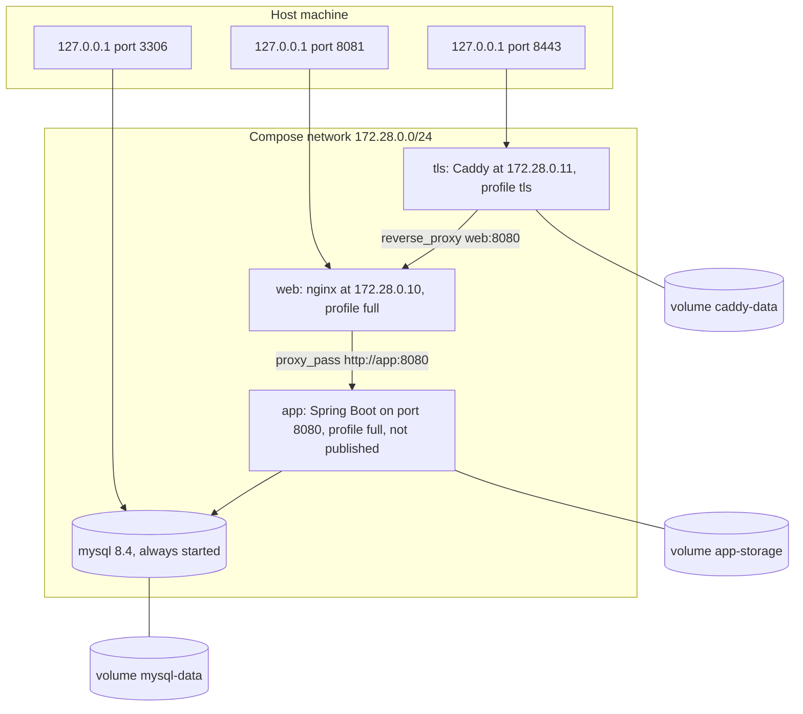
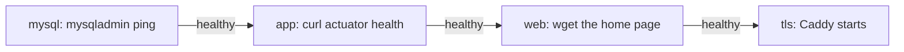

<!-- chapter: 33 | part: V | owner: writer-production | tag: book-m5-platform, book-m6-final | status: expanded -->
# Chapter 33: Deployment and TLS

This chapter moves the Secure Document Viewer from your laptop to a server that other people can reach. You'll learn what changes when strangers are on the other end of the connection, how nginx and Caddy stand in front of the app, how the container images are built, and how to read the compose file that ties the pieces together. By the end you'll be able to bring up the whole stack with one command, put HTTPS in front of it, and explain the reason behind each line of configuration.

## Learning objectives

By the end of this chapter, you will be able to:

- Explain what changes when an app moves from a laptop to a public server.
- Describe the job of a reverse proxy and read the project's nginx configuration line by line.
- Start the app with the `full` and `tls` compose profiles and say what each runs.
- Read the two Dockerfiles and explain why images are built in stages and run as a non-root user.
- Explain HTTPS, certificates, and HSTS, and why the session cookie needs the `Secure` flag.
- Work through the go-live checklist and justify each item.

## Prerequisites

- Chapter 8: HTTP, headers, and cookies (section 8.6 on cookies).
- Chapter 10: Docker images, containers, volumes, and Compose.
- Chapter 30: the platform milestone, where the Docker stack was built.
- Chapter 32: the trust boundary and the forged-address incident.

## Beginner tier: From laptop to server

### 33.1 The analogy: a shop front

On your laptop the app is a workshop: only you walk in. On a server it is a shop on a busy street. You don't let customers walk into the workshop. You put a counter in front, and staff at the counter take requests, check them, and pass them to the back room. A reverse proxy (Chapter 16) is that counter. It receives requests from browsers and forwards them to the app behind it.

The analogy breaks down because the counter here also does jobs a shop counter doesn't. It serves the app's static files itself. In the HTTPS setup, it also scrambles all traffic, so that people on the street can't read what passes across it. It also keeps a rule that matters for security: it decides what the back room is told about who the customer is.

### 33.2 Terms you need

- Reverse proxy (Chapter 16): a program that accepts requests on behalf of another program and forwards them. This project uses nginx (Chapter 30; pronounced "engine-x") for this job, and Caddy (Chapter 30) for HTTPS.
- **Forward proxy vs. reverse proxy:** a forward proxy stands in front of *clients* (a company proxy for its employees); a reverse proxy stands in front of *servers*. The "reverse" is only that.
- **TLS and HTTPS:** TLS (Transport Layer Security) is the protocol that encrypts a connection and proves the server's identity; HTTPS is HTTP carried over TLS. The padlock in a browser means the connection uses it.
- Certificate (Chapter 8): a file, issued by a trusted authority, that proves a server owns its domain name. Without one, browsers warn users away.
- **Certificate authority (CA):** an organization that browsers trust to issue certificates.
- **Let's Encrypt:** a free CA that issues certificates automatically. Caddy talks to it for you.
- HSTS (Chapter 30): a header, `Strict-Transport-Security`, that tells a browser "only ever use HTTPS for this site from now on".
- **Compose profile:** a label on a service in the compose file. A service with a profile starts only when you ask for that profile.
- **Non-root:** a process that runs as an ordinary user inside the container, so a break-in there doesn't hand over the whole container.
- Multi-stage build (Chapter 10): a Dockerfile that uses one image to build the program and a smaller one to run it, so build tools don't ship.
- Origin (Chapter 8): the combination of scheme, host, and port (`https://docs.example.com:443`). Browsers apply many rules per origin, including cookie and CSRF rules.

### 33.3 What changes on a server

Four things change, and this chapter takes each one in turn:

1. Traffic crosses networks you don't control, so it must be encrypted (sections 33.8 and 33.12).
2. The app must not be reachable except through the front door (sections 33.5 and 33.9).
3. The address a request comes from is now the proxy's, so the app must be told the real one, and told whom to believe (section 33.10, and Chapter 32).
4. Passwords and keys must come from the environment, not from code (section 33.11).

A fifth thing changes quietly: you're now responsible for keeping it running. Chapters 34 to 36 cover backups, monitoring, and updates.

### 33.4 A first run: bring up the whole stack

Let's begin with what it looks like when everything works. You need Docker running (Chapter 10) and a clone of the repository. From the project folder:

```bash
cp .env.example .env
```

Open `.env` and fill in `DB_PASSWORD`, `DB_ROOT_PASSWORD`, and `SIGNING_SECRET` (at least 32 random characters). The values are secrets: never commit `.env`, and never paste it into a chat or an issue. Then start the stack:

```bash
docker compose --profile full up -d --build
```

Read that command word by word. `docker compose` uses the `docker-compose.yml` in the current folder. `--profile full` includes the services labeled with the `full` profile (the app and the web front end); the database has no profile, so it always starts. `up` creates and starts the containers. `-d` means "detached": run in the background and give me my terminal back. `--build` builds the images from the Dockerfiles first.

The first build takes several minutes: it downloads a JDK, compiles the backend, downloads Node, and builds the Angular app. Later builds reuse cached layers and are much faster. When it finishes, check what is running:

```bash
docker compose ps
```

You should see three services: `mysql`, `app`, and `web`, each with a state of `running` and, after a while, `healthy`. The `app` takes up to a minute to become healthy (its health check allows a 60-second `start_period`). Then open `http://localhost:8081` in a browser and you'll see the sign-in page. If the first admin's password wasn't set in `.env`, the app generated one and printed it once in its log, which you can read with `docker compose logs app`.

If a service is `unhealthy` or keeps restarting, `docker compose logs <service>` is the first tool to reach for. Section 33.15 lists the usual causes.

## Intermediate tier: How the pieces fit

*On a first read you can skip to "In this project"; the compose file is worth reading once you deploy.*

### 33.5 The compose file

The project's `docker-compose.yml` defines four services. Table 33.1 summarizes them. It's identical at `book-m5-platform` and `book-m6-final`.

**Table 33.1 — Services in `docker-compose.yml`**

| Service | Profile | Image or build | Published port | Role |
|---|---|---|---|---|
| `mysql` | (always) | `mysql:8.4` pinned by digest | `127.0.0.1:3306` | The database |
| `app` | `full` | Built from `Dockerfile` | none | The Spring Boot API |
| `web` | `full` | Built from `frontend/Dockerfile` | `127.0.0.1:8081` | nginx: the Angular app and the `/api` proxy |
| `tls` | `tls` | `caddy:2-alpine` pinned by digest | `127.0.0.1:8443` | HTTPS front end with HSTS |

The profiles give three ways to start it (from the comment at the top of the file):

```bash
docker compose up -d                                        # MySQL only, for development
docker compose --profile full up -d --build                 # MySQL + API + web at http://localhost:8081
docker compose --profile full --profile tls up -d --build   # also https://localhost:8443
```

The first is for development, where you run the backend and the Angular dev server on your own machine and only need the database. The second is the deployable stack. The third adds HTTPS.

Notice what is *not* published. `app` uses `expose: "8080"`, which makes the port reachable inside the compose network only. The database is bound to `127.0.0.1`, meaning only the host machine can connect to it. Only `web` (and `tls`) accept traffic from outside the container network, and even those bind to `127.0.0.1` in the file as shipped. Putting a real site on the internet means editing the `tls` service's `ports` entry so it listens on the public interface, on 443 and (for certificate issuance) 80, which is what the README's "publish ports 80/443" refers to. The repository doesn't ship a production override file; you make that edit deliberately, which is the point of shipping the safe default.

<!-- source: docker-compose.yml at book-m6-final -->
Figure 33.1 draws the stack the compose file describes. Solid arrows are the path a request takes; the boxes at the top are the only ports the host exposes.



*Figure 33.1 — The compose stack: profiles, fixed addresses, published ports, and volumes*

*Text description:* The host machine exposes three ports, all on 127.0.0.1: 8443 to Caddy, 8081 to nginx, and 3306 to MySQL. Inside the compose network, Caddy forwards to nginx, nginx forwards to the app on port 8080, and the app talks to MySQL. Three volumes attach to Caddy, the app, and MySQL. Notice that no arrow reaches the app from the host.

Notice that the app has no arrow from the host. Everything reaches it through nginx, which is the point of Section 33.6.

### 33.6 Why not publish the app directly?

Because everything Chapter 32 built assumes traffic arrives through nginx. nginx sets the security headers for the frontend, caps upload size, and, above all, overwrites `X-Forwarded-For` with the real connection address. If `app:8080` were reachable directly, a caller could bypass those steps. The README states the rule: keep the API reachable only through the proxy. The compose file enforces it by not publishing the port at all.

### 33.7 The images

Before nginx can serve anything, the images have to be built. Two Dockerfiles do it. Here is the backend's.

*Pattern note: Images built from a Dockerfile are infrastructure as code (Chapter 39, Section 39.13).*

**Listing 33.1 — `Dockerfile`, `book-m6-final` (simplified: comments omitted, and the digests shortened)**

```dockerfile
FROM eclipse-temurin:25-jdk@sha256:97014c... AS build
WORKDIR /src
COPY mvnw pom.xml ./
COPY .mvn .mvn
RUN chmod +x mvnw && ./mvnw -B -q dependency:go-offline
COPY src src
RUN ./mvnw -B -q -DskipTests package

FROM eclipse-temurin:25-jre@sha256:bb036e...
RUN apt-get update \
    && apt-get install -y --no-install-recommends fontconfig fonts-dejavu-core curl \
    && rm -rf /var/lib/apt/lists/* \
    && groupadd --system app && useradd --system --gid app --home /app app \
    && mkdir -p /app /data/storage && chown -R app:app /app /data
WORKDIR /app
COPY --from=build /src/target/secure-doc-viewer.jar app.jar
USER app
ENV STORAGE_ROOT=/data/storage \
    JAVA_TOOL_OPTIONS="-XX:MaxRAMPercentage=75 -Djava.awt.headless=true"
VOLUME /data/storage
EXPOSE 8080
ENTRYPOINT ["java", "-jar", "/app/app.jar"]
```

Line by line:

- **Stage one (`AS build`)** uses the full JDK, which has the compiler. `COPY mvnw pom.xml ./` and `dependency:go-offline` come *before* `COPY src src` on purpose: Docker caches each layer, and the dependencies change rarely, so this order lets later builds skip the download until `pom.xml` changes. The last line builds the jar, skipping tests (CI runs those, Chapter 36).
- **Stage two** starts a fresh image with only the JRE (Java runtime, no compiler). The build tools never ship, which makes the image smaller and gives an attacker fewer tools.
- The `RUN apt-get ...` line installs fonts and `curl`. The watermark and PDF rendering draw text with Java's 2D library, which needs real fonts even in a container with no screen (hence `-Djava.awt.headless=true` further down). `curl` is only for the compose health check. The `rm -rf /var/lib/apt/lists/*` deletes the package index to keep the layer small.
- `groupadd --system app && useradd --system ...` creates an ordinary user. `chown` gives it the app folder and the data folder. `USER app` makes every later instruction, and the running container, use that user. **This is the non-root part:** if an attacker breaks into the Java process, they are a user with no power over the container's system files.
- `COPY --from=build` takes only the finished jar from stage one.
- `-XX:MaxRAMPercentage=75` tells the JVM to size its memory from the container's limit (the compose file gives the app `1536m`), using up to 75%, which leaves the rest for the JVM's own overhead and the operating system inside the container.
- `VOLUME /data/storage` marks where the tiles live so Docker keeps them outside the container's writable layer, and `ENTRYPOINT` starts the app.

Notice also the `.dockerignore` file at the repository root. Its first comment reads "Never send secrets, data or build output into the image build context", and it excludes `.env`, `storage/`, `target/`, `.git/`, and the frontend folder. The build context (Chapter 10) is the set of files Docker hands to the build; keeping `.env` out means your secrets can't end up baked into an image layer, where anyone who pulls the image could read them.

The frontend image follows the same pattern.

**Listing 33.2 — `frontend/Dockerfile`, `book-m6-final` (simplified: comments omitted, and the digests shortened)**

```dockerfile
FROM node:24-alpine@sha256:ebfe2f... AS build
WORKDIR /src
COPY package.json package-lock.json ./
RUN npm ci --no-audit --no-fund
COPY . .
RUN npx ng build --configuration production

FROM nginxinc/nginx-unprivileged:stable-alpine@sha256:daa17b...
COPY nginx.conf /etc/nginx/conf.d/default.conf
COPY --from=build /src/dist/frontend/browser /usr/share/nginx/html
EXPOSE 8080
```

Stage one builds the Angular app with Node. `npm ci` installs exactly what the lockfile says (Chapter 36 explains why). Stage two copies the build output, plain HTML, JavaScript, and CSS, into an nginx image, and drops in the project's nginx configuration. The image name, `nginx-unprivileged`, is the non-root variant: it runs as an ordinary user, which is why it listens on 8080 inside the network (ports below 1024 need special privileges).

### 33.8 The nginx configuration, piece by piece

Here is the configuration, with its explanatory comments removed so the structure is visible.

*Pattern note: Nginx in front of the app is the reverse proxy and gateway pattern (Chapter 39, Section 39.7).*

**Listing 33.3 — `frontend/nginx.conf`, `book-m6-final` (simplified: comments omitted)**

```nginx
map $realip_remote_addr $forwarded_proto {
    172.28.0.11 $http_x_forwarded_proto;
    default     $scheme;
}

server {
    listen 8080;
    server_name _;
    server_tokens off;

    set_real_ip_from 172.28.0.11;
    real_ip_header X-Forwarded-For;

    root /usr/share/nginx/html;
    index index.html;

    client_max_body_size 51m;

    location ^~ /api/ {
        proxy_pass http://app:8080;
        proxy_set_header Host $host;
        proxy_set_header X-Forwarded-For $remote_addr;
        proxy_set_header X-Real-IP $remote_addr;
        proxy_set_header X-Forwarded-Proto $forwarded_proto;
        proxy_read_timeout 300s;
        proxy_request_buffering off;
    }

    location = /actuator/health {
        proxy_pass http://app:8080;
        proxy_set_header X-Forwarded-For $remote_addr;
    }

    location ~* \.(?:js|css|woff2?|ico)$ {
        expires 1y;
        add_header Cache-Control "public, immutable" always;
        add_header X-Content-Type-Options "nosniff" always;
        try_files $uri =404;
    }

    location / {
        add_header Cache-Control "no-cache" always;
        add_header Content-Security-Policy "default-src 'self'; script-src 'self'; style-src 'self' 'unsafe-inline'; img-src 'self' blob: data:; connect-src 'self'; font-src 'self'; object-src 'none'; base-uri 'self'; form-action 'self'; frame-ancestors 'none'" always;
        add_header X-Content-Type-Options "nosniff" always;
        add_header X-Frame-Options "DENY" always;
        add_header Referrer-Policy "no-referrer" always;
        add_header Permissions-Policy "camera=(), microphone=(), geolocation=(), payment=()" always;
        try_files $uri $uri/ /index.html;
    }
}
```

Line by line:

- `map $realip_remote_addr $forwarded_proto` builds a variable. If the connection came from Caddy (`172.28.0.11`), use the protocol Caddy reports in `X-Forwarded-Proto` (that is, `https`); otherwise use nginx's own `$scheme`. Nobody but Caddy can claim the connection was HTTPS.
- `listen 8080` and the unprivileged image: non-root, so port 8080.
- `server_tokens off` hides nginx's version number in responses, so a scanner learns less.
- `set_real_ip_from 172.28.0.11` and `real_ip_header X-Forwarded-For`: accept a forwarded client address only from Caddy at that fixed address. Anyone else's header is ignored.
- `client_max_body_size 51m` is kept in step with the backend's 50 MB upload limit plus form overhead. Without it, nginx would reject uploads at its default of 1 MB.
- `location ^~ /api/` proxies API calls to `app:8080`. The `^~` marks it so that no pattern rule elsewhere (like the static-asset rule in Listing 33.3) can capture an API path.
- `proxy_set_header X-Forwarded-For $remote_addr` is the fix for the incident in Chapter 32: nginx *overwrites* the header with the real connection address instead of appending to what the client sent. `X-Real-IP` gets the same value.
- `proxy_read_timeout 300s` allows for a long PDF render; `proxy_request_buffering off` streams uploads through to the backend instead of holding them in nginx first.
- `location = /actuator/health` proxies exactly the bare health path (Chapter 35). The `=` means exact match, so `/actuator/prometheus` isn't forwarded.
- The static-asset location caches hashed bundles (`.js`, `.css`, fonts) for a year with `immutable`. Angular puts a content hash in each bundle's filename, so a changed file has a new name, and caching forever is safe.
- The final `location /` serves the Angular app and sets the security headers. `Cache-Control: no-cache` means "revalidate before reuse", so a new `index.html` is picked up. `try_files $uri $uri/ /index.html` is the **single-page-app fallback**: a deep link like `/viewer/123` isn't a real file, so nginx serves `index.html` and Angular's router takes over.

The Content-Security-Policy deserves a moment. Reading it: scripts only from the same origin (`script-src 'self'`); images from the same origin, `blob:` URLs (the viewer builds tile images from `blob:` URLs, Chapter 21), and `data:`; no plugins (`object-src 'none'`); and no framing (`frame-ancestors 'none'`). Styles allow `'unsafe-inline'`, so Angular's inline `style` attributes work. The result is that even if an attacker injected script into a page, the browser would refuse to run it unless it came from the app's own origin.

### 33.9 Caddy and certificates

**Listing 33.4 — `deploy/Caddyfile`, `book-m6-final` (simplified: comments omitted)**

```
{$SITE_ADDRESS} {
	tls {$TLS_MODE}

	encode zstd gzip

	header {
		Strict-Transport-Security "{$HSTS_POLICY:max-age=31536000}"
		-Server
	}

	reverse_proxy web:8080
}
```

Caddy reads three settings from the environment. `SITE_ADDRESS` is the host name (default `localhost`, set in the compose file). `TLS_MODE` is `internal` to use Caddy's own local certificate authority, fine for trying it out, or an email address to get a real certificate from Let's Encrypt, which needs a public DNS name and ports 80 and 443 reachable from the internet. `HSTS_POLICY` defaults to `max-age=31536000`, one year, and `{$HSTS_POLICY:max-age=31536000}` is Caddy's syntax for "this variable, or this default if it's empty". `encode zstd gzip` compresses responses. `-Server` removes the `Server` header. `reverse_proxy web:8080` forwards everything to nginx, and Caddy replaces `X-Forwarded-For` with the real client address (its own comment says so: no upstream proxy is trusted).

Try it locally:

```bash
docker compose --profile full --profile tls up -d --build
```

Then open `https://localhost:8443`. Your browser will warn that the certificate isn't trusted. That is expected: with `TLS_MODE=internal`, Caddy made its own certificate authority, and your browser has never heard of it. The connection *is* encrypted; what the warning says is that nobody the browser trusts vouches for the server's identity. For a real site with a public name and an email in `TLS_MODE`, Caddy asks Let's Encrypt for a certificate, proves it controls the domain (that's why the ports must be reachable), stores the certificate in the `caddy-data` volume, and renews it automatically before it expires.

Why two proxies? nginx already serves the app. Caddy's strength is certificates: it obtains and renews them without configuration scripts. Keeping it as an optional profile means the plain stack stays simple. Chapter 37 (section 37.11) weighs this against a cloud load balancer.

## Advanced tier: Trust, cookies, and going live

*On a first read you can skip to "In this project"; return here before a real deployment.*

### 33.10 Fixed addresses and the trust boundary

The compose file gives the network a fixed subnet, `172.28.0.0/24`, gives `web` the address `172.28.0.10`, and gives `tls` the address `172.28.0.11`. This is not decoration. The app sets `FORWARD_HEADERS_STRATEGY: native` and `TRUSTED_PROXY_REGEX: '172\.28\.0\.10'`, so it believes `X-Forwarded-For` only from nginx; nginx believes a forwarded address only from Caddy. The chain of belief is one link at a time, and every link is pinned to an address that can't change.

<!-- source: dossier/decisions.md D11, D12; PR #5 body "Operations" (TM2-6) -->
The fixed subnet came from a finding by the Senior Technical Manager review agent (Chapter 32): without pinned addresses, "trust the proxy" could not be expressed safely. The two-address live test in Chapter 32 checked the nginx and direct-to-app links, and a separate check of the `tls` profile confirmed that Caddy ignores a spoofed header.

The failure mode is worth understanding, because it's silent. If the addresses drift, for example someone changes nginx's address without changing `TRUSTED_PROXY_REGEX`, nothing crashes. The app stops believing the forwarded header and judges every request by the address it sees, which is now the proxy's. Every user appears to come from the same address, so the per-address throttling and the audit log's addresses become useless. Exercise 33.3 walks through it.

### 33.11 Secrets and configuration

Secrets are never in the compose file. Look at how it asks for them:

*Pattern note: Settings and secrets from the environment are twelve-factor configuration (Chapter 39, Section 39.12).*

```yaml
MYSQL_PASSWORD: ${DB_PASSWORD:?Set DB_PASSWORD in .env}
MYSQL_ROOT_PASSWORD: ${DB_ROOT_PASSWORD:?Set DB_ROOT_PASSWORD in .env}
```

The `${VAR:?message}` form makes Compose refuse to start, with your message, when the value is missing. A missing secret is a loud failure at startup, not a database with an empty password. The app service gets the rest with `env_file: .env`. The `.env` file is git-ignored, and `.env.example` is the template with no real values.

`SIGNING_SECRET` (at least 32 characters; startup fails otherwise) keys every tile token and the recognised-device hashes, so treat it like a password. The MySQL health check is written as `MYSQL_PWD="$$MYSQL_ROOT_PASSWORD" mysqladmin ping ...`: the doubled `$$` defers expansion to the container, so the password never appears in the stored command that `docker inspect` shows, and `MYSQL_PWD` keeps it off the process's argument list. A comment in the file says exactly this.

On a fresh database the app creates the first admin. The password is `BOOTSTRAP_ADMIN_PASSWORD` if you set it, or a random one printed once in the log if you leave it empty. The app forces a password change at first sign-in only when *it* generated the password. If you set the password yourself, change it yourself and clear it from `.env`; the README's go-live note says so, and commit `5aa0f3c` added it.

### 33.12 Secure cookies and HSTS

A cookie marked `Secure` is sent only over HTTPS. The session cookie's setting comes from `application.yml`:

```yaml
cookie:
  name: SDV_SESSION
  http-only: true
  same-site: strict
  secure: ${SESSION_COOKIE_SECURE:false}
```

The default is `false` so that `http://localhost` works during development; a browser wouldn't send a `Secure` cookie over plain HTTP. **Set `SESSION_COOKIE_SECURE=true` wherever the app is served over HTTPS.** Otherwise the cookie could travel over an unencrypted connection, for example on the first request before a redirect. The CSRF cookie carries `Secure` behind Caddy as well; the live test in PR #5 confirmed it. (Spring decides that from whether the request looks like HTTPS, which is why nginx passes `X-Forwarded-Proto` on only when it comes from Caddy.)

HSTS closes the remaining gap. Once a browser has seen the header on an HTTPS response, it refuses to use plain HTTP for that site for the `max-age` (here, one year, `31536000` seconds), even if the user types `http://`. That protects against a downgrade attack, where someone on the network strips the encryption from a first request.

Its power is also its risk. `includeSubDomains` extends the promise to every subdomain (`www`, `mail`, and the rest), and the browser remembers it for the whole `max-age`. If one subdomain isn't ready for HTTPS, it becomes unreachable for a year. That is why `includeSubDomains` is opt-in through `HSTS_POLICY` (commits `66f7152` and `5aa0f3c`) and the checklist says to add it only if every subdomain is HTTPS.

### 33.13 Non-root, memory limits, health checks and start order

Several small settings make the stack safer and steadier:

- `app` runs as the system user `app` (Listing 33.1), and `web` uses the unprivileged nginx image.
- The containers have memory limits: `mem_limit: 1536m` for the app, whose JVM sizes its heap to 75% of that, and `128m` for nginx and Caddy. A runaway process is killed by Docker, not by taking the host down.
- `restart: unless-stopped` restarts a container that crashes, and after a reboot of the host, unless you stopped it on purpose.
- Each service has a health check, and `depends_on` with `condition: service_healthy` makes them start in order: database, then app, then web, then Caddy. Without it, the app would start before MySQL accepts connections and fail.

<!-- source: docker-compose.yml at book-m6-final -->
Figure 33.2 shows the start order that `depends_on` with `condition: service_healthy` produces.



*Figure 33.2 — Start order: each service waits until the previous one reports healthy*

*Text description:* Four services in a row: MySQL, then the app, then nginx, then Caddy. Each arrow is labeled healthy, meaning a service starts only after the one before it reports healthy; each box names the command used for its health check.

### 33.14 The go-live checklist

The README's go-live checklist turns the chapter into steps. With the reason for each:

- **Serve over HTTPS** with the `tls` profile, `SITE_ADDRESS` set to your domain, `TLS_MODE` set to an email address, ports 80 and 443 published, and `SESSION_COOKIE_SECURE=true`. Add `includeSubDomains` to `HSTS_POLICY` only if every subdomain is HTTPS. Reason: passwords and session cookies must not cross the internet in the clear.
- **Keep `app:8080`, MySQL, and the metrics endpoint off the network**, and set `METRICS_ALLOWED_ADDRESSES` to the Prometheus server, then alert on the counters from Chapter 35. Reason: these are behind the front door, not on it.
- **Strong, unique `SIGNING_SECRET`, `DB_PASSWORD`, and `DB_ROOT_PASSWORD`.** Change the bootstrap admin password at first sign-in. The app forces this only when it generated the password; if you set `BOOTSTRAP_ADMIN_PASSWORD`, change it yourself and clear it from `.env`.
- **Scheduled backups plus one restore drill** (Chapter 34).
- **One app instance** (Chapters 34 and 37): sessions and counters are in memory and tiles are on local disk.

*See also: A highly available, multi-instance version of this checklist is sketched in Chapters 40 and 41 (a design, not a built system).*

### 33.15 Common mistakes

- **Missing `.env` values.** Symptom: Compose refuses to start with "Set DB_PASSWORD in .env". Fix: fill in the value. This is the design working.
- **Forgetting `--profile full`.** Symptom: only MySQL starts, and `localhost:8081` refuses the connection. Fix: add the profile.
- **Stale images.** Symptom: you changed the code but the running container behaves as before. Fix: `--build`, or `docker compose build` first.
- **Certificate warnings.** Symptom: "not private" warning at `https://localhost:8443`. Cause: `TLS_MODE=internal`. Fix: expected locally; for a real site, use a public name and an email in `TLS_MODE`.
- **Certificate issuance fails.** Symptom: Caddy logs errors obtaining a certificate. Causes: the DNS name doesn't point at the server, or ports 80/443 aren't reachable from the internet. Fix: check DNS and firewall.
- **`SESSION_COOKIE_SECURE=true` over plain HTTP.** Symptom: you can't stay signed in, because the browser drops the `Secure` cookie. Fix: use HTTPS, or leave it `false` for local HTTP.
- **Changing nginx's or Caddy's address without changing the trust settings.** Symptom: everyone appears to share one address. Fix: change the compose address, `TRUSTED_PROXY_REGEX`, and `set_real_ip_from` together.
- **Publishing the app port to "make debugging easier".** It bypasses every protection in section 33.6. Use `docker compose exec` and logs instead.
- **Committing `.env`.** It is git-ignored for a reason. If it ever leaks, change every secret in it.

## In this project

| Path | First appears | What it does |
|---|---|---|
| `docker-compose.yml` | `book-m1-accounts` (MySQL), extended in `book-m5-platform` | Services, profiles, fixed subnet |
| `Dockerfile` | `book-m5-platform` | Two-stage backend image, non-root runtime |
| `frontend/Dockerfile` | `book-m5-platform` | Angular build, then unprivileged nginx |
| `frontend/nginx.conf` | `book-m5-platform` | Proxy, headers, header overwrite |
| `deploy/Caddyfile` | `book-m5-platform` | TLS and HSTS |
| `.dockerignore` | `book-m5-platform` | Keeps secrets out of the build context |
| `.env.example` | `book-m1-accounts` | Template for secrets (never commit `.env`) |

See any with `git show book-m6-final:<path>`.

## Try it

### Exercise 33.1 ★ Read the ports

List every port that `docker compose --profile full --profile tls up` publishes on the host, and the address each is bound to. Explain why none is `0.0.0.0`.

### Exercise 33.2 ★★ Predict the spoof

A client sends `X-Forwarded-For: 203.0.113.9` directly to nginx on port 8081. Using Listing 33.3, what address does the app see, and why?

### Exercise 33.3 ★★★ Change the address

Suppose you change nginx's address in the compose file to `172.28.0.20` and change nothing else. Which settings stop working, and what is the visible symptom?

### Exercise 33.4 ★★ Read the Dockerfile

In Listing 33.1, why does `COPY mvnw pom.xml ./` come before `COPY src src`? What would change if you swapped them?

### Exercise 33.5 ★★ Diagnose

After deploying behind HTTPS, users report they are signed out on every page load. `SESSION_COOKIE_SECURE=true` is set. List three things you would check, in order.

### Exercise 33.6 ★★★ Plan the go-live

Write your own go-live plan for a domain you own: the `.env` values, the compose edits, the DNS record, and the first three things you would test after the site is up.

## Summary

- A reverse proxy is the app's front door; here nginx serves the frontend and proxies `/api`, and Caddy adds HTTPS and certificates.
- Only the proxies publish ports; the API and database stay inside the network, and images run as non-root users.
- Two Dockerfiles build in stages, so build tools don't ship, and `.dockerignore` keeps secrets out of images.
- Trust is a chain of fixed addresses: the app trusts nginx, and nginx trusts Caddy.
- `Secure` cookies and HSTS keep sessions off plain HTTP, and `includeSubDomains` is opt-in because it is hard to undo.
- The go-live checklist turns these ideas into steps.

Chapter 34 covers backups, restores, and living with one instance.

## Further reading

- nginx documentation: https://nginx.org/en/docs/
- Caddy documentation: https://caddyserver.com/docs/
- Docker Compose profiles: https://docs.docker.com/compose/how-tos/profiles/
- Dockerfile best practices (multi-stage builds): https://docs.docker.com/build/building/best-practices/
- MDN, Strict-Transport-Security: https://developer.mozilla.org/en-US/docs/Web/HTTP/Reference/Headers/Strict-Transport-Security
- Let's Encrypt, how it works: https://letsencrypt.org/how-it-works/
