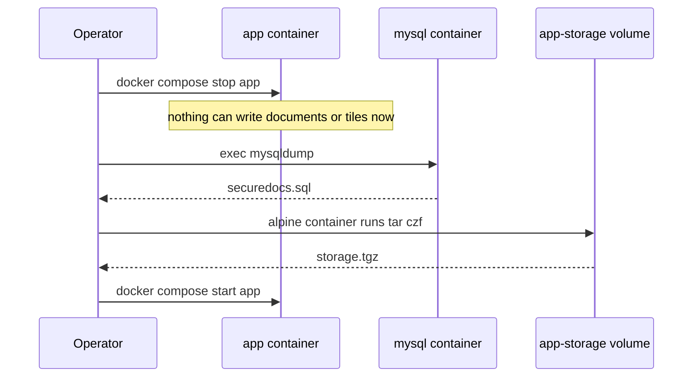
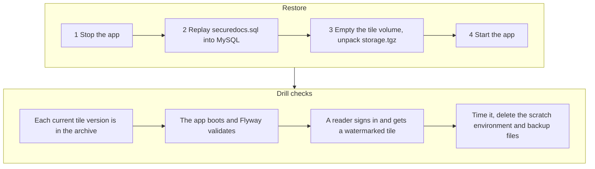

<!-- chapter: 34 | part: V | owner: writer-production | tag: book-m5-platform, book-m6-final | status: expanded -->
# Chapter 34: Backups, restores and operations

This chapter answers a question every real deployment must answer before the first user arrives: if the server's disk dies tonight, what do you get back tomorrow? You'll learn what state the app holds, how to capture it consistently, how to prove a backup works by restoring it, and what the app quietly deletes on its own schedule. Backups are the least exciting part of an app and the part you'll be most grateful for on the one day you need them.

## Learning objectives

By the end of this chapter, you will be able to:

- List every place the app keeps state and say what is lost if each one disappears.
- Explain why the database and the tile files must be backed up at the same moment.
- Run the project's backup and restore commands and say what each flag and line does.
- Plan and judge a restore drill, using the checks the project's own drill used.
- Describe what the storage janitor, the audit purge, and the recognised-device purge remove, and what the janitor refuses to remove.
- Recognize the common ways backups fail, and the symptoms each one leaves.

## Prerequisites

- Chapter 9: SQL and MySQL (dumps, transactions).
- Chapter 10: Docker volumes and Compose.
- Chapter 33: the compose stack and its services.

## Beginner tier: What is a backup?

### 34.1 The analogy: a photograph of a whiteboard

A backup is a photograph of a whiteboard before someone erases it. If two people are writing on the board while you take the photo, one half of the picture shows the board before an edit and the other half after, and the photo tells a story that never happened. Keeping the board still while you photograph it gives a picture you can trust.

The analogy breaks down in two places. First, a real backup is a set of files, and *restoring* it, putting the whiteboard back exactly as photographed, is a separate skill that you have to practice. Second, an app has two whiteboards here (the database and the tile files), and you have to photograph both at the same instant, which is harder than it sounds.

### 34.2 Terms you need

- **Backup:** a copy of your data kept somewhere else, so that a failure of the original doesn't destroy it.
- **Restore:** copying that data back and starting the app on it.
- **Dump:** a text file of the SQL commands needed to rebuild a database. This app makes one with the `mysqldump` program.
- Volume (Chapter 10): a Docker-managed folder that outlives the container that uses it. This app uses `mysql-data` and `app-storage`.
- **Consistent:** every part of the backup describes the same moment in time.
- **Restore drill:** restoring a backup into a scratch environment to prove it works, without touching production.
- **RPO (recovery point objective):** how much recent work you can afford to lose. A nightly backup means an RPO of up to a day.
- **RTO (recovery time objective):** how long you can afford to be down while restoring. A drill measures it.
- **Retention:** how long data, or old backups, are kept before deletion.
- **Off-site:** stored on a different machine, ideally a different location, so one disaster can't take both the original and the copy.

### 34.3 What state exists and where

Before you can back anything up, you have to know what you have. The app holds state in four places. Table 34.1 lists them, with what happens if each is lost.

**Table 34.1 — Where state lives**

| State | Where | If lost |
|---|---|---|
| Accounts, documents, shares, audit trail, recognised-device hashes | MySQL, volume `mysql-data` | Everything except the tile images: nobody can sign in and nothing is listed |
| Rendered tiles | Volume `app-storage`, mounted at `/data/storage` in the app | Documents exist in the database but show no pages |
| Sessions and rate-limit counters | The memory of the app process | Nothing durable: users sign in again, counters reset |
| Secrets (`SIGNING_SECRET`, passwords) | The `.env` file | Tile tokens can't be verified the same way; recognised devices are forgotten |

One thing is deliberately *not* in the table. The source PDF is deleted after ingest, as Chapter 32 explains. The tiles are the only copy of the document's content that the app keeps. That has a sobering consequence: if you lose the tile volume and have no backup, the content is gone unless the publisher still has the original PDF and uploads it again.

Now a small exercise in thinking. Suppose the server disk fails at 3 p.m. and your last backup is from midnight. You lose everything since midnight: documents uploaded that morning, shares changed, audit events. That is your RPO. Whether it is acceptable is a business decision, not a technical one, and you make it before the disaster, not during.

## Intermediate tier: A consistent backup

*On a first read you can skip to "In this project"; return here when you set up scheduled backups.*

### 34.4 Why the two must match

<!-- source: README "Backup and restore"; PR #5 body "Final-review fixes (66f7152)"; dossier/bugs-and-findings.md F1 -->
Replacing a PDF renders new tiles into a new version folder, switches the document to it, and then deletes the previous version's tiles as soon as the switch commits. Now imagine you back up in the obvious order: first dump the database, then archive the tiles. Suppose a publisher replaces a document between the two steps.

1. 10:00: your dump says document D uses tile version 1.
2. 10:01: the publisher replaces D. Version 2 is rendered, D is switched to version 2, and version 1 is deleted.
3. 10:02: you archive the tile volume. It contains version 2 only.

After a restore, the database says D uses version 1, but version 1 isn't in the archive. Every page of D is blank. Neither file is corrupt; they describe different moments. That is what "inconsistent" means, and no tool will warn you.

The Senior Technical Manager review agent (an AI reviewer; see Chapter 32) found this in the final review before go-live, and the runbook changed to stop the app for the few seconds a backup takes, so nothing can change between the two captures (commit `66f7152`). The trade-off is stated openly in the README: a short outage in return for backups that are correct without cleverness. Chapter 37 (section 37.7) puts it next to the alternatives.

### 34.5 The backup commands, line by line

These are copied from the README. They run from the project folder on the machine that hosts the stack.

**Listing 34.1 — Backup, adapted from `README.md` at `book-m6-final` (the README passes the password with `-p`; this version passes it through the environment, as explained in the notes after this listing)**

```bash
docker compose --profile full stop app
docker compose exec -T mysql sh -c 'export MYSQL_PWD="$MYSQL_ROOT_PASSWORD"; exec mysqldump --single-transaction --routines -u root "$MYSQL_DATABASE"' > securedocs.sql
docker run --rm -v secure-doc-viewer_app-storage:/data -v "$PWD":/backup alpine tar czf /backup/storage.tgz -C /data .
docker compose --profile full start app
```

**Line 1** stops only the `app` service. The database stays running, because the next step needs it. With the app stopped, nothing can write documents or tiles, so both stores are still.

**Line 2** is the longest, so take it in pieces:

- `docker compose exec -T mysql` runs a command inside the running `mysql` container. The `-T` flag turns off the pseudo-terminal that Compose normally attaches. Without it, the output stream gets terminal control characters mixed in, and redirecting to a file would corrupt the dump.
- `sh -c '...'` starts a shell inside the container so that variables are expanded there. The single quotes stop *your* shell from expanding `$MYSQL_ROOT_PASSWORD` and `$MYSQL_DATABASE`; the container's shell does it, using the values the container already has. The password never appears in your terminal history.
- `export MYSQL_PWD="$MYSQL_ROOT_PASSWORD"` puts the password into the environment of the dump program, which the MySQL client programs read as the default password. That keeps it out of the program's *argument list*, which is what a process listing (`ps`) shows.
- `exec mysqldump` replaces the shell with the dump program, so its exit status is the command's exit status.
- `--single-transaction` makes the dump read a consistent snapshot of the InnoDB tables in one transaction, without locking them for the duration.
- `--routines` includes stored procedures and functions, if any. The database has none today, but the flag means a future one wouldn't be silently left out.
- `-u root` connects as the root user. The README at this tag writes `-p"$MYSQL_ROOT_PASSWORD"` instead; the expanded password then sits in the dump program's argument list, visible to anyone who can list processes inside the container, and MySQL prints a warning about a password on the command line. The environment variable is the same technique the project's own MySQL health check uses (Chapter 10). It isn't perfect: MySQL's 8.4 manual calls `MYSQL_PWD` deprecated and warns that other users may be able to read process environments too. A stricter option is an option file with restrictive permissions, passed with `--defaults-extra-file`.
- `> securedocs.sql` sends the dump to a file on the host.

**Line 3** archives the tiles. It starts a throwaway `alpine` container (`--rm` deletes it afterward) that mounts two things: the volume `secure-doc-viewer_app-storage` at `/data`, and your current folder (`$PWD`) at `/backup`. Then `tar czf /backup/storage.tgz -C /data .` creates a compressed archive (`c` create, `z` gzip, `f` file) of the volume's contents. `-C /data` changes into `/data` first, so the paths inside the archive are relative (`./doc-id/...`) and can be extracted anywhere.

**Line 4** starts the app again.

<!-- source: README "Backup and restore" at book-m6-final -->
Figure 34.1 shows the four backup lines as a conversation. The app is stopped for the middle two steps, which is what makes the two files describe the same moment.



*Figure 34.1 — The backup sequence: stop the app, capture both stores, start the app*

*Text description:* A sequence of operator actions against three parts. The operator stops the app container, so nothing can write; runs the database dump in the MySQL container and receives securedocs.sql; runs an alpine container that archives the tile volume and receives storage.tgz; and finally starts the app again. Notice that the two captures happen while the app is stopped.

Notice the volume name. Compose builds it from the project name (by default, the name of the folder you cloned into) and the volume name in the file, so `secure-doc-viewer_app-storage` assumes the folder is called `secure-doc-viewer`. If you cloned it elsewhere, run `docker volume ls` to find the real name. Using the wrong name doesn't fail loudly: Docker creates a new empty volume and you archive nothing. Section 34.10 lists that as a common mistake.

### 34.6 The restore commands

**Listing 34.2 — Restore, adapted from `README.md` at `book-m6-final` (same change as Listing 34.1)**

```bash
docker compose --profile full stop app
docker compose exec -T mysql sh -c 'export MYSQL_PWD="$MYSQL_ROOT_PASSWORD"; exec mysql -u root "$MYSQL_DATABASE"' < securedocs.sql
docker run --rm -v secure-doc-viewer_app-storage:/data -v "$PWD":/backup alpine sh -c 'rm -rf /data/* && tar xzf /backup/storage.tgz -C /data'
docker compose --profile full start app
```

The restore mirrors the backup. It stops the app so nothing writes while you restore, then feeds `securedocs.sql` to the `mysql` client (`<` reads the file into the command's input, and `-T` again keeps the stream clean), then empties the tile volume (`rm -rf /data/*`) and unpacks the archive into it (`x` extract), and starts the app.

Two details deserve attention. First, `rm -rf /data/*` deletes the current tiles before unpacking; that is what you want on a real restore, and it is exactly why you rehearse in a scratch environment first (section 34.7). Second, the `mysql` command replays SQL into the *existing* database. A `mysqldump` file contains `DROP TABLE IF EXISTS` and `CREATE TABLE` statements for each table by default, so the tables are rebuilt with the dump's contents, and the `flyway_schema_history` table comes along with them, so Flyway sees the schema as already migrated.

Also keep `.env` with the backup, as the README says. A restore under a different `SIGNING_SECRET` still works, but every account's recognised devices are forgotten, because their hashes are keyed by that secret (Chapter 32). Nothing breaks visibly; users find that a new-device rule applies to everyone until they sign in again from each device.

### 34.7 The restore drill

<!-- source: PR #5 body "Final-review fixes (66f7152)", the restore drill; dossier/bugs-and-findings.md F1 -->
A backup is only proven by a restore. The project did one, and the checks it used are a good template. According to PR #5, the drill went like this:

1. A backup was taken exactly per the runbook.
2. It was restored into a scratch MySQL and a scratch volume, not into the running stack.
3. The check that every document's current tile version was present in the archive passed.
4. The app booted on the restored copy, and Flyway validated migrations V1 to V3. If the dump or the schema history had been damaged, this step would have failed loudly.
5. A reader signed in (`200`) and received a watermarked tile (`200`, `image/png`). This is the end-to-end proof: authentication, database, storage, and watermarking all working on the restored data.
6. The scratch environment and the backup files were removed afterward. Backups contain password hashes and document content, so cleaning up is part of the drill.

<!-- source: README.md "Backup and restore" at book-m6-final; PR 5 body, restore drill -->
Figure 34.2 lays the restore order and the drill checks in one chain. The restore itself is four steps; the drill adds the proof.



*Figure 34.2 — The restore order, followed by the drill's checks (run in a scratch environment)*

*Text description:* Two rows of four boxes, read left to right, the top row before the bottom row. The top row is the restore: stop the app, replay the SQL dump, empty the tile volume and unpack the archive, start the app. The bottom row is the drill's checks: every current tile version is in the archive, the app boots and Flyway validates the migrations, a reader signs in and receives a watermarked tile, and finally the timing and cleanup of the scratch environment.

Notice that the checks climb from cheap to end-to-end: files present, then schema valid, then a real sign-in and tile. A failure at the first check points at a mismatched backup; a failure at the last points at something in the application.

Use the same six steps for your own drills. Add a seventh that the project didn't need to write down: **time the whole thing.** The number you get is your real recovery time (RTO). If it's two hours and your business needs thirty minutes, you've learned that before an emergency rather than during one.

A drill in a scratch environment means a separate compose project so that names and ports don't collide. One way to get one is to clone the repository into a different folder (the folder name becomes the project name, so all volumes get different names), use different `WEB_PORT`, `TLS_PORT`, and `DB_PORT` values in that folder's `.env`, and restore into it. This is the book's suggestion, not a script in the repository.

## Advanced tier: Retention, cleanup and living with one instance

*On a first read you can skip to "In this project".*

### 34.8 What gets deleted automatically, and why it is careful

The app deletes data on schedules. Knowing what and when tells you what a backup does and doesn't need to hold, and what could surprise you.

*See also: On AWS part of this job would move to S3 lifecycle rules; see Chapter 40, Section 40.8.*

**Table 34.2 — Scheduled cleanup at `book-m6-final`**

| Job | Schedule | Removes | Notes |
|---|---|---|---|
| Storage janitor (`StorageJanitor.sweep`) | Two minutes after start, then every 6 hours | Tile directories no document points to; superseded tile versions; abandoned staging renders | Only touches directories older than one hour |
| Audit purge (`AuditLogService.purgeExpired`) | Daily at 03:30 (server time) | Audit events older than `audit-retention-days` (default 180) | The cron expression is configurable |
| Recognised-device purge (`KnownDevices.purgeExpired`) | Daily at 03:45 | Recognised-device hashes with no successful sign-in inside the retention period (30 days) | Explained in Chapter 32 |
| Audit throttle sweep | Hourly | In-memory throttle keys idle for an hour | Writes a summary row for any suppressed tail first |

The janitor is the one to understand well, because it deletes files, which is the operation you can't take back. Its Javadoc says why it exists: to remove "tiles nothing points to: directories left by a crash between rendering and saving, by a failed tile delete, or from before documents were persisted", and that it is "deliberately conservative". Here are the decisions that make it so.

**Listing 34.3 — `StorageJanitor.java`, `book-m6-final` (excerpt in two parts joined at the `// ...` line: the two constants from the top of the class, then the guards from inside the `for` loop of `removeOrphans`, with the source comments removed; the rest of the class is omitted)**

```java
private static final Pattern DOCUMENT_ID = Pattern.compile("[0-9a-f]{8}-[0-9a-f]{4}-[0-9a-f]{4}-[0-9a-f]{4}-[0-9a-f]{12}");
static final Duration MIN_AGE = Duration.ofHours(1);

// ...
if (!DOCUMENT_ID.matcher(name).matches()) {
    continue;
}
Integer version = currentVersion.get(name);
if (version == null) {
    if (olderThan(dir, olderThan)) {
        removed += tryDelete(dir);
    }
    continue;
}
Path current = version == 0 ? dir : dir.resolve("v" + version);
if (version > 0 && !Files.isDirectory(current)) {
    log.warn("Document {} points at tile version {} which is missing; leaving its other tiles alone", name, version);
    continue;
}
```

Read the guards in order:

1. **Only directories shaped like a document id.** The `DOCUMENT_ID` pattern is a UUID. Anything else under the storage root, such as a folder you created by hand for a note, is skipped. The janitor never deletes what it doesn't recognize.
2. **Only old directories.** `MIN_AGE` is one hour. A render that is in progress right now has a recent modification time and is left alone, so the janitor can't delete a document while it's being created.
3. **Orphans go; live documents stay.** If no document in the database points at the directory (`version == null`), it's an orphan and may be removed once it's old enough. That covers crashes between rendering and saving.
4. **The safety net.** If a document points at version 3 but `v3` is missing on disk, the janitor logs a warning and leaves the document's *other* versions alone. This is the guard added after the final review. It exists precisely for the inconsistent-backup case of section 34.4: if a restore leaves the database pointing at a version that isn't there, the other versions may be the only tiles left, and an operator can recover from them. A cleanup job that "tidied up" in that state would turn a repairable problem into permanent loss.

The last line of the janitor's design is `tryDelete`: one locked directory must not stop the sweep. It logs a warning and retries on the next sweep. On Windows, antivirus and sync tools can hold files open; PR #2 records that file moves and deletes retry through those locks, and that `STORAGE_ROOT` should sit outside OneDrive-like folders.

### 34.9 A real incident: the leftover version folder

<!-- source: dossier/bugs-and-findings.md F2; PR #5 body "Final-review fixes" #2 -->
The final review also found a bug that only shows up if the previous section's machinery fails halfway. Replacing a PDF renders into a new `v{n}` folder and then commits the database change. If the database commit failed after the folder had been written, a leftover `vN` directory remained. The next replace tried to create the same version, found the folder already there, and failed with a `500` ("Tile version already exists"), and it kept failing until the janitor removed the leftover, which takes at least an hour because of `MIN_AGE`.

The fix: replacing a PDF now clears a leftover directory at the target version, under the same row lock that protects the switch, so a failed commit no longer blocks later replacements. A test covers it. The lesson is general: any process that creates files before committing needs a plan for the leftovers when the commit fails, and that plan can't depend on a slow background job.

### 34.10 Common mistakes

- **Backing up the database and the tiles at different moments.** Symptom: after a restore, some documents show blank pages. Fix: stop the app around both captures, as in Listing 34.1.
- **Wrong volume name.** Symptom: `storage.tgz` is tiny or empty, no error. Fix: run `docker volume ls`, and check the archive with `tar tzf storage.tgz | head`.
- **Forgetting `-T`.** Symptom: the SQL file contains odd characters, or the restore fails partway. Fix: use `docker compose exec -T` whenever you redirect input or output.
- **Never testing a restore.** Symptom: you find out the backup is bad on the day you need it. Fix: schedule a drill, and put the date in a calendar.
- **`docker compose down -v`.** The `-v` flag deletes named volumes, including `mysql-data` and `app-storage`. Symptom: an empty app after what looked like a routine restart. Fix: use plain `docker compose down` (or `stop`), and remember that `-v` means "and delete my data".
- **Keeping backups on the same disk.** A disk failure then takes the data and its backup together. Copy the files off the machine.
- **Leaving backup files lying around.** They hold password hashes and document content. Restrict who can read them, and delete scratch copies after a drill.
- **Losing `.env`.** Symptom: a restore works, but everyone's recognised devices are forgotten; if the database password is lost, you can't start MySQL against the old data. Keep `.env` with the backup, stored as securely as the backup itself.

### 34.11 Scheduling backups

The README's go-live checklist says "scheduled backups as above, plus one restore drill". The repository doesn't include a scheduler; you choose one. On a Linux host the usual tool is `cron`, which runs a command at fixed times. Here is a sketch, an illustration of the idea rather than a file from the project, that runs the Listing 34.1 commands from a script at 02:00 nightly and keeps a dated copy:

```text
0 2 * * * cd /opt/secure-doc-viewer && ./backup.sh >> backup.log 2>&1
```

Where `backup.sh` contains the four backup commands, names its output files with the date, and then copies them off the machine. Choose the time when nobody reads: the app is stopped for the seconds the dump and archive take, and readers get an error during that window. If that outage is unacceptable, you have reached one of the limits Chapter 37 describes, because a backup that doesn't stop the app needs a storage layer that supports snapshots.

**Protect the copies.** The backup files are the documents themselves: `storage.tgz` holds every page of every document without a watermark, and `securedocs.sql` holds password hashes, accounts, and the audit log. Restrict who can read them, encrypt them before they leave the machine, and delete old ones on a schedule (section 32.11).

A rule of thumb from general practice, not from this project: keep more than one copy, on more than one kind of storage, with at least one off the machine. And measure your retention: keeping thirty daily backups costs thirty times the storage of one, so decide how far back you might need to go before you need to.

### 34.12 Living with one instance

<!-- source: README Limitations, Go-live checklist -->
The app runs as a single instance. Sessions and rate-limit counters live in the memory of the app process, and tiles live on a local volume. Three practical consequences:

*See also: Chapters 40 and 41 sketch how the limits of one instance would be lifted on AWS.*

- **A restart signs everyone out and resets the throttle counters.** Plan restarts and deploys for quiet hours. The idle-session warning (section 22.8) doesn't help, because a restart isn't an idle timeout.
- **A deploy is a short outage.** `docker compose up -d --build` builds the new image and recreates the container. While it starts, the health check (Chapter 35) reports the app as not ready, and nginx returns errors.
- **A second instance won't work by adding a second container.** Each would have its own sessions and its own tile folder, so a user could land on an instance that doesn't know them, and the throttle limits would double. Chapter 37 (sections 37.5, 37.7, and 37.11) sets out what shared sessions in Redis and tiles in S3 would change.

## In this project

| Path | First appears | What it does |
|---|---|---|
| `README.md` ("Backup and restore") | `book-m5-platform` | The runbook in Listings 34.1 and 34.2 |
| `src/main/java/com/example/securedocviewer/service/StorageJanitor.java` | `book-m2-documents` | Removes unreferenced tile folders (Listing 34.3); the missing-current-version guard arrived with `66f7152` |
| `src/main/java/com/example/securedocviewer/audit/AuditLogService.java` | `book-m2-documents` | The audit purge and the throttle sweep |
| `src/main/java/com/example/securedocviewer/security/KnownDevices.java` | `book-m5-platform` | The recognised-device purge |
| `docker-compose.yml` (`mysql-data`, `app-storage`) | `book-m5-platform` | The two volumes to back up |

See any of them with `git show book-m6-final:<path>`.

## Try it

### Exercise 34.1 ★ Name the state

For each of these, say whether a backup must capture it and why: the login sessions, the tiles, the audit log, the `.env` file, the source PDFs.

### Exercise 34.2 ★ Read a command

Explain what each part of `docker compose exec -T mysql sh -c 'export MYSQL_PWD="$MYSQL_ROOT_PASSWORD"; exec mysqldump --single-transaction --routines -u root "$MYSQL_DATABASE"' > securedocs.sql` does, including why the `$` variables are inside single quotes and what `export MYSQL_PWD` achieves compared with `-p`.

### Exercise 34.3 ★★ Break the match

Describe, step by step, what happens if you dump the database at 10:00, a publisher replaces a document at 10:01, and you archive the tiles at 10:02. What does the reader see after a restore, and what does the storage janitor do about it?

### Exercise 34.4 ★★ Read the janitor

In Listing 34.3, what happens to (a) a folder named `notes` in the storage root, (b) a folder shaped like a document id that no document references and that was modified ten minutes ago, (c) a folder shaped like a document id that no document references and that is two days old?

### Exercise 34.5 ★★★ Design the drill

Write a restore-drill checklist for your own deployment: where you restore, how you prove tiles and accounts came back, what you time, and how often you repeat it. Include what you clean up afterward.

### Exercise 34.6 ★★★ Plan a change

Suppose a manager asks for a backup that doesn't stop the app. List the two things that would have to change in the storage and database layers to make a consistent online backup possible, and say what Chapter 37's alternatives would offer.

## Summary

- The app has two durable stores, the database and the tile volume; sessions and counters are memory only, and the source PDF no longer exists.
- The two stores must be captured at the same moment, so the runbook stops the app briefly. Each flag in the commands has a job: `-T` keeps the stream clean, `--single-transaction` gives a consistent snapshot, and single quotes leave the password to the container.
- A restore drill is the only proof a backup works. The project's drill checked tiles present, Flyway validation, and a watermarked tile for a signed-in reader, and it cleaned up afterward.
- The janitor is conservative on purpose: it only touches old, document-id-shaped directories, and it refuses to prune when a document's current tiles are missing.
- Backups fail in quiet ways: a wrong volume name, a missing flag, or a never-tested restore.
- One instance means restarts are outages; Chapter 37 shows what scaling out would change.

Chapter 35 shows how to watch the running app with health checks and metrics.

## Further reading

- MySQL 8.4 reference manual, `mysqldump`: https://dev.mysql.com/doc/refman/8.4/en/mysqldump.html
- Docker documentation, volumes: https://docs.docker.com/engine/storage/volumes/
- Docker Compose CLI reference, `exec`: https://docs.docker.com/reference/cli/docker/compose/exec/
