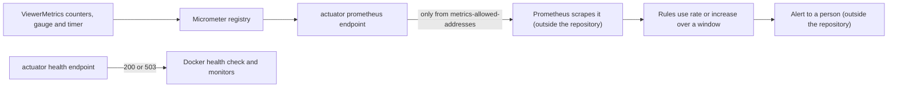
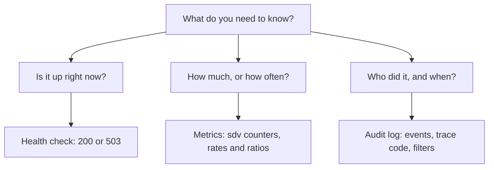

<!-- chapter: 35 | part: V | owner: writer-production | tag: book-m5-platform, book-m6-final | status: expanded -->
# Chapter 35: Health, metrics and alerting

Once the app is running for other people, you can't watch it by staring at a terminal. Nobody is sitting next to the server when a reader gets a blank page at 2 a.m., and the person who eventually hears about it will want an answer to a simple question: what was the app doing at that moment? This chapter shows how the Secure Document Viewer reports on itself. A health check says whether it is alive. A set of counters says what it is doing and how often. The audit log says who did it. Together they let you notice a problem before a user reports it, and diagnose it after.

## Learning objectives

By the end of this chapter, you will be able to:

- Explain the difference between a health check, a metric, and an audit event, and pick the right one for a question.
- Read the project's health endpoint and explain why it reports only a status.
- Name every `sdv_*` metric the app exports and say what a rise in each one means.
- Read a raw metrics page, and turn counters into rates with the Prometheus functions `rate()` and `increase()`.
- Choose alert conditions for sign-in lockouts, rate limiting, and render trouble, and say what a person does first when each fires.
- Explain why the metrics endpoint is restricted by network address and how that restriction is enforced.

## Prerequisites

- Chapter 11: Spring Boot foundations (starters and configuration files).
- Chapter 16: the sign-in throttle (section 16.6).
- Chapter 27: the audit trail.
- Chapter 32: forged headers and the trust boundary.
- Chapter 33: the compose stack and the proxy in front of the app.

## Beginner tier: Three ways an app talks about itself

### 35.1 The analogy: a car's dashboard

A car has three kinds of feedback. The "check engine" light answers a yes-or-no question: is something wrong right now? The gauges (speed, temperature, fuel) answer "how much?" and let you notice a trend, such as the temperature creeping up over ten minutes. In a delivery company's fleet there is also a trip log that records who drove which vehicle, where, and when.

The app has all three. The health check (Chapter 30) is the light, **metrics** are the gauges, and the **audit log** is the trip log. Each answers a different question, and using the wrong one is a common beginner mistake: a light can't tell you a trend, and a gauge can't tell you who was driving.

The analogy breaks down in an important place. A driver sees the dashboard without doing anything. The app's numbers are invisible until a program reads them on a schedule, stores them, and compares them to a rule. That is why this chapter also covers a scraper and alerts. Without them, the numbers exist and nobody sees them.

### 35.2 Terms you need

- **Operations** (often shortened to "ops"): the work of keeping software running for its users after it has been built.
- **Observability:** how well you can tell what a running system is doing from the outside, using the signals it produces.
- Actuator (Chapter 28): the Spring Boot module that adds operational endpoints, such as health and metrics, to an app. You met Spring Boot starters in Chapter 11; Actuator is one of them.
- Health check (Chapter 30): a URL that answers "are you working?" with a status code. Docker, load balancers, and monitors call it repeatedly.
- **Metric:** a named number measured over time, such as "tiles served so far".
- **Counter:** a metric that only goes up (until the app restarts). You care about how fast it rises, not its absolute value.
- **Gauge:** a metric that goes up and down, such as the number of renders currently winding down.
- **Timer:** a metric that records how long something took, and how many times it happened.
- **Metric tag** (also called a label): a name and value attached to a metric so one metric can be split into series, such as `outcome="failure"` on the sign-in counter.
- **Micrometer:** the library Spring Boot uses inside the app to record metrics. It is neutral about where they go.
- **Prometheus:** a monitoring system that periodically fetches ("scrapes") metrics from a URL and stores them as time series. It is a separate program from your app.
- **Scrape interval:** how often Prometheus fetches the numbers, commonly every 15 or 30 seconds.
- **Alert:** a rule that notifies a person when a metric crosses a threshold for long enough.
- **Audit event:** a stored record of a security-relevant action, with who, what, and when (Chapters 14 and 27).

### 35.3 A first look: the health check

The simplest thing you can ask a running app is "are you alive?" Ask it now, if you have the stack from Chapter 33 running:

```bash
curl -i http://localhost:8081/actuator/health
```

The `-i` flag makes `curl` print the response headers as well as the body. On a healthy stack you see a `200` status line and a body like `{"status":"UP"}`. That is everything the endpoint says. It does not list the database, the disk, or the version of anything. Section 35.8 explains why that restraint is deliberate.

Now think about who calls this URL. You do, occasionally. But mostly a machine does, every few seconds, forever: Docker, to decide whether a container is healthy, and any external monitor you add. A health check is a question meant for machines, which is why its answer is a status code. A `200` means "yes"; a `503` means "no". Machines don't need prose.

## Intermediate tier: What the app exposes

*On a first read you can skip to "In this project"; return here when you set up monitoring.*

### 35.4 Turning Actuator on, and only as far as needed

Actuator can expose many endpoints, and many of them are dangerous on a public network: environment variables, configuration, a heap dump. The project turns on exactly two. Here is the relevant part of `application.yml`.

**Listing 35.1 — `src/main/resources/application.yml`, `book-m6-final` (excerpt: the `management` block only)**

```yaml
management:
  endpoints:
    web:
      exposure:
        # Health (status only) and Prometheus metrics. nginx proxies only the bare
        # health status; metrics are limited to metrics-allowed-addresses.
        include: health,prometheus
  endpoint:
    health:
      show-details: never
      probes:
        enabled: true
```

Read it line by line:

- `include: health,prometheus` lists the only endpoints that exist. Anything not listed, such as `env` or `heapdump`, is not exposed at all. You can see the effect in the PR #3 live test: `/actuator/env` returned `401`, not the environment.
- `show-details: never` means the health response contains a status and nothing else, even for a signed-in administrator.
- `probes: enabled: true` also switches on two narrower checks, `/actuator/health/liveness` ("is the process running?") and `/actuator/health/readiness` ("is it ready for traffic?"). Orchestration systems distinguish the two. This project runs one container per service and uses only the plain health URL.

### 35.5 How the health status is decided

Health is a summary of small checks called health indicators. Spring Boot ships indicators for the database connection, disk space, and other things it finds on the classpath. When any indicator is down, the overall status is `DOWN` and the HTTP status becomes `503` (Service Unavailable). That gives a monitor a single thing to look at.

<!-- source: PR #3 body "Test plan" (live health test) -->
The project's authors tested this live during Phase 3 (PR #3): the endpoint showed `UP`, then `DOWN` with a `503` when MySQL was stopped, then `UP` again after MySQL restarted. That test matters because it proves the check is connected to something real. A health endpoint that always answers `200` is worse than none, because it gives false comfort.

Two places use the same URL:

- **Docker.** In `docker-compose.yml` the `app` service has this health check: `curl -fsS -o /dev/null http://localhost:8080/actuator/health`, every 10 seconds, with a 60-second `start_period` (time the app is allowed to spend starting up before failures count) and 6 retries. The `-f` flag makes `curl` exit with an error on an HTTP failure status, which Docker reads as unhealthy. The `web` service declares `depends_on: app: condition: service_healthy`, so nginx doesn't start until the app is healthy.
- **nginx.** `frontend/nginx.conf` has a `location = /actuator/health` block that proxies exactly that one path. The `=` means exact match, so `/actuator/health/liveness` or `/actuator/prometheus` are not forwarded. From outside, only the bare status is reachable.

### 35.6 Micrometer and Prometheus: how numbers leave the app

Inside the app, code records measurements through Micrometer. Micrometer doesn't store anything long-term; it holds current values in memory and hands them to whichever monitoring system you attach. Here the system is Prometheus, so the app exposes a page, `/actuator/prometheus`, that lists every current value in a plain-text format.

Prometheus works by **pulling**: every scrape interval it fetches that page, notes the time, and stores each number as a point in a time series. The app never pushes. Two consequences follow:

1. **A restart resets counters to zero.** Prometheus copes, because its `rate()` function treats a drop as a reset and continues, but an absolute counter value alone tells you little.
2. **The app must be reachable by Prometheus.** That is why the endpoint's access rule (section 35.9) matters.

Let's look at what the page contains. This is an **illustrative** sample, not captured from a run, with values invented to show the shape. The real page also includes hundreds of JVM and HTTP metrics.

```text
# HELP sdv_tiles_served_total Watermarked tiles returned
# TYPE sdv_tiles_served_total counter
sdv_tiles_served_total 18432.0
# HELP sdv_sign_in_total Sign-in attempts by outcome
# TYPE sdv_sign_in_total counter
sdv_sign_in_total{outcome="success"} 214.0
sdv_sign_in_total{outcome="failure"} 9.0
sdv_sign_in_total{outcome="locked"} 0.0
# HELP sdv_render_seconds Time to render a whole PDF into tiles
# TYPE sdv_render_seconds summary
sdv_render_seconds_count 31.0
sdv_render_seconds_sum 118.6
```

Line by line: `# HELP` is the description the code registered; `# TYPE` says what kind of metric it is; each following line is `name{tags} value`. Notice three naming rules. First, dots in the code become underscores (`sdv.tiles.served` becomes `sdv_tiles_served`). Second, Prometheus appends `_total` to counters. Third, a timer is exported as separate `_count` and `_sum` series (plus a `_max` value), from which you compute an average.

Also notice that `sdv_sign_in_total` has all three outcomes even though `locked` has never happened. The constructor of `ViewerMetrics` registers every outcome up front, with the comment "Registered up front so every outcome is exported as 0 before it first happens". This matters for alerting. A series that doesn't exist yet can't be compared with anything, and a rule written against it silently never fires. Starting each series at zero avoids that trap.

<!-- source: ViewerMetrics.java, SecurityConfig.java, application.yml at book-m6-final -->
Figure 35.1 follows a measurement from the code that counts it to the person who is alerted. The two boxes marked "outside the repository" are yours to set up.



*Figure 35.1 — From a counter in the code to an alert, and the separate health path*

Notice the address rule on the way to Prometheus and the fact that health takes a separate, simpler path: a status code for machines, no numbers.

### 35.7 The app's own metrics, one by one

Besides the usual JVM, HTTP, and connection-pool metrics that Spring Boot supplies, the app records its own. They are all defined in one class, `ViewerMetrics`. Its Javadoc states the purpose in one sentence: they let an on-call person tell "a scraper is hammering tiles" or "sign-ins are being brute-forced" from "rendering has become slow". Its last line is a rule worth remembering: "Counts only; who did what lives in the audit log."

Here are the class's real registrations.

**Listing 35.2 — `ViewerMetrics.java`, `book-m6-final` (excerpt: the counter and timer registrations in the constructor; the fields, the sign-in loop, and the methods that increment them are omitted)**

```java
this.tilesServed = Counter.builder("sdv.tiles.served")
        .description("Watermarked tiles returned").register(registry);
this.tilesRateLimited = Counter.builder("sdv.tiles.rate_limited")
        .description("Tile requests refused by the per-user rate limit").register(registry);
this.rendersRejected = Counter.builder("sdv.render.rejected")
        .description("Uploads refused with 503 because every render slot stayed busy").register(registry);
this.tilesBusy = Counter.builder("sdv.tiles.busy")
        .description("Tile requests refused with 503 because the server-wide tile limit was reached").register(registry);
this.rendersTimedOut = Counter.builder("sdv.render.timed_out")
        .description("Uploads rejected because rendering exceeded render-timeout").register(registry);
this.renderTime = Timer.builder("sdv.render")
        .description("Time to render a whole PDF into tiles").register(registry);
```

Each `Counter.builder(name)` creates a counter, `.description` supplies the `# HELP` text, and `.register(registry)` adds it to the registry that the Prometheus page reads. Elsewhere the code calls, for example, `metrics.tileServed()` in `TileController` when a tile is returned.

Table 35.1 lists every project metric, with what it counts and what a change means.

**Table 35.1 — The app's own metrics at `book-m6-final`**

| Prometheus name | Kind | Incremented when | What a rise tells you |
|---|---|---|---|
| `sdv_tiles_served_total` | counter | A watermarked tile is returned (`TileController`) | Reading traffic. The baseline that every other tile metric is compared with |
| `sdv_tiles_rate_limited_total` | counter | A tile request is refused with `429` by the per-user limit | A reader hit the limit, or a client is pulling tiles fast |
| `sdv_tiles_busy_total` | counter | A tile request is refused with `503` because the server-wide tile limit was reached (`TileWorkLimiter`) | The CPU is saturated by many simultaneous readers; the viewer retries, so users see slowness, not errors |
| `sdv_sign_in_total{outcome="success"}` | counter | A sign-in succeeds | Normal use |
| `sdv_sign_in_total{outcome="failure"}` | counter | A password is wrong | Typing mistakes, or guessing |
| `sdv_sign_in_total{outcome="locked"}` | counter | A sign-in is refused because a throttle rule is over its limit | Guessing serious enough to trip a rule, or a real user locked out |
| `sdv_render_seconds_count` and `_sum` | timer | A PDF finishes rendering | Upload volume; average render time is `_sum / _count` |
| `sdv_render_rejected_total` | counter | An upload is refused with `503` because every render slot stayed busy | Render capacity is too small for the upload rate |
| `sdv_render_timed_out_total` | counter | A render exceeds `render-timeout` (default 3 minutes) | A pathological or enormous PDF |
| `sdv_render_abandoned_running` | gauge | (Current value) renders abandoned after a timeout but still stopping | A hostile page is holding a render slot; see below |

The last row deserves a paragraph, because it records a real design compromise. When a render exceeds `render-timeout`, the app rejects the upload and abandons the render at its next page boundary. The render can't be killed instantly, so it still holds its render slot until it actually stops. This is on purpose: if abandoned renders freed their slots immediately, hostile uploads could pile up CPU and memory. The gauge `sdv_render_abandoned_running` shows how many such renders are still winding down. A value above zero for a long time means one page is taking very long to finish, and the README's Limitations section tells you to watch this gauge.

### 35.8 Why health reports only a status

A public endpoint should answer yes or no and nothing else. Detailed health output can name your database host, your disk layout, and library versions. To an attacker that is a map. So the project sets `show-details: never`, and the compose file and nginx expose only the bare status. If you need details when debugging, you read the container logs or use the metrics, which sit behind an address rule rather than in public.

### 35.9 Restricting the metrics endpoint

Metrics are more revealing than health. The names alone show which features exist, and rates show how busy the service is and when. So the metrics page is not public. Here is the rule in `SecurityConfig` (the same file you read in Chapter 32):

```java
.requestMatchers(HttpMethod.GET, "/actuator/prometheus")
        .access(fromAddresses(properties.getMetricsAllowedAddresses()))
```

`fromAddresses` is a small method in the same class. It turns a list of address ranges (in CIDR notation, such as `127.0.0.1/32`, which means exactly one address) into matchers and allows a request only if it matches at least one. It judges by the request's connection address, meaning the address of whoever actually opened the TCP connection to the app, not by `X-Forwarded-For`, which a caller can forge (Chapter 32). The default, from `application.yml`, is `127.0.0.1/32,::1/128`: loopback only, in both IP versions. In production you set `METRICS_ALLOWED_ADDRESSES` to your Prometheus server's address.

Two things protect the endpoint at once: nginx never proxies the path, and the app refuses any address not on the list. If either alone failed, the other would still hold. This layering is called defense in depth (Chapter 28).

<!-- source: PR #5 body "Operations" (TM-12) -->
The endpoint came from a finding by the Senior Technical Manager review agent (Chapter 32), which asked for operational visibility without exposing it to the world.

## Advanced tier: Deciding what to alert on

*On a first read you can skip to "In this project".*

### 35.10 Rates, not totals

A counter is a running total since the last restart, so its raw value is nearly useless: "18,432 tiles served" says nothing about whether that happened in an hour or a month. What you want is a **rate**, how fast the counter rises. Prometheus gives you two functions for this. They belong to Prometheus's query language, PromQL, and the examples below are the book's own illustrations, not queries stored in the repository.

*Pattern note: Rates, errors and durations are the RED idea (Chapter 39, Section 39.15).*

- `increase(sdv_sign_in_total{outcome="failure"}[15m])` is how many failed sign-ins happened in the last 15 minutes.
- `rate(sdv_tiles_served_total[5m])` is tiles per second, averaged over the last 5 minutes.

The window in square brackets matters. A short window reacts quickly and is noisy; a long window is smooth and slow. The sign-in throttle in this app works over a 15-minute window (section 16.6), so a 15-minute window in the alert matches how the app itself thinks.

You can also divide one series by another to get a **ratio**, which is often the most useful signal:

```text
rate(sdv_tiles_rate_limited_total[15m]) / rate(sdv_tiles_served_total[15m])
```

That expression is the share of tile requests that were refused by the limit, relative to those served. One refused request among a thousand is background noise. Twenty in a hundred means readers are being hurt.

### 35.11 An alert is a decision, not a graph

An alert that fires all the time trains people to ignore it. The point of an alert is to interrupt a person, so it should fire only when a person should do something. A good alert states four things: the condition, how long it must hold (so a single blip doesn't page anyone), what it means, and what to do first.

The README's go-live checklist names three signals to alert on. Each maps to a threat from Chapter 32.

**Alert 1: sign-in lockouts (`sdv_sign_in_total{outcome="locked"}`).**

- Condition idea: more than a handful of `locked` outcomes in 15 minutes.
- Meaning: either someone is guessing passwords hard enough to trip a throttle rule, or a real user has been locked out.
- First step: open the admin audit log and filter for the lockout event. The event records which rule fired (`rule=account-wide`, for example) and the address. A single address suggests guessing. The account-wide rule means the account is being attacked from many addresses, and its owner may be locked out from a new device until the window passes or an administrator presses Unlock (Chapter 32).

**Alert 2: rate limiting (`sdv_tiles_rate_limited_total`).**

- Condition idea: the refused share of tile requests above an agreed percentage for 15 minutes.
- Meaning: either the limit is too tight for how readers really read, or a client is pulling tiles faster than any human would.
- First step: check whether one user accounts for it (the audit log records a `RATE_LIMITED` event at most once per user per window). One user pulling all the time looks like a script. Many users each hitting the limit occasionally means the limit is set too low. The product owner's sign-off on the rate-limit defaults (September 19, 2026) says exactly this: revisit them using this number.

**Alert 3: render trouble (`sdv_render_rejected_total`, `sdv_render_timed_out_total`, `sdv_render_abandoned_running`).**

- Condition idea: any rejected uploads at all, or the abandoned gauge above zero for more than a few minutes.
- Meaning: publishers are being refused, either because capacity is too low for the upload rate or because a file is pathological.
- First step: look at `sdv_render_seconds` (average time is `_sum / _count`) and the application log for the document that timed out.

Pick thresholds from a week of real traffic. The counters give you the baseline, and a threshold chosen without one is a guess.

### 35.12 Reading the metrics together: three scenarios

Signals are more useful in combination. These scenarios are teaching examples built from the metrics above, not incidents from the project.

*Scenario A: a sudden rise in `sdv_tiles_rate_limited_total`, flat `sdv_tiles_served_total`.* Tiles are being refused but reading traffic is not growing. One client is hitting the limit repeatedly while others read normally. Look for one user in the audit log. That pattern fits a script.

*Scenario B: `sdv_tiles_busy_total` rising along with high CPU and normal sign-ins.* No one is misbehaving; many readers are active at once and the server-wide tile cap is the limit. The viewer retries these `503` responses, so users feel slowness. The fix is capacity or a higher `max-concurrent-tile-renders`, not blocking anyone.

*Scenario C: `sdv_sign_in_total{outcome="failure"}` rising steeply, `locked` rising, `success` flat.* A guessing attack. Check the rule that fired, then the addresses.

### 35.13 The audit log as the third signal

Metrics say something happened; the audit log says who and when. It records sign-ins and failures, lockouts, password and account changes, uploads, edits, shares and deletes, denied access, and throttling. Two volume controls keep it useful:

- `PAGE_VIEWED` is recorded once per session, document, and page every 10 minutes rather than for every tile. Recording every tile would bury everything else. The enum's own comment says so.
- `ACCESS_DENIED` events are capped per user, so a flood of forbidden requests can't fill the table.

Each watermark also carries a six-character trace code. Typing it into the audit log's trace filter finds the exact sign-in behind a leaked screenshot (Chapter 32). Events older than 180 days are purged nightly (Chapter 34).

The three signals answer different questions, so use them in order. An alert (metric) tells you that something is wrong. The health check tells you whether the service is up. The audit log tells you who did it. Beginners often try to answer "who" from metrics, which by design contain no names. The design keeps personal information out of the monitoring system and behind the application's own access control.

Figure 35.2 puts the three signals side by side, as a way to choose the right one.

<!-- source: application.yml (health and prometheus endpoints), ViewerMetrics.java, AuditEventType.java at book-m6-final -->


*Figure 35.2 — Choosing between the health check, the metrics, and the audit log*

## Common mistakes

- **Alerting on a total instead of a rate.** "More than 1,000 tiles served" fires forever after the first busy day. Use `rate()` or `increase()`.
- **A health check that can't fail.** If the endpoint answers `200` even when the database is down, monitors see nothing. The project tested the `503` path on purpose.
- **Exposing the metrics endpoint to the internet.** Symptom: strangers can read your traffic pattern. Fix: keep `METRICS_ALLOWED_ADDRESSES` to the scraper's address, and don't add a proxy rule for `/actuator/prometheus`.
- **Forgetting that a restart resets counters.** Symptom: a graph drops to zero after a deploy and someone reports an outage. `rate()` handles resets; the raw counter doesn't.
- **Trusting `X-Forwarded-For` for the metrics rule.** The rule uses the connection address on purpose; a rule that believed the header could be satisfied by any caller.
- **Setting thresholds before seeing traffic.** Symptom: an alert that fires daily and is muted within a week. Collect baseline data first.

## In this project

| Path | First appears | What it does |
|---|---|---|
| `src/main/java/com/example/securedocviewer/service/ViewerMetrics.java` | `book-m5-platform` | Registers and increments every `sdv_*` metric |
| `src/main/java/com/example/securedocviewer/security/SecurityConfig.java` | `book-m1-accounts`, hardened by `book-m5-platform` | Health public, metrics by address |
| `src/main/resources/application.yml` (`management`, `metrics-allowed-addresses`) | `book-m3-hardening`, extended by `book-m5-platform` | What Actuator exposes and who may scrape |
| `frontend/nginx.conf` | `book-m5-platform` | Forwards only `/actuator/health` |
| `docker-compose.yml` | `book-m5-platform` | Container health checks |
| `src/main/java/com/example/securedocviewer/audit/AuditEventType.java` | `book-m2-documents` | The audit event vocabulary |

See any of them with `git show book-m6-final:<path>`.

## Try it

### Exercise 35.1 ★ Health, metric, or audit?

For each question, say which of the three signals answers it best: "is the database reachable?", "how many tiles were served today?", "who opened document X?", "are uploads being refused?".

### Exercise 35.2 ★ Read the page

Using the sample metrics page in section 35.6, compute the average render time in seconds, and say how many failed sign-ins are recorded.

### Exercise 35.3 ★★ Read the rule

Explain in your own words what `fromAddresses(...)` does, why it judges by the connection address rather than `X-Forwarded-For`, and what would happen if `METRICS_ALLOWED_ADDRESSES` were left at its default while Prometheus ran in another container.

### Exercise 35.4 ★★ Which metric?

A publisher reports that uploads sometimes fail with a "server busy" message. Name the metric that confirms it, the setting that governs it, and one way to reduce it.

### Exercise 35.5 ★★★ Design an alert

Write an alert for `sdv_sign_in_total{outcome="locked"}`: a condition with a window, how long it must hold, what it means, and the first three things a person does when it fires.

### Exercise 35.6 ★★★ Explain the zero

Explain why `ViewerMetrics` registers all three sign-in outcomes in its constructor, and what could go wrong in an alert rule if it did not.

## Summary

- A health check says alive or not, metrics say how much and how often, and the audit log says who.
- Health is public but minimal (`show-details: never`, exact-match proxying); metrics are restricted by address, twice over.
- Micrometer records inside the app; Prometheus pulls the numbers by scraping `/actuator/prometheus`.
- Counters are totals; alert on rates and ratios computed with `rate()` and `increase()`.
- The app's own metrics map onto the threats in Chapter 32: guessing (sign-in), harvesting (rate limiting), and overload (renders and busy tiles).
- Choose alert thresholds from real traffic, and write down what a person does first when each fires.

Chapter 36 turns to the code and images you don't write yourself: dependencies, scanning, and CI.

## Further reading

- Spring Boot reference, Actuator: https://docs.spring.io/spring-boot/reference/actuator/
- Micrometer documentation: https://docs.micrometer.io/
- Prometheus documentation, querying basics: https://prometheus.io/docs/prometheus/latest/querying/basics/
- Prometheus documentation, alerting rules: https://prometheus.io/docs/prometheus/latest/configuration/alerting_rules/
