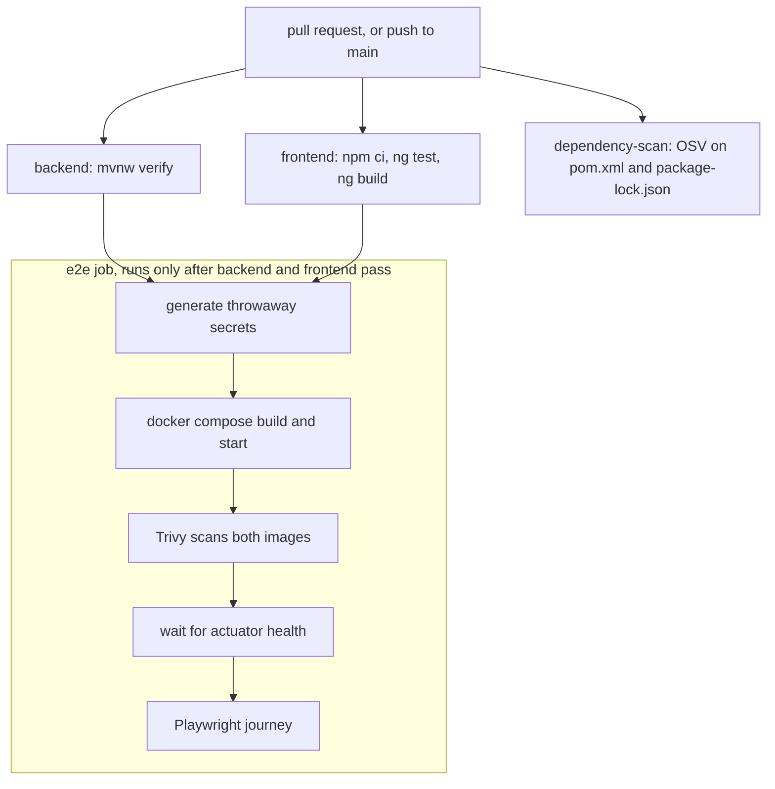
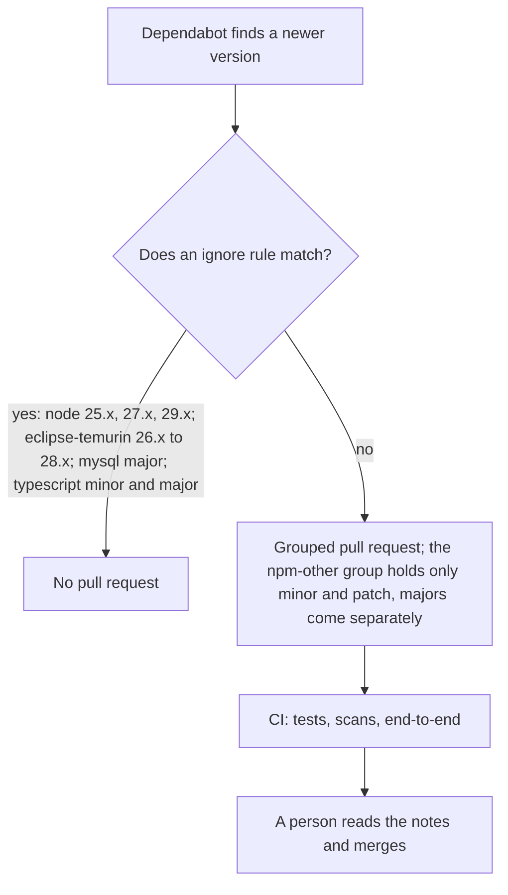

<!-- chapter: 36 | part: V | owner: writer-production | tag: book-m5-platform, book-m6-final | status: expanded -->
# Chapter 36: Supply chain and CI

Most of the code in a running app is code you didn't write: libraries, base images, build tools. You trust it because it's popular, but popular software has flaws too, and a flaw in a library you use is a flaw in your app. This chapter shows how the project checks that code automatically on every change, how it keeps updates coming without letting a surprise upgrade in, and what it looks like when the machinery catches a real problem.

## Learning objectives

By the end of this chapter, you will be able to:

- Explain what supply-chain risk is, with an example from this project.
- Read the project's GitHub Actions workflow and say what each job proves and what it does not.
- Explain why images are pinned by digest and actions by commit SHA, and what pinning costs.
- Distinguish what the OSV scan and the Trivy scan each look at.
- Read Dependabot's LTS-only rules and say why each rule exists.
- Decide what to do when a scan fails.

## Prerequisites

- Chapter 6: Maven (dependencies, `pom.xml`, the wrapper).
- Chapter 7: Git and GitHub (branches, pull requests).
- Chapter 20: npm and `package-lock.json`.
- Chapter 30: the platform milestone (Docker images and the end-to-end test).

## Beginner tier: What is the supply chain?

### 36.1 The analogy: ingredients in a kitchen

A restaurant is only as safe as its ingredients. The chef can wash every dish perfectly, but if the flour was contaminated at the mill, customers get sick, and the chef didn't do anything wrong. Your app's ingredients are libraries (Spring, Angular, PDFBox), base images (Java, nginx, MySQL), and the tools that build it. **Supply-chain risk** is the chance that one of them is flawed or malicious.

**Where the analogy breaks down:** in three places. Software ingredients change constantly, so an ingredient that was safe on Monday can have a published flaw by Friday. You also inherit ingredients-of-ingredients without ever choosing them: a library you add pulls in libraries of its own. And unlike flour, a flawed library can be fixed with a new version that costs nothing, if you know about it and can adopt it safely. The whole chapter is about knowing and adopting.

### 36.2 Terms you need

- Dependency (Chapter 6): a library your code uses, listed in `pom.xml` (Java) or `package.json` (JavaScript).
- **Transitive dependency:** a dependency of a dependency. You don't list it, but you ship it.
- **Vulnerability:** a flaw in software that an attacker can exploit.
- **Advisory:** a published notice that a version of some software has a vulnerability, usually with a fixed version. Advisories have identifiers such as `GHSA-...` (GitHub) or `CVE-...`.
- **Lockfile:** a file that records the exact version of every dependency, including transitive ones, so builds are repeatable. For npm it is `package-lock.json`.
- **CI (continuous integration):** a server that builds and tests your project automatically on every change.
- **GitHub Actions:** GitHub's CI service. A **workflow** is a YAML file in `.github/workflows/`. It has **jobs** (which run on separate machines), each made of **steps** (which run one after another).
- Digest (Chapter 10): a long hash, like `sha256:97014c...`, that identifies exactly one version of a container image. An **image tag** such as `24-alpine` is a friendly name that can be moved to a different image later.
- **Commit SHA:** the hash that identifies exactly one commit; used to pin an action to reviewed code.
- Dependabot (Chapter 31): a GitHub service that opens pull requests when newer versions of your dependencies appear.
- **LTS (long-term support):** a release line that receives security fixes for years, unlike short-lived releases.
- **Reproducible build:** building twice from the same inputs gives the same result. Pinning is how you approach this.

### 36.3 A real case: the Tomcat advisories

The abstract risk became concrete during the project's final review rounds. Spring Boot 4.1.1, the framework version the project uses, ships with a particular version of Tomcat (the web server library inside Spring Boot). That version, 11.0.24, had three published critical advisories. Nothing in the project's own code was wrong. The problem was one of the ingredients.

<!-- source: dossier/bugs-and-findings.md G9; commit f682716; pom.xml at book-m6-final -->
The fix was a single line in `pom.xml`, with a comment that explains it. Here it is.

**Listing 36.1 — `pom.xml`, `book-m6-final` (excerpt: the Tomcat override in `<properties>`)**

```xml
<!-- Boot 4.1.1 ships Tomcat 11.0.24 (GHSA-9xv2-5v5q-p794, GHSA-gcx9-497g-6cp6,
     GHSA-h3x4-894j-xpx5, all critical). Drop this once Boot manages 11.0.25+. -->
<tomcat.version>11.0.26</tomcat.version>
```

Read it as a small piece of engineering practice. The property `tomcat.version` overrides the version that Spring Boot manages for the Tomcat libraries. The comment names the three advisories, so the next person knows why the override exists, and says when to remove it, so the override doesn't outlive its reason. An override with no comment becomes a mystery that nobody dares delete.

The lesson is worth stating: a framework release can lag its own dependency's security fixes, so you can't rely on the framework alone. You need something that looks at what you actually ship. That something is the OSV scan in Section 36.6.

## Intermediate tier: The workflow

*On a first read you can skip to "In this project"; the workflow is worth reading once you have your own repository.*

### 36.4 What CI runs

The file `.github/workflows/ci.yml` (the same at `book-m5-platform` and `book-m6-final`) has four jobs. It runs on every pull request and on every push to `main`. Two settings at the top are worth understanding before the jobs.

```yaml
permissions:
  contents: read

concurrency:
  group: ci-${{ github.ref }}
  cancel-in-progress: true
```

`permissions: contents: read` gives the workflow's token read-only access to the repository, so even a compromised step can't push code. This is the principle of **least privilege**: give a process only what it needs. `concurrency` with `cancel-in-progress` means that if you push again while an earlier run is still going, the older run is canceled. Otherwise stale runs would queue up and waste minutes.

**Table 36.1 — CI jobs**

| Job | What it runs | What it proves |
|---|---|---|
| Backend tests | `./mvnw -B verify` on Java 25 | Unit and integration tests pass (H2 in MySQL mode, and MySQL 8.4 through Testcontainers, because the runner has Docker) |
| Frontend tests and build | `npm ci`, `ng test`, `ng build --configuration production` on Node 24 | Frontend tests pass and the production build compiles |
| Known-vulnerability scan (OSV) | The OSV scanner on `pom.xml` and `frontend/package-lock.json` | No Maven or npm dependency, including transitive ones, has an advisory known to the OSV database on the day the job ran |
| End-to-end (Docker stack) | Builds the full stack with throwaway secrets, scans both images with Trivy, then runs Playwright | The real containers work together, contain no fixable HIGH, or CRITICAL vulnerabilities, and the browser journey succeeds |

The `e2e` job declares `needs: [backend, frontend]`, so it starts only after both pass. That ordering saves time: there's no point building Docker images when a unit test has already failed.

<!-- source: .github/workflows/ci.yml at book-m6-final -->
Figure 36.1 shows how the four jobs relate. Any red node fails the run. GitHub shows the failed status on the pull request; whether a failure also blocks merging depends on branch protection or repository rulesets. On September 20, 2026, the project's private repository could not enable them (the GitHub API answered HTTP 403, "Upgrade to GitHub Pro or make this repository public"), so here a red run is a signal that the reviewer must honor, not a lock.



*Figure 36.1 — The CI jobs: three run in parallel, and the end-to-end job waits for two of them*

*Text description:* A pull request or push to main starts three jobs in parallel: backend tests, frontend tests and build, and the OSV dependency scan. The end-to-end job starts only after the backend and frontend jobs pass. Inside it, five steps run in order: generate throwaway secrets, build and start the Docker stack, scan both images with Trivy, wait for the health endpoint, and run the Playwright journey.

Notice that the dependency scan is not a gate for the end-to-end job; it runs alongside, and its failure still turns the whole run red.

### 36.5 The backend and frontend jobs, line by line

Here is the backend job in full.

**Listing 36.2 — `.github/workflows/ci.yml`, `book-m6-final` (excerpt: the `backend` job)**

```yaml
backend:
  name: Backend tests
  runs-on: ubuntu-latest
  steps:
    - uses: actions/checkout@3d3c42e5aac5ba805825da76410c181273ba90b1  # v7.0.1
    - uses: actions/setup-java@de7274f081f381c8f8158605e0321c36c376e2e6  # v6.0.1
      with:
        distribution: temurin
        java-version: '25'
        cache: maven
    # Unit + integration tests against in-memory H2 (MySQL mode); no services needed.
    - run: ./mvnw -B verify
```

- `runs-on: ubuntu-latest` picks the kind of virtual machine GitHub provides for the job.
- `actions/checkout` copies your repository onto that machine. Each `uses:` line runs a prebuilt **action**, a reusable step written by someone else. That makes actions part of your supply chain too, which is why they are pinned (Section 36.8).
- `actions/setup-java` installs a JDK. `distribution: temurin` and `java-version: '25'` match the version the project builds with. `cache: maven` saves the downloaded dependencies between runs so the job doesn't download the internet each time.
- `./mvnw -B verify` runs the Maven wrapper (Chapter 6, which pins Maven 3.9.16) in **batch mode** (`-B`, which suppresses interactive-terminal noise in logs). `verify` runs the whole lifecycle through the tests. The comment records that these tests need no extra services; the MySQL test starts its own database through Testcontainers.

The frontend job is parallel in structure: `actions/setup-node` with Node 24, then `npm ci`, `npx ng test --watch=false`, and `npx ng build --configuration production`. Notice `npm ci`, not `npm install`. `npm ci` installs exactly what `package-lock.json` says and fails if `package.json` and the lockfile disagree. `npm install` may quietly update the lockfile. In CI you want the first behavior: the build must use the versions you reviewed.

### 36.6 OSV and Trivy: two different scans

They look at different things, so the project runs both.

**OSV** ("Open Source Vulnerabilities") reads your dependency lists and checks every library and version against a database of published advisories. Here is the job.

**Listing 36.3 — `.github/workflows/ci.yml`, `book-m6-final` (excerpt: the `dependency-scan` job's command; the image digest is shortened here)**

```yaml
# Fails the build if any Maven or npm dependency (including transitive
# ones) has a published vulnerability.
- run: >
    docker run --rm -v "$PWD:/src:ro" ghcr.io/google/osv-scanner:v2@sha256:afd838...
    scan source --lockfile=/src/pom.xml --lockfile=/src/frontend/package-lock.json
```

The scanner itself runs as a container (`docker run --rm`), pinned by digest. It mounts the repository read-only (`:ro`) at `/src`, so the scanner can read your files but can't change them. It scans two inputs: `pom.xml` for the Java side and `package-lock.json` for the JavaScript side. It exits with an error if it finds any advisory, and that error fails the job, which shows as a failed check on the pull request.

**Trivy** scans something different: the *built container images*. An image contains an operating system (packages like `libssl`), a Java runtime, and your application. A flaw can hide in an operating system package that neither `pom.xml` nor `package-lock.json` mentions, and only an image scan sees it.

**Listing 36.4 — `.github/workflows/ci.yml`, `book-m6-final` (simplified: in the file, the `docker run` command is one long line whose arguments are separated by runs of spaces; here it is broken across lines with backslashes added, the leading indentation is reduced, and the image digest is shortened)**

```yaml
- name: Scan the built images for OS and library vulnerabilities
  # Fails on any HIGH/CRITICAL vulnerability that has a fix available.
  run: |
    for image in secure-doc-viewer-app secure-doc-viewer-web; do
      docker run --rm -v /var/run/docker.sock:/var/run/docker.sock \
        aquasec/trivy:0.74.0@sha256:62b1e6... \
        image --scanners vuln --severity HIGH,CRITICAL --ignore-unfixed --exit-code 1 "$image"
    done
```

Line by line: the `for` loop scans the two images the compose build produced. Trivy runs in its own container, and mounting `/var/run/docker.sock` lets it read images from the host's Docker engine. `--scanners vuln` limits it to vulnerabilities (Trivy can also look for leaked secrets and misconfigurations). `--severity HIGH,CRITICAL` ignores lower-severity findings, so the build fails only on serious ones. `--ignore-unfixed` skips flaws for which no fixed version exists yet, because you can't act on those. `--exit-code 1` makes any remaining finding fail the step.

Two of those options are deliberate trade-offs, and it helps to name them. Failing only on HIGH and CRITICAL keeps the signal strong: if every low-severity note failed the build, people would learn to ignore red builds. Ignoring unfixed findings keeps the build actionable: a red build should always mean "there is something you can do." The cost is that a serious unfixed flaw doesn't turn the build red, so a person still has to keep an eye on the advisories for the software they run.

### 36.7 Throwaway secrets in the end-to-end job

<!-- source: .github/workflows/ci.yml at book-m6-final; PR #5 body "CI and dependencies" -->
The end-to-end job needs a full running stack, and the stack needs secrets (Chapter 33). The job never uses real ones. It generates them fresh on every run:

```bash
rand() { openssl rand -hex "$1"; }
ADMIN_PASSWORD="$(rand 16)"
echo "::add-mask::$ADMIN_PASSWORD"
echo "E2E_ADMIN_PASSWORD=$ADMIN_PASSWORD" >> "$GITHUB_ENV"
```

`openssl rand -hex 16` prints 32 random hexadecimal characters. `::add-mask::` is a GitHub Actions command that replaces the value with asterisks anywhere it would appear in the logs, so a failing run can't leak it. Appending to `$GITHUB_ENV` makes the value available to later steps. The same step writes a `.env` file with the database passwords, the signing secret, and the bootstrap admin password, all random. The result: nothing real is stored in the repository, every run uses fresh secrets, and the run's containers disappear afterward.

After the stack builds, the job scans the images (Listing 36.4), then loops up to 60 times, five seconds apart, calling `http://localhost:8081/actuator/health` (Chapter 35) and continuing only when it answers. If the app never becomes healthy, the step prints the app's logs and fails. Only then does Playwright run: `npx playwright install --with-deps chromium` fetches the browser, and `npx playwright test` drives the journey from Chapter 24. On failure, the job prints the last 200 lines of the service logs and uploads the Playwright report for seven days (`retention-days: 7`), so you can see what the browser saw.

## Advanced tier: Pinning and update rules

*On a first read you can skip to "In this project."*

### 36.8 Pinning by digest and commit SHA

A tag like `mysql:8.4` can point to a different image tomorrow, because the image's maintainers can push a new build under the same tag. That is often what you want (security patches), but it means your build is no longer the one you tested. The project pins each base image by digest, for example `mysql:8.4@sha256:85b9bf...` in `docker-compose.yml`, and the same in both Dockerfiles. A rebuild then gets exactly the image that was reviewed, and Dockerfile comments say so: "Pinned by digest (Dependabot updates it) so a rebuild gets exactly the reviewed image."

*See also: The last mile on AWS (OpenID Connect and images by digest in ECR) is sketched in Chapter 41, Section 41.6.*

*Pattern note: Pinning by digest is infrastructure as code with immutable images (Chapter 39, Section 39.13).*

GitHub Actions get the same treatment. Look at a pinned line again:

```yaml
- uses: actions/checkout@3d3c42e5aac5ba805825da76410c181273ba90b1  # v7.0.1
```

The long hash is a commit SHA. The `# v7.0.1` comment is for humans; the workflow uses the hash. A tag on an action's repository can be moved by whoever controls that repository, and if it were moved to malicious code, every workflow using the tag would run it. A commit SHA can't be moved. Pinning to a SHA is the practice GitHub's own security guidance recommends for third-party actions (see Further reading); it is not a project incident.

**What pinning costs.** Updates are no longer automatic. If you pin and then forget, you stay on an old image and miss security patches. Pinning only works together with something that proposes new pins regularly, and that something is Dependabot.

### 36.9 Dependabot and the LTS-only rules

`.github/dependabot.yml` asks for weekly grouped update pull requests for Maven, npm, Docker, Docker Compose, and GitHub Actions. Grouping matters: without it, Dependabot opens one pull request per dependency, which is dozens a week. The `maven` group and the `angular` group each bundle related updates into a single reviewable PR. CI runs the full suite on each one, and that is what makes automatic proposals safe: a change reaches `main` only after the tests, the scans, and the end-to-end run pass.

<!-- source: PR #10 body; dossier/decisions.md D13; PRs #6, #7, #8; commit 8cdb129 -->
A week of Dependabot output exposed a gap. It proposed MySQL 26.7 (PR #6), Node 25 (PR #7), and a group with TypeScript 7, Vitest 5, and jsdom 30 (PR #8), and the last couldn't even install, because Angular 22 accepts only TypeScript `>=6.0 <6.1`. None of the three was a bug in Dependabot. Each was an upgrade the project didn't want: a non-LTS database release, a Node version that will never become LTS, and a bundle where one breaking change blocked the others. The project closed all three and replaced them with PR #10, which added rules.

<!-- source: .github/dependabot.yml at book-m6-final; PR 10 body -->
Figure 36.2 is the decision Dependabot now makes for each candidate update.



*Figure 36.2 — How the LTS-only rules filter Dependabot's proposals*

*Text description:* A decision flow. Dependabot finds a newer version and asks whether an ignore rule matches. If yes, for example a non-LTS Node or MySQL version or a TypeScript minor version, no pull request is opened. If no, a grouped pull request is opened, CI runs the tests, scans, and end-to-end run, and a person reads the release notes and merges.

**Table 36.2 — Dependabot rules from PR #10**

| Ecosystem | Rule | Why |
|---|---|---|
| Docker `node` | ignore 25.x, 27.x, 29.x | Odd Node majors never become LTS; 24 and 26 are LTS lines |
| Docker `eclipse-temurin` | ignore 26.x to 28.x | Java LTS is 25; the next is 29 |
| Compose `mysql` | ignore major bumps | Stay on the 8.4 LTS; 26.7 is an Innovation release; moving to 9.7 LTS is a deliberate upgrade with a migration test |
| npm `typescript` | ignore minor and major | Angular 22 accepts only TypeScript `>=6.0 <6.1`; it moves with Angular |
| npm `npm-other` group | minor and patch only | Majors arrive as separate PRs so one breaking upgrade can't hold back the rest |

Here is how the rules look in the file itself, for the docker ecosystem.

**Listing 36.5 — `.github/dependabot.yml`, `book-m6-final` (excerpt: the `docker` entry)**

```yaml
- package-ecosystem: docker
  directories: [/, /frontend]
  schedule:
    interval: weekly
  ignore:
    # Odd-numbered Node releases never become LTS (24 and 26 are LTS lines).
    - dependency-name: node
      versions: ['25.x', '27.x', '29.x']
    # Java LTS releases are 25, then 29: skip the non-LTS releases in between.
    - dependency-name: eclipse-temurin
      versions: ['26.x', '27.x', '28.x']
```

`directories: [/, /frontend]` tells Dependabot to look for Dockerfiles in both the repository root (the backend image) and `frontend/`. Each `ignore` entry names a dependency and the versions to skip.

Afterward, Vitest 5 (PR #11) and jsdom 30 (PR #12) arrived as separate pull requests and merged. This is the rules working as designed: a breaking major version is now a decision someone reads, tests, and merges on its own. jsdom 30's release notes, for example, raise the minimum Node version, which is exactly the kind of change you want to read deliberately rather than discover inside a group of twenty updates.

The general lesson: automated updates need rules about *which* versions you accept. Otherwise they generate work instead of saving it.

### 36.10 A flaky test on `main`

<!-- source: PR #9 body; commit ec6c1c5; dossier/bugs-and-findings.md C7 -->
Your CI can also catch a problem in *your own tests*. After PR #5 merged, CI on `main` failed once. The test `aRenderThatTakesTooLongIsAbandonedAndFreesItsSlot` asserted that every render slot was free at the same instant the second render returned. But the render thread frees its slot in a `finally` block that runs immediately after the caller receives its result. On a fast machine the assertion could land in that gap and read 0 free slots instead of 1.

PR #9 changed the test to wait up to 5 seconds for the counters to reach the expected value. It was a test-only change; production behavior was unchanged, since in production the slot frees microseconds after the upload returns. The fixed test passed five times in a row locally. The lesson is one to remember whenever you test code that uses several threads: never assert on state that another thread changes after your result is returned. Poll with a timeout instead.

### 36.11 When a scan fails: a decision procedure

A red scan is not a disaster, but it needs a decision. Here is a practical order, drawn from how the project handled the Tomcat case.

1. **Read the finding.** Which library or package, which version, which advisory, is there a fixed version?
2. **Is there a fixed version you can adopt?** If the fix is in a newer patch release, upgrade. For a transitive dependency, look for an override mechanism such as the `tomcat.version` property in Listing 36.1.
3. **Write down why.** A comment beside the override names the advisories and says when to remove it.
4. **Run the whole suite.** The tests and the end-to-end run tell you whether the upgrade broke anything.
5. **If there is no fix yet,** decide whether the flaw is reachable in your app, add a note where the team will see it, and check again when a fix appears. Trivy's `--ignore-unfixed` means this case won't turn the build red, so someone has to remember to look.

### 36.12 Common mistakes

- **Pinning without an update path.** Symptom: months later the images are old and a scan finds problems in them. Fix: keep Dependabot for the `docker` and `github-actions` ecosystems.
- **Using `npm install` in CI.** Symptom: CI passes with versions you never reviewed. Fix: `npm ci`.
- **Ignoring a red scan "because it is only a library."** Every library runs with your app's permissions. Read the advisory.
- **Adding an override and forgetting it.** Symptom: an old `tomcat.version` line pins you to a version older than what the framework now ships. Fix: always write the removal condition next to the override.
- **Broad permissions in a workflow.** Symptom: a compromised step can push code. Fix: start from `contents: read` and add only what a job needs.
- **Printing secrets in CI logs.** Fix: generate them at run time and mask them with `::add-mask::`, as the end-to-end job does.
- **Merging every Dependabot pull request without reading.** The scans and tests catch a lot, but they can't tell you whether a breaking major version fits your plans. Read the release notes for majors.

## In this project

| Path | First appears | What it does |
|---|---|---|
| `.github/workflows/ci.yml` | `book-m5-platform` | The four jobs in Table 36.1 |
| `.github/dependabot.yml` | `book-m5-platform`; LTS rules by `book-m6-final` | Weekly grouped updates and the rules in Table 36.2 |
| `pom.xml` (`tomcat.version`) | `book-m5-platform` | The Tomcat override (Listing 36.1) |
| `Dockerfile`, `frontend/Dockerfile`, `docker-compose.yml` | `book-m5-platform` | Digest-pinned base images |

See any of them with `git show book-m6-final:<path>`.

## Try it

### Exercise 36.1 ★ Which job?

For each, name the CI job that would catch it: a failing unit test; a vulnerable Maven library; an outdated operating system package in the nginx image; a broken sign-in screen.

### Exercise 36.2 ★ Read the pin

In `actions/checkout@3d3c42e5aac5ba805825da76410c181273ba90b1  # v7.0.1`, which part does the workflow use and which is only for humans? Why does it matter?

### Exercise 36.3 ★★ Why pin?

Explain what could go wrong if `actions/checkout` were referenced by tag and the tag was moved to malicious code, and which line near the top of the workflow limits the damage.

### Exercise 36.4 ★★ Read the flags

Explain what each of `--severity HIGH,CRITICAL`, `--ignore-unfixed`, and `--exit-code 1` does in the Trivy step, and describe one situation each flag hides from you.

### Exercise 36.5 ★★★ Handle a finding

Suppose the OSV job fails: a transitive Java dependency has an advisory fixed in a newer patch version, and the framework doesn't manage that version yet. Write the steps you would take, including what you would add to `pom.xml` and what comment you would write.

### Exercise 36.6 ★★★ Write a rule

This is a hypothetical: suppose a future Angular release accepted a newer TypeScript minor version than the one the project uses. Describe how the `typescript` rule in Table 36.2 (ignore minor and major updates) would treat that newer version when Dependabot finds it, and what a person would do when upgrading Angular.

## Summary

- Most of a running app is code you didn't write, so it needs checking on every change; the Tomcat advisories are the project's real example.
- CI runs tests, the production build, an OSV dependency scan, Trivy image scans, and a real end-to-end run, and each proves something different.
- OSV reads dependency lists; Trivy reads built images. A flaw can hide from one and not the other.
- Digests and commit SHAs make builds reproducible, and Dependabot pays their update cost.
- Update rules that follow LTS lines keep automation from generating breaking changes; breaking majors arrive one at a time.
- A red scan needs a decision procedure, not panic: read, upgrade or override, document, test.

Chapter 37 steps back and weighs every major decision in the app.

## Further reading

- GitHub Actions documentation: https://docs.github.com/en/actions
- GitHub Actions, security hardening (pinning and permissions): https://docs.github.com/en/actions/security-for-github-actions/security-guides/security-hardening-for-github-actions
- Dependabot options reference: https://docs.github.com/en/code-security/dependabot/working-with-dependabot/dependabot-options-reference
- OSV-Scanner: https://google.github.io/osv-scanner/
- Trivy: https://trivy.dev/docs/
- npm documentation, `npm ci`: https://docs.npmjs.com/cli/commands/npm-ci
