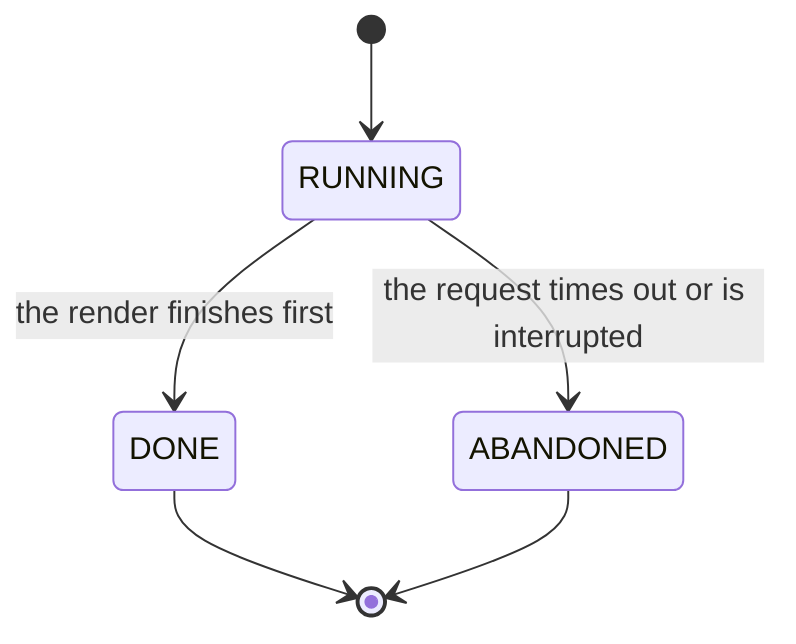
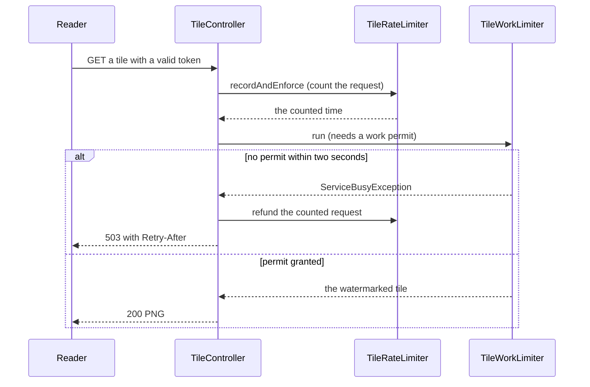

<!-- chapter: 38 | part: VI | owner: writer-backend | tag: book-m6-final | status: expanded -->
# Chapter 38: Design patterns in the code

Programmers keep meeting the same problems, and over decades they've given names to the solutions that worked. Those names are **design patterns**, and they are a vocabulary as much as a technique: "that's a strategy" says in two words what would otherwise take a paragraph. This chapter names the patterns hiding in the Secure Document Viewer's code, shows where each one lives, says what it cost, and, just as important, says when *not* to use it.

## Learning objectives

By the end of this chapter, you will be able to:

- Explain what a design pattern is and what it is not.
- Recognize about a dozen patterns in the project's code by name, and point to the file where each lives.
- Say what problem a pattern solves, what it costs, and when it is over-engineering.
- Tell where the project follows a pattern closely and where it only approximates one.
- Use pattern names to describe a design decision, connecting them to the trade-offs of Chapter 37.
- Recognize the Angular counterparts: injection, interceptors and guards, and signals.

## Prerequisites

- Chapter 4: classes, objects, records and interfaces
- Chapters 11 to 16: beans, controllers, transactions, filters and throttling
- Chapters 17 and 18: bounded work, atomic file handling and tests
- Chapters 19 to 23: the Angular basics (needed only for Section 38.12)
- Chapter 37: the engineering trade-offs (referred to in Section 38.14)

## Beginner tier: A vocabulary for solutions

### 38.1 What a design pattern is

A carpenter has names for joints: a dovetail, a mortise and tenon, a butt joint. Each is a solution to a problem that keeps coming back ("how do I join two boards at a corner so it holds under pull?"), each has known strengths and weaknesses, and a carpenter who says "use a dovetail" saves ten minutes of explanation. A **design pattern** is the software version: a named, reusable solution to a problem that recurs in code. The classic catalog is the 1994 book *Design Patterns* by Gamma, Helm, Johnson and Vlissides, whose authors are nicknamed the "Gang of Four", and it names 23 patterns. Many more have been named since.

**Where the analogy breaks down:** a joint is a physical object you cut the same way each time. A pattern is a *shape*, and every use adapts it: the code differs, the names differ, and sometimes only part of the pattern appears. A pattern is also not a library you can import. It is an idea you recognize and choose.

Every pattern in this chapter is described in the same five parts, so that you learn to ask the same questions of any pattern you meet.

1. **The problem:** what keeps going wrong without it.
2. **The pattern:** its standard name and a one-sentence definition in plain words.
3. **Where it lives:** the file and the tag, checked in the code. If the project only approximates a pattern, this part says so plainly.
4. **What it costs:** every pattern adds something, such as a class, an indirection or a rule to remember.
5. **When not to use it:** the situations in which the pattern is just clutter.

The fifth part matters as much as the others. A beginner who has just learned a pattern is tempted to use it everywhere, a habit sometimes called **pattern-itis**. Good design starts from the problem, and a pattern earns its place only when the problem is really there.

### 38.2 Patterns you have already met

Several patterns have appeared earlier in the book without their names. Table 38.1 puts the names on them.

**Table 38.1 — Patterns from earlier chapters**

| Pattern | One sentence | Where you met it |
|---|---|---|
| Dependency injection | A class states what it needs, and something else supplies it | Constructor injection everywhere (Chapter 11) |
| Repository | A collection-like interface that hides how objects are stored | `AppUserRepository`, `DocumentRepository` (Chapter 14) |
| Service layer | One class holds the rules of a use case, apart from the web and the database | `DocumentService` (Chapters 12 and 16) |
| Data transfer object | A plain carrier of data between layers | `DocumentSummary`, `DocumentDetail` (Chapter 12) |

Each of these earns its keep. **Dependency injection** removes the wiring from every class and lets a test hand in a fake, and its cost is that the connections are invisible until you know to look for them (Chapter 11). A **repository** lets `DocumentService` say `findVisibleTo(user)` without a line of SQL; its cost is that a query method's name has to be read as a sentence (Chapter 14), and a careless one can hide a slow query. A **service layer** keeps rules in one place, so that two controllers can't implement "who may open this" differently; the price is a class that grows large, and `DocumentService` is the project's largest for that reason. A **data transfer object** (DTO), here a Java record, decides exactly what leaves the server, so a database entity with a password hash can never be serialized by accident (Chapter 12).

Two smaller patterns show up in the smallest code. A **value object** is a small immutable object defined by its values, with no identity of its own. A **factory method** is a static method that builds an object, so callers don't need to know how. The project's `Viewer` is both.

**Listing 38.1 — `Viewer.java` (`book-m6-final`, imports omitted)**

```java
/** The signed-in user a document operation is performed for. */
public record Viewer(String username, boolean admin, boolean publisher) {

    public static Viewer of(Authentication authentication) {
        boolean admin = hasRole(authentication, "ROLE_ADMIN");
        return new Viewer(authentication.getName(), admin, admin || hasRole(authentication, "ROLE_PUBLISHER"));
    }

    private static boolean hasRole(Authentication authentication, String role) {
        return authentication.getAuthorities().stream().anyMatch(a -> role.equals(a.getAuthority()));
    }
}
```

*Path: `src/main/java/com/example/securedocviewer/document/Viewer.java`*

`Viewer` is a **record**: its three fields can't change after construction, and two `Viewer`s with the same values are equal, which is what makes it a value object. It is deliberately small. `DocumentService` receives a `Viewer` rather than Spring's `Authentication`, so the service's rules mention only "admin" and "publisher", not framework types. The static method `of` is the factory: it reads the authority strings (`ROLE_ADMIN`, `ROLE_PUBLISHER`) once, and applies the rule that an administrator is also a publisher. Every controller calls `Viewer.of(authentication)`, so that translation exists in exactly one place. The same shape appears in `WatermarkService.Layout.of(...)` and in `UserSummary.of(user)`, and it comes at almost no cost.

**When not to use a factory method:** a plain constructor is clearer when there is only one way to build the object. A factory is worth adding when construction involves a decision or a translation, as here.

## Intermediate tier: Patterns that shape behavior

*If you're reading for the first time, Sections 38.3 and 38.4 are the important ones here; 38.5 to 38.7 are variations you can return to.*

### 38.3 Chain of responsibility: the filter chain

**The problem:** a request must pass several independent checks (who are you, is your session still valid, may you go here), and you want to add or remove a check without rewriting the others. **The pattern:** a **chain of responsibility** passes a request along a line of handlers, each of which may handle it, change it, or pass it on. **Where it lives:** the Spring Security filter chain, which Chapters 15 and 16 described. Every servlet filter receives the request and a `chain` object. Calling `chain.doFilter(request, response)` hands the request to the next filter; *not* calling it stops the request right there. The project adds two links.

- `SessionLifetimeFilter` (Listing 16.5) ends a session that is too old and then always passes the request on. Its job is to *change what the later filters see*.
- `PasswordChangeRequiredFilter` (Listing 16.8) writes a `403` and returns without calling the chain when a password change is pending. Its job is to *stop* the request.

Figure 16.2 showed where they sit. What makes it a good chain is that neither filter knows about the other: each does one job, and their order, set in one place in `SecurityConfig`, decides how they combine. A new check is a new class and one line of configuration.

The Angular app has the same idea in an HTTP interceptor, and here it is worth being precise. **An interceptor is a link in a chain of responsibility, but the project registers a chain of one.** The `provideHttpClient(withInterceptors([sessionInterceptor]))` call in `app.config.ts` lists a single interceptor. (The CSRF header that Chapter 16 described is *not* project code: Angular's built-in support copies the cookie into the header, as a comment in `app.config.ts` says.)

**Listing 38.2 — `session.interceptor.ts` (`book-m6-final`, simplified: the imports, the long comments and the `passwordChangeRequired` branch are omitted)**

```typescript
export const sessionInterceptor: HttpInterceptorFn = (req, next) => {
  const sessionService = inject(SessionService);
  const router = inject(Router);

  return next(req).pipe(
    tap((event) => {
      if (event instanceof HttpResponse && sessionService.isLoggedIn()) {
        sessionService.touch();
      }
    }),
    catchError((error: unknown) => {
      const isAuthProbe = AUTH_PROBES.some((path) => req.url.endsWith(path));
      // ...
      if (!isAuthProbe && error instanceof HttpErrorResponse && error.status === 401) {
        sessionService.forceLogout();
        // ...
      }
      return throwError(() => error);
    }),
  );
};
```

*Path: `frontend/src/app/core/session.interceptor.ts`*

The interceptor calls `next(req)`, which is "pass the request down the chain", and then acts on the *response* on its way back: it records that the user is active, and on a `401` it clears local state and returns the user to the sign-in screen. So a chain runs in both directions.

**What it costs:** a chain hides the total behavior. To know what happens to a request you must read the whole configuration, and the order matters. **When not to use it:** when there are two fixed steps that always run in the same order, a plain method calling two other methods is easier to read than a chain.

### 38.4 Strategy: swappable behavior

**The problem:** a class must do one job in a way that might change, and you don't want an `if` for every variant. **The pattern:** a **strategy** puts each variant behind a common interface, so callers depend on the interface and the variant can be swapped. **Where it lives:** all through Spring Security, which is built from strategies, and the project chooses and configures them.

- `PasswordEncoder` (Listing 15.2): the project picks `createDelegatingPasswordEncoder()`, a strategy that itself chooses another strategy from the `{bcrypt}` label.
- `CsrfTokenRepository` (Listing 16.1): `CookieCsrfTokenRepository` stores the token in a cookie. Another implementation could store it in the session.
- `SpaCsrfTokenRequestHandler` (Listing 16.2): a project class that implements `CsrfTokenRequestHandler` and *chooses between two other strategies* according to whether the header is present.
- `SessionAuthenticationStrategy`, which you will see next.

The best evidence that these are strategies is the way they are wired.

**Listing 38.3 — `SecurityConfig.java` (`book-m6-final`, excerpt: two beans)**

```java
/** Allows a request only from one of the given CIDR ranges, judged by the TCP peer. */
static AuthorizationManager<RequestAuthorizationContext> fromAddresses(List<String> cidrs) {
    List<IpAddressMatcher> matchers = cidrs.stream().map(String::trim).map(IpAddressMatcher::new).toList();
    return (authentication, context) -> new AuthorizationDecision(
            matchers.stream().anyMatch(m -> m.matches(context.getRequest())));
}

// ...

@Bean
public SessionAuthenticationStrategy sessionAuthenticationStrategy(SessionRegistry sessionRegistry) {
    return new CompositeSessionAuthenticationStrategy(List.of(
            new ChangeSessionIdAuthenticationStrategy(),
            new RegisterSessionAuthenticationStrategy(sessionRegistry)));
}
```

*Path: `src/main/java/com/example/securedocviewer/security/SecurityConfig.java`*

The first method returns an `AuthorizationManager`, an interface with one method, so a **lambda** (Chapter 5) *is* the strategy. The metrics endpoint's rule (Chapter 16) plugs in a decision function that says "allowed only from these address ranges". The second bean builds a **composite**: a strategy made of other strategies, treated as one. Signing in must both change the session id (defeating fixation) and register the session (so an admin can list it), and the composite runs both. That is a second named pattern, **composite**: a group of objects that can be used like a single one.

**What a strategy costs:** an interface, and a reader must find *which* implementation is active. **When not to use it:** when there is one behavior and no realistic second one. The project doesn't create its own strategy interfaces for such cases: there is no `TokenSigner` interface with one implementation, because `SignedUrlService` is a concrete class, and Section 37.4 compares it with signed URLs from a cloud provider, a change you would make only if the need arose.

### 38.5 Template method and callbacks: the framework owns the boilerplate

**The problem:** many operations have the same fixed steps around one variable step (begin a transaction, do something, commit or roll back). Writing the fixed steps each time invites mistakes, such as forgetting the rollback. **The pattern:** in a **template method**, the fixed skeleton is written once and the variable step is supplied by the caller; in Java and Spring it is usually supplied as a *callback*, a lambda passed in. **Where it lives:** the Spring classes `TransactionTemplate` and `JdbcTemplate`, both used by the project.

**Listing 38.4 — Two callbacks in the project (`book-m6-final`, excerpts from two files)**

```java
// DocumentService.java
this.tx = new TransactionTemplate(transactionManager);
// ...
return tx.execute(status -> detail(requireViewable(documentId, viewer, actor), viewer));

// AuditLogService.java
private static final RowMapper<AuditEvent> ROW_MAPPER = (ResultSet rs, int rowNum) -> new AuditEvent(
        rs.getLong("id"),
        rs.getTimestamp("occurred_at").toInstant().toEpochMilli(),
        AuditEventType.valueOf(rs.getString("event_type")),
        // ...
```

*Path: `src/main/java/com/example/securedocviewer/document/DocumentService.java` and `src/main/java/com/example/securedocviewer/audit/AuditLogService.java`*

In the first line, `TransactionTemplate.execute` is the skeleton: it begins a transaction, calls the lambda, commits if it returns and rolls back if it throws (Chapter 14). The lambda is the variable step, and it is the *only* thing the project writes. In the second, `JdbcTemplate` runs the query and loops over rows, and the `RowMapper` lambda says how to turn *one row* into an `AuditEvent`. In both, the framework controls the flow and calls your code at the right moment, which is the inversion of control from Chapter 11.

**What it costs:** control flow that jumps between your lambda and the framework, which makes stepping through it in a debugger surprising. **When not to use it:** for the fixed skeleton of a single call, a template class is more machinery than a try/catch. It pays when the boilerplate is easy to get wrong, as transaction handling is.

### 38.6 Builder and fluent interfaces

**The problem:** creating an object with many optional parts, through one constructor with a long list of parameters, is unreadable. **The pattern:** a **builder** collects the parts step by step and produces the object at the end. A **fluent interface** is a builder whose methods return the object itself, so calls chain into one readable sentence. **Where it lives:** in code you have read already. `HttpSecurity` builds the security filter chain (Listing 15.1); `ResponseEntity.ok().cacheControl(CacheControl.noStore()).body(png)` builds a response (Listing 12.5); `User.withUsername(...).password(...).roles(...).disabled(...).build()` builds Spring Security's user object (Listing 15.4); and `ViewerMetrics` registers its counters like this:

```java
this.tilesServed = Counter.builder("sdv.tiles.served")
        .description("Watermarked tiles returned").register(registry);
```

(`book-m6-final`, `ViewerMetrics.java`, excerpt.) Each chain reads like a description, and most builders are safe to leave half-finished until the final `build()`. **What it costs:** long chains are harder to step through, and an error message may point at the whole statement. **When not to use it:** for an object with two or three required fields, a constructor or a record is shorter and checked by the compiler; the project's own records (`Viewer`, `TileAccess`) have no builders.

### 38.7 Observer: react without being called

**The problem:** one part of the system must react to something that happens elsewhere, without the two knowing about each other. **The pattern:** in an **observer** (also called publish-subscribe), a publisher announces events and any number of subscribers listen. **Where it lives:** the session lifecycle. `SecurityConfig` registers a `HttpSessionEventPublisher` bean, whose comment says: "Lets the registry forget sessions when they are invalidated or time out." A project class listens:

**Listing 38.5 — `SessionMetadata.java` (`book-m6-final`, excerpt: the two listeners)**

```java
@EventListener
public void onDestroyed(SessionDestroyedEvent event) {
    bySessionId.remove(event.getId());
}

@EventListener
public void onIdChanged(HttpSessionIdChangedEvent event) {
    Info info = bySessionId.remove(event.getOldSessionId());
    if (info != null) {
        bySessionId.put(event.getNewSessionId(), info);
    }
}
```

*Path: `src/main/java/com/example/securedocviewer/security/SessionMetadata.java`*

`SessionMetadata` remembers where and when each session signed in, for the admin list. It never asks the container "has a session ended?". It is *told* when a session is destroyed, and removes its record, and when the id changes at sign-in (Chapter 15) it moves the record to the new id. The code that ends sessions knows nothing about this class. In Angular, the same idea appears as RxJS observables and signals (Section 38.12).

**What it costs:** hidden control flow. Reading `SessionMetadata` won't tell you *who* triggers `onDestroyed`. **When not to use it:** when the caller can simply call the other component directly and the coupling is fine, an event is just a longer way to write a method call.

## Advanced tier: Patterns that keep the server alive and correct

*You can skip to "In this project" on a first read. These sections connect patterns to the incidents of Chapters 13 to 17.*

### 38.8 State machine: the render that may be abandoned

**The problem:** an activity passes through stages, and several threads can change its stage at the same time (a render finishing while the request gives up). Without a rule about which changes are allowed, both can win. **The pattern:** a **state machine** names the possible states and the allowed moves between them, and makes each move atomic. **Where it lives:** `TileGenerationService` (Chapter 17). It is a small, honest example, an `enum` and one atomic reference.

**Listing 38.6 — `TileGenerationService.java` (`book-m6-final`, excerpts from `render`; the surrounding code is omitted)**

```java
private enum RenderState { RUNNING, DONE, ABANDONED }

// ...

AtomicReference<RenderState> state = new AtomicReference<>(RenderState.RUNNING);

// ...

if (!state.compareAndSet(RenderState.RUNNING, RenderState.DONE)) {
    // Finished just after the request gave up: nobody will commit it.
    discardStaging(stagingDir, new CancellationException("abandoned"));
    throw new CancellationException("Render abandoned after render-timeout");
}

// ...

} catch (TimeoutException e) {
    if (!state.compareAndSet(RenderState.RUNNING, RenderState.ABANDONED)) {
        return awaitFinished(job); // it finished in the meantime: use it
    }
```

*Path: `src/main/java/com/example/securedocviewer/service/TileGenerationService.java`*

Figure 38.1 draws the machine.



*Figure 38.1 — The states of one PDF render*

<!-- source: TileGenerationService.render at book-m6-final -->

The key is `compareAndSet(expected, new)`. It changes the state to `new` *only if* it is currently `expected`, as a single indivisible step, and tells you whether it worked. So exactly one of the two competitors wins. If the render finishes first and moves `RUNNING` to `DONE`, the timeout's attempt to move `RUNNING` to `ABANDONED` fails, and the request uses the finished result. If the timeout wins, the render's later attempt to reach `DONE` fails, and the render throws away its own staging folder because nobody will commit it. There is no way to be both, and no lock is needed. This is the same lesson as the sign-in race in Chapter 16: a decision followed by an action is a race unless something makes the two one step.

**What it costs:** a little vocabulary and care. Every transition must be listed, and every place that changes the state must go through the same rule. **When not to use it:** when a boolean says everything (running or not) and no two things can change it at once. A state machine for a two-valued flag is decoration.

The Angular side has one too. `idle.ts` defines `IdleState` as a union of three shapes (`active`, `warning`, `expired`) and computes the state from the time of the last activity in a pure function, `idleState(nowMs, lastActivityMs, timeoutSeconds)`. Chapter 19 showed the union; here it is a state machine whose transitions are driven by the clock and tested without waiting.

### 38.9 Bulkhead and rate limiter: bounding what one part can take

**The problem:** without limits, one busy or hostile part of the system can use all of a shared resource, and everything else fails with it. **The pattern:** a **bulkhead**, named after the watertight compartments of a ship, gives each kind of work its own separate limit so that flooding one compartment can't sink the rest. A **rate limiter** bounds how often something may happen in a period. **Where they live:** `TileWorkLimiter` (Listing 17.7) is a semaphore that caps *tile* work across all users; `TileGenerationService` has a *separate* semaphore for PDF renders. Because the two limits are independent, a burst of slow uploads can't consume the permits that tile serving needs, and the reverse. That is the bulkhead idea, and we say "approximates" because the project uses two semaphores rather than a general-purpose bulkhead library: it's the idea, written by hand at the two places that need it.

The per-user rate limiter is `TileRateLimiter`. It keeps, for each user, a list of the times of recent requests, and refuses a new one when the list already holds the maximum for the window.

**Listing 38.7 — `TileRateLimiter.recordAndEnforce` (`book-m6-final`, simplified: the comments are omitted)**

```java
public Instant recordAndEnforce(String username) {
    Window window = windowsByUser.computeIfAbsent(username, id -> new Window());
    Instant now = Instant.now();
    Instant cutoff = now.minusSeconds(properties.getTileRateLimitWindowSeconds());

    synchronized (window) {
        while (!window.timestamps.isEmpty() && window.timestamps.peekFirst().isBefore(cutoff)) {
            window.timestamps.pollFirst();
        }
        if (window.timestamps.size() >= properties.getTileRateLimitPerWindow()) {
            long retryAfterSeconds = Math.max(1, (long) Math.ceil(
                    Duration.between(cutoff, window.timestamps.peekFirst()).toMillis() / 1000.0));
            throw new RateLimitExceededException(
                    "Tile rate limit reached (" + properties.getTileRateLimitPerWindow()
                            + " per " + properties.getTileRateLimitWindowSeconds() + "s).",
                    retryAfterSeconds);
        }
        window.timestamps.addLast(now);
    }
    return now;
}
```

*Path: `src/main/java/com/example/securedocviewer/security/TileRateLimiter.java`*

The standard name for this technique is a **sliding window log**: the window always covers the last N seconds, and the list is the log. The alternative usually taught first, a **token bucket**, refills tokens at a steady rate and allows bursts up to the bucket size. The project's choice has a useful property: the answer to "when may I retry?" is exact (the moment the oldest entry leaves the window), and it fills the `Retry-After` header. Its cost is memory proportional to the limit (up to 180 timestamps per active user), and the sweep that discards idle windows every five minutes (Chapter 14). **The limit of the design**, stated in Chapter 37 (Section 37.5): the log lives in one server's memory, so it doesn't work across several instances.

**When not to use these:** a bulkhead or limiter on something that is cheap and can't run away is friction. The project limits *renders* and *tile work* because they are CPU and memory heavy, and limits *readers* because a scraper could otherwise pull every tile in seconds.

### 38.10 Reserve first, hand back later

**The problem:** a check followed by an action can be beaten by parallel requests, as the sign-in race in Chapter 16 showed. **The pattern:** there isn't a well-known standard name for this one, and it is honest to say so. The technique is to **reserve** the resource *before* the risky step, in the same indivisible step as the check, and **compensate** (hand it back) if the step didn't consume it after all. The name "reserve, then release or compensate" is used in several fields, from bookings to payments; here it is small.

**Where it lives, twice.** `LoginThrottle.reserve` counts an attempt before the password is checked, and `succeeded` hands it back (Listing 16.6). And the tile rate limiter has the same shape for a different reason. A request is counted as soon as it passes the token checks. Then, if the *server* turns out to be too busy to serve it, the reader shouldn't be charged:

**Listing 38.8 — `TileController.java` (`book-m6-final`, excerpt: the refund)**

```java
} catch (ServiceBusyException busy) {
    // The server was busy, not the reader too fast: don't charge their allowance.
    tileRateLimiter.refund(username, counted);
    throw busy;
}
```

*Path: `src/main/java/com/example/securedocviewer/controller/TileController.java`*

Figure 38.2 shows the two limiters cooperating on one request.



*Figure 38.2 — Counting a request, and refunding it when the server is busy*

<!-- source: TileController.getTile, TileRateLimiter and TileWorkLimiter at book-m6-final -->

The refund arrived together with the server-wide cap on concurrent tile work, in one of the later review rounds, so that a reader who is turned away with `503` is not charged against their allowance for a request that was never served. <!-- source: dossier bugs-and-findings G10; commit 782ab6b --> **What it costs:** the compensation code has to be right on every failure path. **When not to use it:** when the check and the action can be made one step already (an atomic database update), there is nothing to hand back.

### 38.11 Guard clauses and failing fast

**The problem:** deeply nested `if` statements bury the normal path, and a bad value discovered late does damage on the way. **The pattern:** a **guard clause** checks a precondition at the top of a method and returns or throws at once, and **fail fast** applies the same idea to whole programs: detect a broken state at the earliest possible moment. **Where it lives:** everywhere. `BootstrapAdmin.run` begins with `if (accounts.hasAnyUsers()) { return; }` (Listing 11.8). `requireWithinLimits` (Listing 13.7) throws before any rendering. `ViewerProperties` refuses to start without a valid secret (Chapter 13). On the Angular side, `safeReturnUrl` in `login.component.ts` accepts a return address only if it starts with a single slash, so `?returnUrl=//evil.example` can't redirect the user off the site. **What it costs:** almost nothing, and that's why it's the most useful pattern in the chapter. **When not to use it:** never as a rule, but a guard that throws for something a caller can reasonably expect (a normal "not found") should return a value instead.

### 38.12 Adapter and facade in small doses

**The problem:** your code needs something from a library or framework in a shape the library doesn't provide, and you don't want the library's types to spread everywhere. **The pattern:** an **adapter** translates one interface into the one your code expects; a **facade** offers a small, simple interface over a larger subsystem. **Where they live, approximately.** `RequestActors` turns a servlet request and an `Authentication` into the project's own `Actor` (username, session handle, client address), which every audit call needs, so no controller assembles it by hand. `ViewerMetrics` wraps Micrometer's registry behind methods named for the domain (`tileServed()`, `signIn(outcome)`), and registers every sign-in outcome at zero on startup so the metric exists before its first event. Neither is a textbook adapter, since neither implements a specific target interface, so the honest description is "adapter in spirit", a thin class that keeps a library's vocabulary out of business code. **What it costs:** one more class between you and the library. **When not to use it:** when you would only be renaming a single call.

### 38.13 The Angular side in patterns

The frontend uses several of the same ideas in its own form. All of the following are checked in `frontend/src/app/` at `book-m6-final`.

- **Dependency injection.** Services declare `@Injectable({ providedIn: 'root' })` and take dependencies in the constructor, and functions such as guards and interceptors use `inject(...)`. The wiring is in `app.config.ts`. (Chapters 21 and 22.)
- **Interceptor as a chain of one.** Section 38.3.
- **Route guards.** A guard is a *guard clause* for navigation, and `roleGuard` shows function composition:

**Listing 38.9 — `auth.guard.ts` (`book-m6-final`, excerpt: `roleGuard`)**

```typescript
export const roleGuard =
  (...roles: Role[]): CanActivateFn =>
  (route, state) => {
    const signedIn = authGuard(route, state);
    if (signedIn !== true) {
      return signedIn;
    }
    return inject(SessionService).hasAnyRole(...roles) ? true : inject(Router).createUrlTree(['/documents']);
  };
```

*Path: `frontend/src/app/core/auth.guard.ts`*

`roleGuard(...)` is a function that *returns* a guard, and the guard it returns calls `authGuard` first and adds a role check. Each route uses one guard, so there are no multi-guard chains. The file's own comment says the guard is "UX only": the server enforces the same rules on every call.

- **Signals as fine-grained observers.** `SessionService` keeps a private writable signal and exposes read-only computed values such as `isLoggedIn` and `isAdmin`. Anything that reads a signal is re-evaluated when it changes, an observer relationship set up by the framework rather than by subscription code.
- **Observables for streams.** `HttpClient` methods return RxJS observables, and the document-manage screen debounces a search box through a `Subject` with `debounceTime` and `switchMap`, cancelling stale requests.
- **A bounded worker pool.** The viewer fetches tiles with at most six concurrent workers (`MAX_CONCURRENT_TILE_FETCHES = 6`) and an `AbortController` to cancel in-flight requests. It is the browser-side echo of the bulkhead in Section 38.9.
- **Pure functions for time.** `idleState` and `shouldPoll` take the current time as an argument, so tests don't wait.

The project does *not* use a state-management library such as NgRx, and does not use reactive forms or component inputs and outputs. The signals and services are enough for its size, which is the right answer for a small app.

### 38.14 Patterns in decisions, and patterns the project does not need

Chapter 37 argued that a design decision is a choice between options with costs. Patterns give the options names. Take one decision from that chapter, keeping sessions and the counters that limit sign-ins and tiles in memory rather than in a shared store (Section 37.5). Seen through this chapter, the project chose a *sliding window log* and a *reserve-and-compensate* rule, implemented as ordinary objects in one process. The cost is exactly what the patterns' costs predict: the state is per instance, so running three copies would multiply the limits by three. Naming the patterns makes the cost easy to state, and makes the moment to change easy to recognize.

Here is a short list of patterns you'll meet elsewhere that this project doesn't need, with a sentence on why.

- **Singleton (the classic version).** A class that enforces having one instance. Spring already creates one shared instance of each bean, so no class needs its own machinery.
- **Abstract factory and full factory hierarchies.** No place needs families of related objects created interchangeably.
- **Decorator and proxy written by hand.** Spring adds proxies for `@Transactional` itself (Chapter 11); the project writes none of its own.
- **Command and undo.** Nothing in the app is undoable.
- **Circuit breaker and retry frameworks.** There are no calls to other services to protect (`pom.xml` has no such library).
- **CQRS, event sourcing and sagas.** These suit systems with many services or heavy write volumes. The audit log is append-only (Chapter 39), but the app is not event-sourced.
- **Microservices.** The app is one deployable; Section 37.11 explains why one instance is enough for now and what running several would require (shared sessions and shared tile storage first).

### 38.15 Common mistakes

- **Pattern-itis.** Using a pattern because you know it, not because the problem is there. Signs: an interface with exactly one implementation and no realistic second, a `Factory` that builds one class, a builder for an object with two fields.
- **Cargo-culting.** Copying a pattern's shape without its reason. If you can't say what would go wrong without it, leave it out.
- **Naming instead of thinking.** "It's the strategy pattern" is not a justification; the problem and the cost are.
- **Forcing the code into a name.** Half of a pattern is often the right amount. Say "approximates" and move on, as this chapter does.
- **Abstracting on the first use.** A common rule is to wait for the third case before extracting a pattern. The project's two limiters were written separately and stayed separate.
- **Hiding control flow.** Observers, callbacks and chains make code shorter and its behavior harder to trace. Use them where the decoupling is worth it.
- **Forgetting the tests.** A pattern that makes code harder to test is a bad fit. The project chose constructor injection partly because a test can call `new SignedUrlService(properties)` (Chapter 18).

## In this project

**Table 38.2 — Where the patterns live (`book-m6-final` unless noted)**

| Pattern | Where | Chapter |
|---|---|---|
| Dependency injection | Every controller and service constructor | 11 |
| Repository | `account/AppUserRepository.java`, `document/DocumentRepository.java` | 14 |
| Service layer | `document/DocumentService.java` | 12, 16 |
| Value object and factory method | `document/Viewer.java`, `document/TileAccess.java`, `model/SignedTilePayload.java` | 38 |
| Chain of responsibility | `security/SessionLifetimeFilter.java`, `security/PasswordChangeRequiredFilter.java`; Angular `core/session.interceptor.ts` (a chain of one) | 16, 22 |
| Strategy and composite | `security/SecurityConfig.java`, `security/SpaCsrfTokenRequestHandler.java` | 15, 16 |
| Template method and callbacks | `TransactionTemplate` in `DocumentService`, `RowMapper` in `AuditLogService` | 14 |
| Builder and fluent interface | `HttpSecurity`, `ResponseEntity`, `ViewerMetrics` | 12, 15 |
| Observer | `security/SessionMetadata.java`; Angular signals and RxJS | 21, 22 |
| State machine | `service/TileGenerationService.java` (`RenderState`); Angular `core/idle.ts` | 17, 19 |
| Bulkhead and sliding window rate limiter | `service/TileWorkLimiter.java`, `security/TileRateLimiter.java` | 17, 26 |
| Reserve and compensate | `security/LoginThrottle.java`, `TileController` and `TileRateLimiter` | 16 |
| Guard clause and fail fast | `account/BootstrapAdmin.java`, `service/TileGenerationService.java`, `config/ViewerProperties.java` | 11, 13 |
| Adapter and facade (approximate) | `audit/RequestActors.java`, `service/ViewerMetrics.java` | 12, 35 |

## Try it

### Exercise 38.1 ★ Name the pattern

For each snippet, name the pattern and say which file it comes from: (a) `Viewer.of(authentication)`; (b) `tx.execute(status -> ...)`; (c) `new CompositeSessionAuthenticationStrategy(List.of(...))`; (d) `@EventListener public void onDestroyed(...)`.

*Solution:* Appendix C, Exercise 38.1.

### Exercise 38.2 ★ Where does the chain stop?

In `PasswordChangeRequiredFilter`, which line decides whether the chain continues, and what happens to a request that reaches it while a password change is pending?

*Solution:* Appendix C, Exercise 38.2.

### Exercise 38.3 ★★ Find the strategies

Open `SecurityConfig.java` and list every bean whose type is an interface from Spring Security (for example `PasswordEncoder`, `CsrfTokenRepository`). For each, say what a second implementation could look like and whether the project has any reason to write one.

*Solution:* Appendix C, Exercise 38.3.

### Exercise 38.4 ★★ Trace the state machine

In `TileGenerationService.render`, list every place that reads or changes `state`. Draw the states and transitions from the code and compare your drawing with Figure 38.1. Is there a move the figure doesn't show?

*Solution:* Appendix C, Exercise 38.4.

### Exercise 38.5 ★★★ Apply the fifth question

Pick three patterns from this chapter and, for each, invent a small feature of the app where using it would be over-engineering. Explain in one paragraph what a simpler design would be.

*Solution:* Appendix C, Exercise 38.5 (a worked outline).

### Exercise 38.6 ★★★ A decision in pattern words

Choose one decision from Chapter 37 and rewrite it in this chapter's vocabulary: name the pattern in use, its cost as this chapter states it, and what the project would have to change to move to the alternative. Then say which of the two designs you would choose for a team of five and why.

*Solution:* Appendix C, Exercise 38.6 (a worked outline).

## Summary

- A design pattern is a named, reusable solution to a recurring problem; it is a vocabulary and a shape, not a library, and every use adapts it.
- Every pattern has a cost and a place where it is clutter; the fifth question, "when not to use it?", is the one that stops pattern-itis.
- The project uses dependency injection, repositories, a service layer, records as value objects and factory methods throughout, and chains of responsibility, strategies and composites through Spring Security.
- Callbacks (`TransactionTemplate`, `RowMapper`) let the framework own the boilerplate; builders make configuration read like a sentence; events let parts react without calling each other.
- A small state machine with `compareAndSet` settles the race between a render finishing and a request timing out; a semaphore bulkhead and a sliding window limiter bound the work, and reserve-then-compensate makes limits correct under parallel requests.
- The Angular code has an interceptor (a chain of one), guards, signals and a bounded worker pool, but no state library, and the chapter says plainly where the project only approximates a pattern.

## Further reading

- *Spring Framework Reference Documentation*, "Programmatic Transaction Management." https://docs.spring.io/spring-framework/reference/data-access/transaction/programmatic.html
- *Spring Security Reference Documentation*, "The Security Filter Chain" (Architecture). https://docs.spring.io/spring-security/reference/servlet/architecture.html
- *Spring Framework Reference Documentation*, "Standard and Custom Events." https://docs.spring.io/spring-framework/reference/core/beans/context-introduction.html#context-functionality-events
- *Java Platform SE API*, `java.util.concurrent.atomic.AtomicReference`. https://docs.oracle.com/en/java/javase/25/docs/api/java.base/java/util/concurrent/atomic/AtomicReference.html
- *Angular Documentation*, "Intercepting requests and responses." https://angular.dev/guide/http/interceptors
- *Angular Documentation*, "Signals." https://angular.dev/guide/signals
