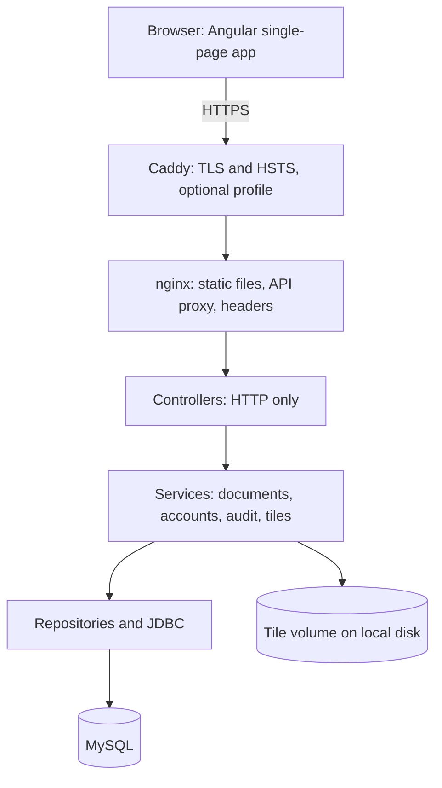
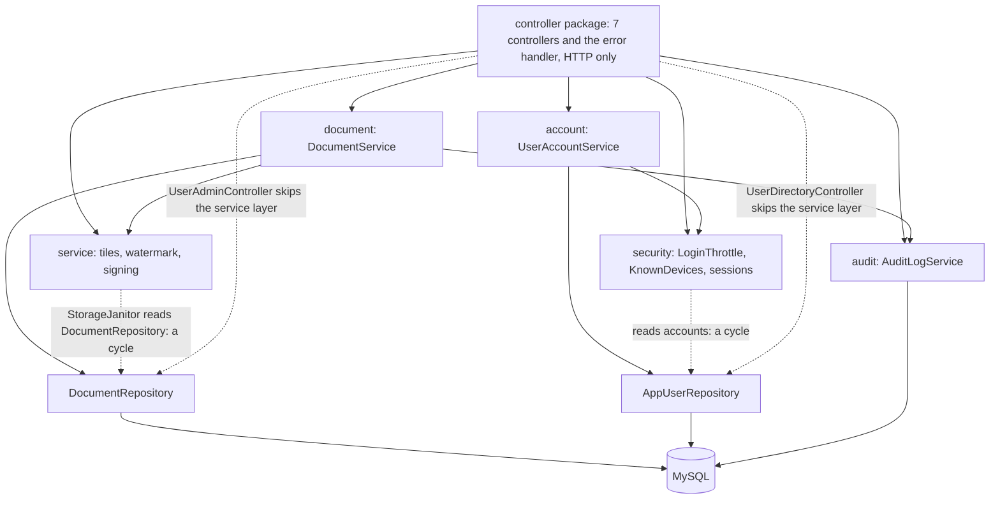
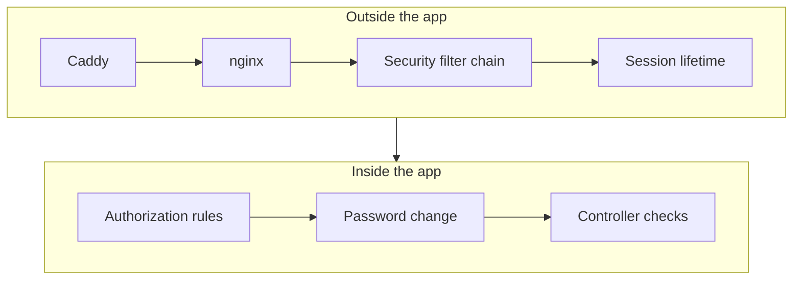
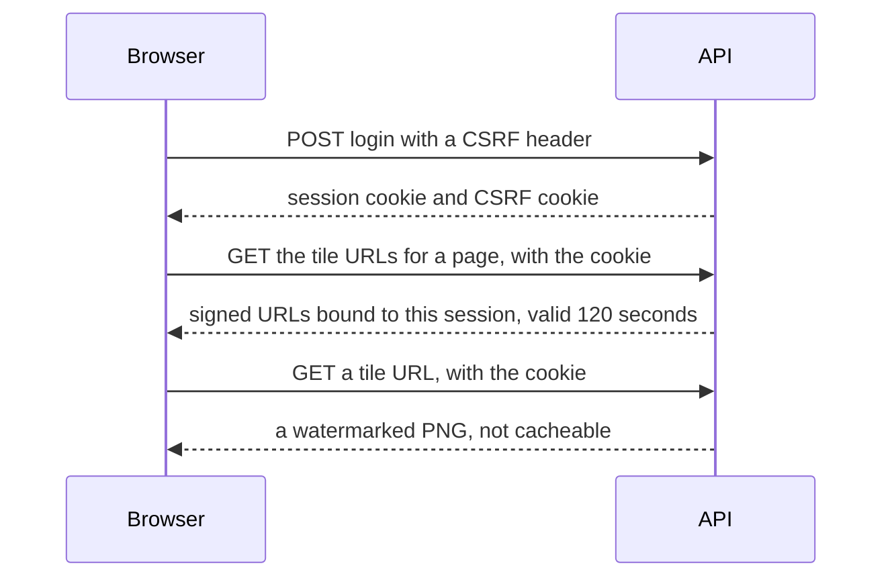
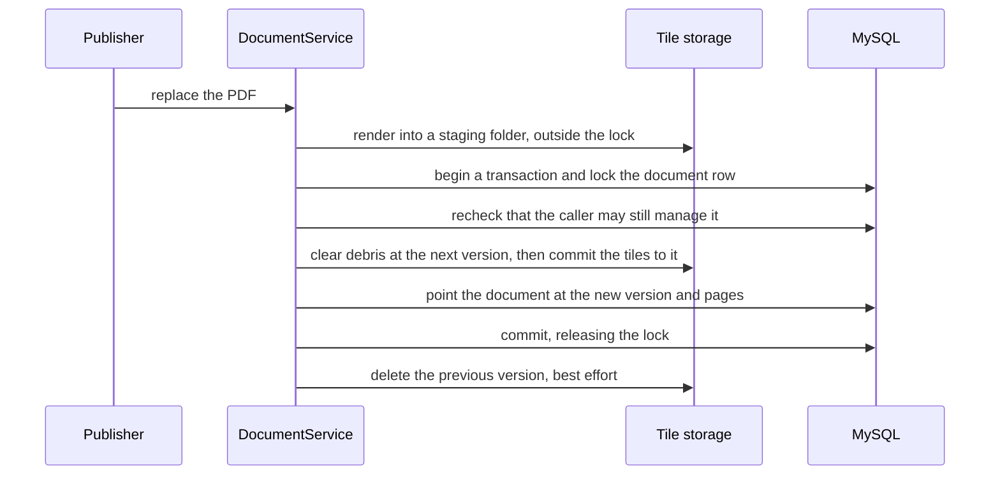
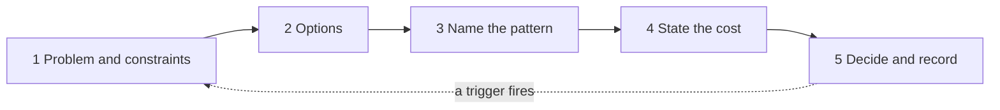

<!-- chapter: 39 | part: VI | owner: writer-production | tag: book-m6-final | status: expanded -->
# Chapter 39: Architectural patterns and how to decide

Chapter 38 named the patterns inside the code: the small shapes that solve small problems. This chapter climbs one level. It names the patterns that shape the whole system, such as how the parts are stacked, where the front door is, how state is kept, and how the app is built and watched. Then it ends with something more useful than a list: a way to use these names while you make design decisions, with a real decision from this project worked through step by step.

## Learning objectives

By the end of this chapter, you will be able to:

- Explain what an architectural pattern is and how it differs from a design pattern.
- Recognize about a dozen architectural patterns in the Secure Document Viewer, and point to the file, configuration, or tag where each lives.
- Say where the project follows a pattern closely and where it only approximates one.
- State, for each pattern, what it cost and when it would be over-engineering.
- Apply a five-step framework to a design decision, using pattern names and the trade-offs of Chapter 37.
- Write a short decision record for a decision of your own.

## Prerequisites

- Chapter 8: HTTP, cookies, and how a request travels
- Chapter 10: containers and Compose
- Chapter 14: transactions, row locks, and versioned data
- Chapter 16: filters, sessions, and throttling
- Chapters 32 to 36: threat modeling, deployment, backups, metrics, and CI
- Chapter 37: the engineering trade-offs
- Chapter 38: design patterns in the code

## Beginner tier: The shape of a system

### 39.1 The analogy: a city plan

A design pattern is like the layout of a single room: where the door goes, where the light falls. An **architectural pattern** is like the plan of the city: where the roads run, where the gates are, which districts may talk to which, and where the water comes in. You can fix a badly placed door in an afternoon. Moving a road means rebuilding what stands beside it.

**Where the analogy breaks down:** in two ways. Software is cheaper to rearrange than a city, but not as cheap as beginners assume: the parts hold each other up through data, deployments, and habits. And a city grows without a plan, while software that grows without a plan still has an architecture. It isn't one anyone chose.

That second point matters for this chapter. The Secure Document Viewer has an architecture whether or not anyone had a name for it. Naming it lets you see what it costs, and decide on purpose.

### 39.2 Terms you need

- **Architecture:** the set of large decisions about a system that are expensive to change: how it is divided into parts, how the parts communicate, where state lives, and how it is deployed.
- **Architectural pattern:** a named, reusable answer to a recurring architecture-level problem. It says what the parts are and how they relate, and it comes with known costs.
- **Deployable:** the unit you build, ship, and start as one thing. Here it is one Java program in one container.
- **Monolith:** a system deployed as a single deployable. The word is neutral; it isn't an insult.
- **Stateful and stateless:** a stateful server remembers things about its callers between requests. A stateless one treats every request as new and finds everything it needs in the request or in a shared store.
- **Trade-off:** a choice where gaining one thing costs another (Chapter 37).
- **Decision record:** a short written note of what was decided, why, and what it costs, kept so that later readers know the reasons.

More terms are defined where they first matter, and a few you already know are used plainly with a pointer: reverse proxy (Chapter 16), defense in depth (Chapter 28), least privilege (Chapter 36), and observability (Chapter 35).

### 39.3 The whole system in one picture

Before naming the patterns, look at what they describe. Figure 39.1 is the app as it runs in the compose stack from Chapter 33.



<!-- source: docker-compose.yml, frontend/nginx.conf, deploy/Caddyfile, src/main/java packages at book-m6-final -->
*Figure 39.1 — The Secure Document Viewer as one picture: the parts that the architectural patterns name*

*Text description:* A top-to-bottom chain following a request: the browser, running the Angular single-page app, connects over HTTPS to Caddy, then nginx, then the controllers, then the services, then repositories and JDBC, then MySQL. A second arrow from the services leads to the tile volume on local disk.

Read it from top to bottom, the way a request travels. Each arrow crosses a boundary, and each boundary is a decision. The rest of the chapter goes through those decisions in the order you meet them.

### 39.4 Client-server and the single-page app with a REST API

**The problem.** A person needs an interactive interface, but the rules and the data must stay somewhere the person can't tamper with.

**The pattern.** Split the system in two: a client that runs where the user is and shows things, and a server that runs where you control it and decides things. Here the client is a single-page application (SPA): the browser downloads one page of HTML and JavaScript once, and after that it only fetches data, as JSON, from the server's **REST API** (Chapter 12).

**Where it lives.** The client is the Angular app under `frontend/`, built into plain files and served by nginx. The server is the Spring Boot app whose controllers answer under `/api`. The nginx configuration has the rule that makes an SPA work: `try_files $uri $uri/ /index.html`, so a deep link like `/viewer/123`, which isn't a real file, still serves the app and lets Angular's router take over (Chapter 33).

The pattern shows up sharply in this project because the whole design rests on it. The README's first argument is that hiding a button in the browser protects nothing, because the client is in the attacker's hands. So the server checks everything, every time, and the client is treated as a convenience.

**What it costs.** Two codebases in two languages, and an API that becomes a contract between them, so a change to one side can break the other. The project pays part of this with one origin: nginx serves the app and proxies `/api`, so cookies and cross-site request forgery (CSRF) tokens work without extra cross-origin settings (Chapter 22).

**When not to use it.** For a mostly-static site with a few pages, a server that returns finished HTML is simpler, faster to show, and easier for search engines. An SPA earns its cost when the interface is interactive and stateful, as a viewer with keyboard shortcuts, zoom, and idle warnings is.

### 39.5 Layered architecture

**The problem.** If every class can call every other class, a change anywhere can break anything, and nobody can say where a rule lives.

**The pattern.** Arrange the code in layers, each with one job, and allow each layer to depend only on the layer beneath it. The classic four are: presentation (talks HTTP), business logic (the rules), data access (talks to the database), and the database itself.

**Where it lives.** The Java packages under `src/main/java/com/example/securedocviewer/` follow it. Figure 39.2 draws what the code at `book-m6-final` actually does.



<!-- source: controller, document, account, audit, service packages at book-m6-final; constructor dependencies of the seven controllers -->
*Figure 39.2 — The layers as built: two controller shortcuts and two package cycles*

*Text description:* The controller package points to five packages: document, account, service, audit, and security. Repositories sit under document and account, and everything at the bottom reaches MySQL. Solid arrows are the intended direction. Dotted arrows mark exceptions: two controllers that call repositories directly, and two cycles, where the tile services read the document repository and the security package reads accounts.

Verify the rule that matters most, which is that dependencies point down. No class outside the `controller` package imports a controller, so the arrow never points up. `DocumentController`, for instance, depends on `DocumentService` and a small helper, and nothing else.

Now the honest part. The project *approximates* the pattern; it doesn't follow it strictly. Two controllers, `UserAdminController` and `UserDirectoryController`, hold a repository directly and query it, skipping the service layer. `TileController` coordinates eleven collaborators, including the rate limiter, the work limiter, the watermark service, and the audit log, so it does the work of a business-logic layer as well as HTTP. `AuthController` has thirteen `private final` fields, twelve of them collaborators, and several of them Spring Security internals. And `UserAdminController` revokes a user's sessions itself after a role change: a business rule that sits in a controller. In a small app, a service that only forwards one call is ceremony, so these are places where the rule is relaxed, and you should know where.

Beneath the controllers the layering is looser still, as Figure 39.2 shows. `StorageJanitor` (in `service`) reads `DocumentRepository`, while `DocumentService` (in `document`) calls the tile service: a cycle between two packages. `UserAccountService` (in `account`) calls `KnownDevices` in `security`, while `security` reads accounts: a second cycle. Nothing enforces direction, so nothing stops a third from appearing.

<!-- source: constructor fields of UserAdminController, UserDirectoryController, TileController at book-m6-final -->

**What it costs.** Indirection: to follow one request you open a controller, a service, and a repository. And a temptation to create a layer for the sake of it.

**When not to use it.** When a layer would only pass calls through. The rule of thumb this project follows is to add a service when there is a rule to enforce. `DocumentService` checks ownership and visibility, so it exists. A directory lookup has no rule beyond "publishers may search," which the security configuration already enforces.

## Intermediate tier: Boundaries and how they are crossed

*On a first read you can skip to "In this project"; the decision framework at the end of the chapter is the part to keep.*

### 39.6 The modular monolith: one deployable, several modules

**The problem.** You want the parts of the system to be separate enough to understand independently, without paying the cost of running many separate services.

**The pattern.** A **modular monolith** is a single deployable whose inside is divided into modules with clear responsibilities and limited knowledge of one another. The opposite extreme is **microservices**, where each module is its own deployable that talks to the others over the network.

**Where it lives.** The whole backend is one jar in one container (`Dockerfile`), and the source is divided into packages: `account`, `audit`, `document`, `security`, `service`, `controller`, and a few for models and exceptions. The packages carry meaning: accounts don't know about documents, and documents know about accounts, audit, and tiles. The imports show it: the `document` package imports from `account`, `audit`, `exception`, `model`, and `service`. But the meaning is not airtight: the two cycles of Section 39.5 mean that `service` and `document`, and `account` and `security`, each know about the other.

Again, the honesty. Nothing *enforces* those boundaries. There is no module descriptor and no architecture test in the repository, so a future change could add an import in the wrong direction and nothing would complain except a reviewer. The project is a modular monolith by convention, not by machinery.

**What it costs.** One database, one release, one process to scale: a slow tile render and a sign-in share the same JVM, which is why the project added the bulkhead and rate limiter of Chapter 38. Those are separate pools of permits, not separate resources: both kinds of work still draw on the same CPU and memory, so they limit how many at once, not how much. And the shared database means any module can, technically, read any table.

**When not to use it, and when to go further.** For a small team and one product, this is usually the right size, and Chapter 37 (Section 37.11) says what scaling out would require. Microservices are justified when parts must scale or be released independently, or when separate teams need to own them. They are over-engineering here: they would add network calls where there are method calls, distributed failures where there are exceptions, and several deployments where there is one. The project's records show no evaluation of microservices, so this is the book's assessment, not a project decision.

### 39.7 The gateway and the trust boundary

**The problem.** The outside world is hostile and the app is busy. Someone has to stand at the edge, decide what is let through, and say what the inside should believe about the caller.

**The pattern.** Put a reverse proxy (Chapter 16), sometimes called a **gateway** when it does more, at the edge. It terminates TLS, serves static files, forwards the rest, and sets the rules about headers. Everything behind it trusts it, and nothing else.

**Where it lives.** Chapters 32 and 33 covered it in detail. Two pieces are worth naming as architecture. Caddy handles TLS and HTTP Strict Transport Security (HSTS); nginx serves the app, proxies `/api`, sets the frontend's security headers, and overwrites `X-Forwarded-For`. The app trusts forwarded headers only from nginx's fixed address. The trust boundary is the line between what the inside believes and what it must check.

**What it approximates.** This is a reverse proxy, not an API gateway in the product sense. It doesn't authenticate callers, rate-limit them, or transform requests; the app does all of that. That's a choice with a reason: it keeps every security rule in one language and one test suite (Chapter 18), and it means the gateway can be swapped without moving any rules.

**What it costs.** Trust that depends on fixed addresses and on five settings agreeing, and a failure mode that is silent when they drift (Chapter 33, Exercise 33.3). **When not to use it:** a single container that you reach directly on a laptop doesn't need a proxy, and the `docker compose up -d` profile that starts only MySQL is exactly that.

### 39.8 The pipeline: pipes and filters for the request path

**The problem.** A request must pass a series of independent checks. If you write them as one long method, each check becomes tangled with the others, and adding one means editing all of them.

**The pattern.** **Pipes and filters** (also called a pipeline): the request flows through a chain of small stages, each doing one job, and either passing the request on or refusing it. At the code level you met the same idea in Chapter 38 as the chain of responsibility. At the system level the whole request path is one pipeline.

**Where it lives.** Figure 39.3 shows the path of an API request.



<!-- source: SecurityConfig.java (addFilterBefore and addFilterAfter around AuthorizationFilter) and frontend/nginx.conf at book-m6-final -->
*Figure 39.3 — The request path as a pipeline: each stage can refuse, and the order is part of the design*

*Text description:* Two rows, read left to right, the top row first. The top row: Caddy, then nginx (with its location rules and headers), then the Spring Security filter chain (CSRF, sessions, and others), then the session lifetime filter. The bottom row: the authorization filter with its rules (`denyAll` last), then the password-change filter, and finally the controller and service checks. Notice that each stage can refuse the request, and that the order is part of the design.

Two of the filters are the project's own, and their position is written in the configuration:

**Listing 39.1 — `SecurityConfig.java` (`book-m6-final`, excerpt: two registrations from the filter chain)**

```java
.addFilterBefore(new SessionLifetimeFilter(properties.getSessionMaxLifetime()),
        org.springframework.security.web.access.intercept.AuthorizationFilter.class)
.addFilterAfter(new PasswordChangeRequiredFilter(),
        org.springframework.security.web.access.intercept.AuthorizationFilter.class)
```

*Path: `src/main/java/com/example/securedocviewer/security/SecurityConfig.java`*

`SessionLifetimeFilter` runs *before* the authorization rules, because an expired session should be refused before any rule is evaluated. `PasswordChangeRequiredFilter` runs *after* them, because it needs to know who the caller is, and only then can it say "you must change your password first" (Chapter 16). The order is part of the design, which is the cost of the pattern: to know what happens to a request you must read the whole chain.

**When not to use it:** when there are two fixed steps that always run in the same order, a plain method is simpler. The pipeline earns its place here because checks are added over time (both custom filters arrived in the platform milestone, `book-m5-platform`) and each must be testable alone.

### 39.9 Sessions, tokens, and the hybrid

**The problem.** After sign-in, the server must recognize the browser on every request. There are two broad answers.

**The patterns.** In **session-based** (stateful) authentication, the server keeps a record of each signed-in user and hands the browser an opaque id, in a cookie. Each request presents the id and the server looks it up. In **token-based** (stateless) authentication, the server signs a token that carries the facts and hands it to the client, which presents it each time; any server that knows the signing key can verify it without a lookup.

**Where it lives, and the hybrid.** This app uses both, for different jobs. Table 39.1 shows the split.

**Table 39.1 — Two mechanisms, two jobs**

| Job | Mechanism | Where |
|---|---|---|
| Recognize the signed-in user | Server-side session in an httpOnly cookie | `SecurityConfig`, `application.yml` |
| Authorize one tile fetch | Short-lived HMAC-signed URL carrying its own facts | `SignedUrlService`, `SessionKeys` |

The signed URL is shaped like a **capability URL** (a URL whose possession is meant to grant access): it can't be forged, it expires, and it is scoped to one tile. It is not a capability in the strict sense, because the server never treats it as sufficient. It carries a keyed hash of the issuing session, the request must also present that session's cookie, and `TileController` re-checks access on every request (Chapter 32). A pasted URL fails in another browser. Figure 39.4 shows the sequence.



<!-- source: AuthController, PageTileUrlController, TileController, SignedUrlService at book-m6-final; README -->
*Figure 39.4 — The hybrid: a session proves who you are; the signed URL pins one request to a tile, a render, and a session for 120 seconds; the server still re-checks access on every tile*

*Text description:* A conversation between a browser and the API. The browser signs in with a CSRF header and receives a session cookie and a CSRF cookie. It asks for the tile URLs of a page and receives signed URLs valid for 120 seconds. It then requests a tile with the cookie and receives a watermarked PNG that must not be cached.

**What it costs.** The session state lives in the memory of one instance, so scaling out needs a shared store (Section 37.5). The signed URLs need a secret that every instance shares, and rotating it invalidates outstanding URLs. **Why not tokens only?** Chapter 37 (Section 37.12) sets out the trade: the project gets immediate revocation (sign-out and admin revoke end the session and every URL derived from it), and pays with statefulness.

## Advanced tier: State, change, and operations

*On a first read you can skip to "In this project"; return here when you plan a change to how data is stored or how the app is run.*

### 39.10 The append-only audit log as an event log

**The problem.** Later you'll need to answer "who did what, and when," and the answer must not be quietly changed after the fact.

**The pattern.** An **event log** is an ordered record of things that happened, added to and never edited. Each entry says what occurred, who caused it, and when.

**Where it lives.** The table `audit_event` (migration `V2__documents_shares_audit.sql`) has a time, a type, a username, a session handle, a client address, and details about the document, page, and tile. The only statements that change it in the code are one insert and one purge: `AuditLogService` inserts events and deletes those older than `audit-retention-days` (180) once a night. Nothing updates a row. Events are written in their own transaction, so a denial that rolled back its request still leaves its record (Chapter 27).

**What it approximates.** This is an audit log, not **event sourcing**. In event sourcing the log *is* the source of truth and current state is rebuilt from it. Here the documents and accounts are ordinary tables, and the log only describes what happened to them. Also, "append-only" is a convention, not a guarantee: the app's database user could technically update or delete rows, and nothing in the schema prevents it.

**What it costs.** Volume. The project found this early: an entry for every tile buried the rest, so `PAGE_VIEWED` is recorded once per session, document, and page every 10 minutes, and denials are capped per user (Chapter 35). And retention is a policy you own: 180 days is a decision.

**When not to use it:** as a substitute for application logs, which serve developers, or for business state, which belongs in tables. It fits questions about people and actions.

### 39.11 Immutable versions with an atomic switch

**The problem.** A reader is in the middle of a document while a publisher replaces it. If you overwrite the tiles in place, a reader can see half old and half new, and a failure halfway leaves the document broken.

*See also: Chapter 40, Section 40.8 applies this pattern to Amazon S3.*

**The pattern.** Never change something readers are using. Build the new version beside the old one, then switch a single pointer to it in one atomic step, and remove the old version afterward. This is the idea of **copy-on-write**. The old version is immutable while anyone can see it, and the switch is all-or-nothing.

**Where it lives.** Each render goes into its own folder, `{docId}/v{n}`, and the document row records which version is current. The switch happens under a database row lock, and Listing 39.2 shows it.

**Listing 39.2 — `DocumentService.java` (`book-m6-final`, excerpt: `replaceFile` without its signature and the final audit record)**

```java
tx.executeWithoutResult(status -> requireManageable(documentId, viewer, actor));
RenderedDocument rendered = tiles.render(pdf);
int[] previousVersion = new int[1];
DocumentDetail updated;
try {
    updated = tx.execute(status -> {
        Document document = documents.findByIdForUpdate(documentId)
                .orElseThrow(() -> new DocumentNotFoundException("Document not found."));
        // Rendering can take a while: the owner may have been demoted or disabled,
        // or the document handed to someone else, since the check above.
        if (!canManage(document, currentRoles(viewer))) {
            recordDenied(actor, viewer, Subject.document(documentId, document.getTitle(), "manage"));
            throw new ForbiddenException("Only the owner (as a publisher) or an admin can change this document.");
        }
        previousVersion[0] = document.getTileVersion();
        int nextVersion = document.getTileVersion() + 1;
        try {
            // Under the row lock nothing committed points past the current version,
            // so anything already at the next one is debris from a failed replace.
            tiles.deleteVersion(documentId, nextVersion);
            tiles.commit(rendered, documentId, nextVersion);
        } catch (IOException e) {
            throw new java.io.UncheckedIOException(e);
        }
        document.replacePages(nextVersion, rendered.tileSize(), toPages(rendered));
        return detail(document, viewer);
    });
} catch (RuntimeException e) {
    tiles.discard(rendered);
    throw e;
}
try {
    tiles.deleteVersion(documentId, previousVersion[0]);
} catch (IOException e) {
    log.warn("Could not remove superseded tiles of {}; the storage janitor will retry", documentId, e);
}
```

*Path: `src/main/java/com/example/securedocviewer/document/DocumentService.java`*

Figure 39.5 follows the same steps as a sequence, so you can see what happens outside the lock and what happens inside it.



<!-- source: DocumentService.replaceFile, DocumentRepository.findByIdForUpdate (PESSIMISTIC_WRITE) at book-m6-final; README; dossier decisions D8 -->
*Figure 39.5 — Replacing a document: rendering happens first, and under the lock the tiles move into place and the pointer switches*

*Text description:* A conversation between a publisher, DocumentService, tile storage, and MySQL. The service renders into a staging folder outside the lock, then begins a transaction and locks the document row, rechecks the caller's rights, clears debris, and commits the tiles to the next version, points the document at the new version, and commits. Finally it deletes the previous version on a best-effort basis.

Notice three details. The slow work (rendering) happens *before* the lock. Under the lock, the code moves the new tiles into place (a fast local rename today; Chapter 40 discusses what changes when tiles are uploaded) and switches the pointer, so the lock is held only briefly. After the lock is taken, the code re-checks that the caller may still manage the document, because rendering can take long enough for the owner to be demoted; this is the same check-then-act care as in Chapter 32. And the old version is deleted last and only as best effort: if that fails, the storage janitor (Chapter 34) cleans up later, and readers are unaffected.

The pattern also reached into the token. After a review round found that old tile URLs silently served the new render, the render version became part of the signed payload, and a token for an old version answers `410 Gone` (Chapters 32 and 37).

**What it costs.** Disk for two versions during a change, a janitor to remove leftovers, and a new status, `410`, that the client must understand. Backups get harder too: the database and the tiles must match (Chapter 34). **When not to use it:** for data nobody reads while it changes, plain overwrite is simpler. The pattern pays when there are concurrent readers and a broken intermediate state is unacceptable.

### 39.12 Configuration from the environment, and the twelve-factor checklist

**The problem.** The same build must run on a laptop, in CI, and in production, with different secrets and addresses, and secrets must never live in the code.

*See also: Chapter 41, Section 41.2 shows secrets injected as environment variables on Amazon ECS.*

**The pattern.** The **twelve-factor app** is a published methodology for building services that deploy cleanly. Its third factor is the relevant one here: store configuration in the environment, not in the code.

**Where it lives.** Look at how the app asks for its settings:

**Listing 39.3 — `application.yml` (`book-m6-final`, excerpt: comments removed)**

```yaml
spring:
  config:
    import: optional:file:.env[.properties]

  datasource:
    url: jdbc:mysql://${DB_HOST:localhost}:${DB_PORT:3306}/${DB_NAME:securedocs}?connectionTimeZone=UTC&forceConnectionTimeZoneToSession=true
    username: ${DB_USERNAME:securedocs}
    password: ${DB_PASSWORD:}
```

*Path: `src/main/resources/application.yml`*

Every value that differs between environments is a placeholder with an optional default, such as `${DB_HOST:localhost}`. The password has an empty default on purpose, and for the signing secret, startup fails if it is missing or too short. The `import` line reads a git-ignored `.env` file in development, and, as the comment in the file notes, real environment variables win. In the compose stack the same names arrive from `env_file`.

How closely does the project follow the whole checklist? Table 39.2 is honest about it.

**Table 39.2 — The twelve-factor checklist, applied to this project (the factors that the repository evidences)**

| Factor | The project |
|---|---|
| Config in the environment | Yes: Listing 39.3, `.env`, compose |
| Backing services as attached resources | Yes: MySQL is reached through `DB_HOST` and `DB_PORT`, so swapping it is a configuration change |
| Build, release, run kept separate | Yes: multi-stage Dockerfile builds once; compose runs the image (Chapter 33) |
| Stateless processes | **No:** sessions and rate-limit counters are in memory and tiles are on local disk (Chapter 37, Sections 37.5 and 37.7) |
| Dev and prod parity | Largely: MySQL 8.4 in Docker for development, and the integration test runs on real MySQL 8.4 (Chapter 18) |

The "stateless" row is the important one. It's the reason the project runs one instance, and the reason Section 37.17 needs seven steps to change that. Knowing the pattern told the project what its limits would be before it hit them.

**What it costs:** discipline about what counts as configuration, and a risk in the other direction: too many settings make a system hard to understand. **When not to use it:** for values that never differ, a constant in the code is clearer than a setting.

### 39.13 Infrastructure as code and immutable images

**The problem.** A server built by hand can't be reproduced, reviewed, or rolled back.

**The pattern.** **Infrastructure as code:** describe the environment in files kept under version control, so it can be reviewed and rebuilt. **Immutable images:** build a container image once, never modify a running container, and replace it with a new image to change anything.

**Where it lives.** The compose file, the two Dockerfiles, the nginx configuration, and the Caddyfile are all in the repository, so a review of the environment is a code review. The images are pinned by digest (Chapter 36), so a rebuild produces exactly what was reviewed. Chapter 36 also names the cost: pinned images don't update by themselves, and Dependabot pays that price. **When not to use it:** for a throwaway experiment, hand setup is faster. The value starts when someone else must rebuild it.

### 39.14 Defense in depth, least privilege, and secure by default

**The problem.** Any one protection can fail, be misconfigured, or be bypassed.

**The patterns.** Defense in depth (Chapter 28) means several independent protections between the attacker and the asset. Least privilege (Chapter 36) means giving each part only the permissions it needs. **Secure by default** means the safe setting is the one you get if you configure nothing.

**Where they live.** The chain of checks in Figure 32.2 is defense in depth for a tile: the signature, the session binding, the rate limit, the access check, the version, and the work limit are independent. Least privilege: the containers run as non-root users (Chapter 33), and the CI workflow token is read-only (Chapter 36). Secure by default: the security configuration ends with `.anyRequest().denyAll()`, so a URL nobody thought about is refused, and the compose file publishes ports only on `127.0.0.1`.

The honest exceptions matter too. `SESSION_COOKIE_SECURE` defaults to `false`, so that development over plain HTTP works; the safe setting for production has to be turned on, which is why it appears in the go-live checklist. And a signed-in reader with a valid session can still fetch every tile; the limits make it slow, not impossible (Chapter 32). A secure default reduces mistakes; it doesn't remove the need for the checklist.

**What they cost:** more moving parts to keep consistent, and friction for the people who must work around a strict default. **When not to overdo it:** each added layer should defend something real. A control that guards nothing is only noise.

### 39.15 Health checks and observability: the RED idea

**The problem.** A running system can fail in ways nobody sees until a user complains.

**The pattern.** A common way to watch a service is by three questions, known as **RED**: the **R**ate of requests, the **E**rrors, and the **D**uration. Health checks answer the yes-or-no "is it alive."

**Where it lives.** Chapter 35 covers it in full. Mapped onto RED: `sdv_tiles_served_total` is the rate of the busiest operation; `sdv_tiles_rate_limited_total`, `sdv_tiles_busy_total`, `sdv_render_rejected_total`, and `sdv_render_timed_out_total` count refusals and failures; `sdv_render_seconds` is the duration of the heaviest job. Spring Boot's own HTTP and JVM metrics fill the gaps for every endpoint.

It only approximates RED. The project's counters cover the operations that matter most (tiles, renders, sign-ins), not every request, and rely on the framework's standard metrics for the rest. The health endpoint returns a status only, and the compose health checks decide start order (Chapter 33).

**What it costs:** metrics must be chosen, named, and kept meaningful, and someone has to run a scraper and act on alerts. **When not to use it:** not at all, for anything with users. The choice is how much.

## The decision framework

Naming patterns is useful only if it improves decisions. Here is a method that uses everything so far. It has five steps, and Figure 39.6 shows them, including the loop back to step 1 when the world changes.



<!-- source: the book's own method; example from dossier decisions D7 -->
*Figure 39.6 — A decision framework: from the problem to a recorded decision, and back when the world changes*

*Text description:* Five boxes in a row: problem and constraints, options, name the pattern, state the cost, decide and record. A dotted arrow returns from the last box to the first, labeled a trigger fires, showing that a recorded decision is revisited when the world changes.

### 39.16 The five steps

1. **Start from the problem and the constraints, not the pattern.** Write the problem in one sentence and list what is fixed: time, team, existing systems, and what you must not break. A pattern chosen first looks for a problem to solve.
2. **List at least two or three real options,** including "do nothing" and "the simplest thing."
3. **Name the pattern for each option,** with the standard name and one plain-words sentence. Naming lets you look up known costs and known failures.
4. **State the cost of each option,** in the same terms every time: what it makes harder, what state or operations it adds, what breaks first at scale (Chapter 37's headings do this).
5. **Decide, write it down, and say what would make you revisit it.** A decision record with a trigger turns "we'll fix it later" into something with a date attached.

### 39.17 A worked example: how the lockout was decided

Here is a real decision from the project, put through the framework. It's the sign-in lockout, and it changed twice. The facts come from the pull request for the platform milestone (PR #5), the README, and the commit that introduced the final design (`672907d`).

<!-- source: PR #5 body "TM3-1"; commit 672907d; README "Sign-in lockout"; dossier decisions D7 -->
**Step 1: problem and constraints.** Attackers guess passwords, and a stolen password must be hard to find by guessing. Constraints: no multi-factor authentication (MFA) and no identity provider (Chapter 37, Section 37.6); one instance, so counters are in memory; real owners must not be locked out by strangers.

**Step 2: options.** (a) Count failures per account and address, and per address. (b) Add a counter for the account from all addresses. (c) Add that counter only for addresses the account hasn't signed in from before. (d) Do nothing: rely on BCrypt's slowness and strong passwords. (e) Add a second proof, such as multi-factor authentication or an identity provider (out of scope here; see Section 37.6). This is a retelling with the framework, not a decision made with it: the facts come from the pull request and the commits.

**Step 3: patterns.** (a) is **rate limiting** by two keys. (b) is the same with a wider key. (c) adds an **allowlist of known devices** for the widest key, and makes the rule conditional on it. (d) is no control. (e) is delegated authentication.

**Step 4: costs.**

**Table 39.3 — The lockout options with their costs**

| Option | What it stops | What it costs |
|---|---|---|
| (a) per account and address, per address | Guessing from one place; one place trying many accounts | Nothing stops a botnet spreading guesses over many addresses |
| (b) plus account-wide from anywhere | The botnet | Anyone can lock out any user by failing 20 times: a new attack |
| (c) account-wide only for unknown devices | The botnet, without hurting the owner on a usual device | Storage of hashed addresses; a new device is locked out during an attack until the window passes or an administrator unlocks it |
| (d) do nothing | Nothing beyond BCrypt's cost per guess | Unlimited guessing; the review's first finding was exactly this |
| (e) MFA or an identity provider | A stolen or guessed password alone | A new dependency, enrollment, and recovery work, and a project outside the app's current scope |

**Step 5: the decision and the record.** The project shipped (a) first, tried (b) as the fix for a different problem, saw (by review) that (b) created a denial-of-service, and settled on (c). The record is in the README, in prose that states the cost plainly: "while an account is under a distributed attack, its owner can still sign in from a usual device, but not from a new one … until the window passes or an admin presses Unlock". The audit event records which rule fired, so the trade-off is visible when it bites. The trigger to revisit is in Chapter 37 (Section 37.14): when the app gains MFA or an identity provider.

Notice what the framework did. It didn't produce the answer; it made the second option's flaw visible, because the cost step forced the question "who benefits from this rule?".

### 39.18 A decision record you can copy

A short note is enough. This template is the book's own suggestion, drawn from general practice, not from the repository:

```text
Title: <the decision in one line>
Date and status: <date>; proposed, accepted, or superseded by <link>
Problem and constraints: <two to four sentences>
Options considered: <each with its pattern name and cost>
Decision: <what you chose and why>
Consequences: <what gets easier, what gets harder>
Revisit when: <the trigger>
```

Fill it in before you write the code. If you can't state the cost, you haven't understood the option.

### 39.19 Patterns this project does not use

To keep the vocabulary honest, here are architecture-level patterns you'll meet elsewhere that the project has not adopted, each with one line on why it isn't needed here. The project's records show no evaluation of most of these, so the reasons are the book's assessment.

**Table 39.4 — Patterns the project does not use**

| Pattern | One line |
|---|---|
| Microservices | One team and one deployable; the network calls and distributed failures would add cost without a need (Section 39.6) |
| Message queue and asynchronous jobs | Uploads render inside the request; the reviewers deferred background processing, and bounded concurrency covers the main risk |
| Event sourcing and CQRS | Ordinary tables and one model are enough; the audit log records events but isn't the source of truth (Section 39.10) |
| Service mesh | There is no fleet of services to connect |
| Caching layer for tiles | Watermarking per viewer defeats shared caching (Chapter 37, Section 37.2) |

<!-- source: PR #3 body ("Deferred: processing uploads in the background"); README Limitations -->

### 39.20 Where you met each pattern

Table 39.5 maps the patterns of Chapters 38 and 39 to the chapters where you met them in the code, so you can go back and see them in place.

**Table 39.5 — Patterns and the chapters where they appear**

| Pattern | Chapter | Where you met it |
|---|---|---|
| Dependency injection, repository, service layer | 38 | Chapters 11, 12, 14, 27 |
| Chain of responsibility, strategy, builder, template method | 38 | Chapters 12, 14, 15, 16, 22 |
| Observer, state machine | 38 | Chapters 17, 19, 21, 22 |
| Bulkhead, rate limiter, reserve then refund | 38 | Chapters 16, 17, 26 |
| Client-server and SPA | 39 | Chapters 1, 8, 21 to 23, 25 |
| Layered architecture | 39 | Chapters 11 to 14, 26, 27 |
| Modular monolith | 39 | Chapters 6, 11, 37 |
| Reverse proxy and gateway; trust boundary | 39 | Chapters 16, 22, 30, 32, 33 |
| Pipes and filters | 39 | Chapters 15, 16, 32, 38 |
| Session, token, and the hybrid | 39 | Chapters 15, 16, 25, 26, 37 |
| Audit log as event log | 39 | Chapters 14, 27, 35 |
| Immutable versions and atomic switch | 39 | Chapters 14, 30, 32, 34 |
| Twelve-factor configuration | 39 | Chapters 10, 13, 33 |
| Infrastructure as code, immutable images | 39 | Chapters 10, 33, 36 |
| Defense in depth, least privilege, secure by default | 39 | Chapters 16, 28, 32, 33, 36 |
| Health checks and observability | 39 | Chapters 30, 35 |

## Common mistakes

- **Choosing the pattern first.** Symptom: a design that has the right names and no clear problem. Fix: write the problem in one sentence before the pattern.
- **Following the diagram, not the code.** A layered diagram is not proof that the layers hold. Check the imports, as Section 39.5 does.
- **Splitting before you must.** Symptom: several services, one team, and a week lost to network errors. Fix: start with a modular monolith and split along a boundary that hurts.
- **Calling a convention a guarantee.** "Append-only" and "modular" were both conventions here. Say which of your rules the machinery enforces.
- **Copying an architecture from a large company.** Their constraints (thousands of engineers, global traffic) aren't yours. Check the constraints in step 1.
- **Skipping the cost step.** If a design record has no "what it costs," it's advertising, not a decision.
- **Never revisiting.** A decision without a trigger stays forever, long after its reasons are gone. Write the trigger down.

## In this project

| Path | First appears | What it shows |
|---|---|---|
| `frontend/` and `src/main/java/.../controller/` | `controller/` from `book-m0-mvp` (with a static page); Angular from `book-m1-accounts` | Client-server and SPA (Section 39.4) |
| `src/main/java/com/example/securedocviewer/` (packages) | `book-m0-mvp`, extended through `book-m2-documents` | Layers and modules (Sections 39.5, 39.6) |
| `frontend/nginx.conf`, `deploy/Caddyfile` | `book-m5-platform` | Gateway and trust boundary (Section 39.7) |
| `src/main/java/.../security/SecurityConfig.java` | `book-m1-accounts` | Pipeline and secure by default (Sections 39.8, 39.14) |
| `src/main/java/.../service/SignedUrlService.java` | `book-m0-mvp` | Capability URLs in the hybrid (Section 39.9) |
| `src/main/java/.../audit/AuditLogService.java` | `book-m1-accounts` (in `service/`), `audit/` package from `book-m2-documents` | Event log (Section 39.10) |
| `src/main/java/.../document/DocumentService.java` | `book-m2-documents`, versioned in `book-m5-platform` | Atomic switch (Section 39.11) |
| `src/main/resources/application.yml` | `book-m0-mvp` | Configuration from the environment (Section 39.12) |
| `docker-compose.yml`, `Dockerfile` | Compose with MySQL only from `book-m1-accounts`; full stack and `Dockerfile` from `book-m5-platform` | Infrastructure as code, immutable images (Section 39.13) |

See any with `git show book-m6-final:<path>`.

## Try it

### Exercise 39.1 ★ Name the pattern

For each, name the architectural pattern: (a) nginx overwrites `X-Forwarded-For`; (b) `try_files $uri $uri/ /index.html`; (c) `.anyRequest().denyAll()`; (d) a new folder `v3` beside `v2` and then a single database update.

*Solution:* Appendix C, Exercise 39.1.

### Exercise 39.2 ★★ Check the layers

Pick any two controllers and list the classes they depend on. For each, say whether it follows the layered rule that dependencies point down, and whether it skips a layer. Use `git show book-m6-final:<path>` and read the constructor.

*Solution:* Appendix C, Exercise 39.2.

### Exercise 39.3 ★★ Cost first

Choose one of the twelve patterns in Sections 39.4 to 39.15. Write its cost and its "when not to use it" without looking at the chapter, then compare.

*Solution:* Appendix C, Exercise 39.3.

### Exercise 39.4 ★★ The twelve factors

Section 39.12 marks "stateless processes" as not met. Name three specific pieces of state in the code that stop the app being stateless, and say which Chapter 37 decision each belongs to.

*Solution:* Appendix C, Exercise 39.4.

### Exercise 39.5 ★★★ Apply the framework

Suppose a manager asks for a "download my reading history" feature that lists every page a user has viewed. Apply the five steps: problem and constraints, three options, the pattern for each, the cost, and a decision record with a trigger.

*Solution:* Appendix C, Exercise 39.5 (a worked outline).

### Exercise 39.6 ★★★ Argue against a pattern

Argue for or against splitting the tile-rendering code into its own service. Use Section 39.6 and Chapter 37, name what would have to be true for the split to be right, and say what you would measure first.

*Solution:* Appendix C, Exercise 39.6 (a worked outline).

## Summary

- An architectural pattern names a large, expensive-to-change decision: how the parts are stacked, where the edge is, where state lives, and how the system is built and watched.
- The project uses about a dozen: client-server and SPA, layers, a modular monolith, a reverse proxy at the edge, a request pipeline, a session-plus-signed-URL hybrid, an audit event log, immutable versions with an atomic switch, environment configuration, infrastructure as code, layered defenses, and observability.
- It approximates several rather than following them strictly (layers with two shortcuts, a modular monolith by convention, an audit log that isn't event sourcing), and saying so is part of using the vocabulary honestly.
- Every pattern has a cost and a "when not to." Naming it lets you look the cost up before you pay it.
- The five-step framework turns pattern names into decisions: problem and constraints, options, pattern names, costs, and a recorded decision with a trigger.
- The lockout example shows the payoff: the cost step exposed the flaw in the obvious option.

Part VII applies these ideas to a cloud design, and the epilogue then ties the parts together.

## Further reading

- *The Twelve-Factor App*. https://12factor.net/
- *Spring Security Reference Documentation*, "Architecture" (the filter chain). https://docs.spring.io/spring-security/reference/servlet/architecture.html
- *OWASP Developer Guide*, "Security Principles." https://owasp.org/www-project-developer-guide/draft/foundations/security_principles/
