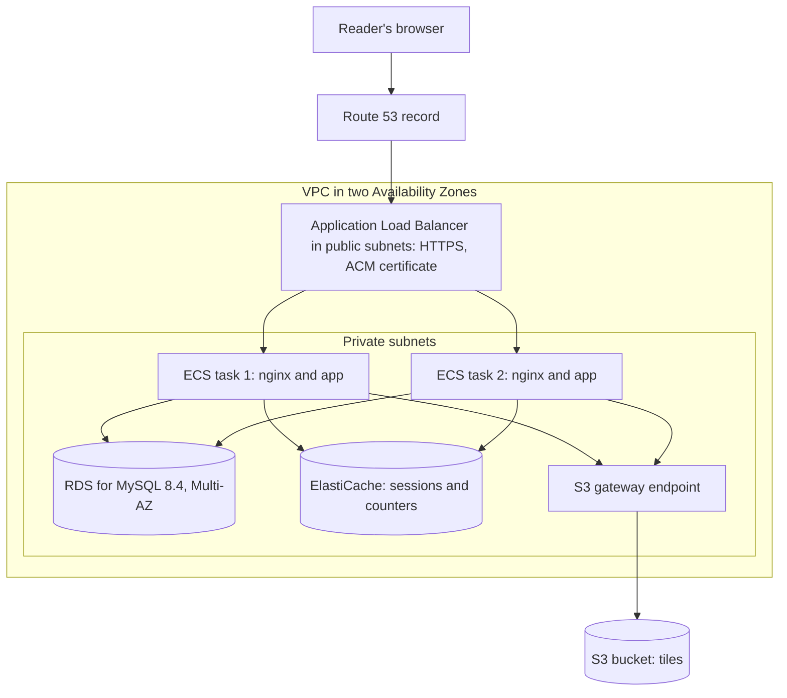
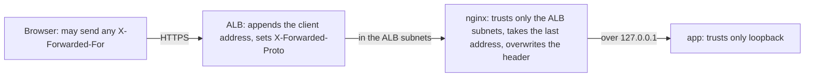
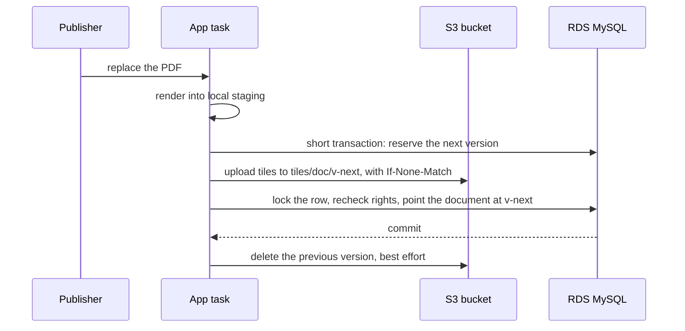

<!-- chapter: 40 | part: VII | owner: writer-production | tag: book-m6-final | status: expanded -->
# Chapter 40: Designing a move to AWS: compute, network, data, and state

Chapter 37 ended with a plan for running three copies of the app instead of one, and Chapters 33 to 36 showed how the app runs today: one machine, Docker Compose, nginx, and Caddy in front, a MySQL container beside it. This chapter asks what it would take to run the same app as a production service on Amazon Web Services (AWS), the cloud platform, in a way that improves availability, recoverability, security, and room to grow, rather than only changing where it runs. It is the first of two chapters: Chapter 41 continues with secrets, operations, the optional edge, cost, and the decision to go.

> **Read this first: this is a design, not a deployment.** The project never ran the Secure Document Viewer on AWS. What you read here is a plan built from two things you can check: the app's code at `book-m6-final`, and the official AWS documentation as it stood on September 20, 2026. A statement that depends on that documentation is tagged with a number in parentheses, such as (source 3), the first time its page is cited; the numbered list of pages is at the end of the chapter. "Checked" means read and compared, not tried in an account. AWS changes, so check again before you build. Where a claim could not be verified, the text says so. Code marked "illustrative" was never run. There are no prices and no benchmarks: use the AWS Pricing Calculator with your own numbers.

## Learning objectives

By the end of this chapter, you will be able to:

- Map the pieces of today's Docker Compose stack to AWS building blocks, and say what is not quite the same about each.
- Name the classes and settings in the app that would change for compute, the database, the tiles, and the shared state, and say what would not change.
- Explain how the trusted-proxy rules of Chapters 32 and 33 change behind an Application Load Balancer.
- Explain why the atomic replace of a document survives the move to S3 only because the database pointer is the switch.
- Describe what has to be atomic when sessions and rate-limit counters move to a shared store.
- Say when the app should not move at all (finished in Chapter 41).

## Prerequisites

No AWS knowledge is assumed. If you are short of time, read Section 37.17 and Chapter 39 in full and skim the rest as you meet it.

- Chapters 8, 10, 14 and 16: HTTP headers, cookies, and TLS; containers and Compose; transactions, row locks, and Flyway; sessions, throttling and trusted proxies.
- Chapters 32 to 36: the security review, deployment, backups, metrics, and CI that this chapter re-plans.
- Chapter 37, especially Section 37.17, and Chapter 39: the seven-step plan and the patterns (twelve-factor configuration, immutable versions, defense in depth).

## Beginner tier: What moving to a cloud means

### 40.1 The analogy: from your own workshop to a serviced building

Today the app lives in a workshop you run yourself: one room (one machine), your own tools (Docker Compose), and you are the person who fixes the roof. Moving to a cloud is like renting space in a large serviced building. The building provides electricity, locks, a reception desk, and a backup generator as separate services that you switch on and pay for. You no longer maintain the roof.

**Where the analogy breaks down:** in two places. First, the building's services are many and separately configured: each one has its own settings, permissions, and failure modes, and a mistake in one (a door left open) is yours, not the landlord's. AWS calls this the **shared responsibility model**: AWS secures the cloud itself, and you secure what you put in it (source 1)<!-- source: AWS shared responsibility model, aws.amazon.com/compliance/shared-responsibility-model, checked 2026-09-20 -->. Second, a landlord can change the building's rules and prices, and you can't walk through the machinery yourself: you see the services only through their documentation and their settings. (Cost is a separate lesson, in Chapter 41, Section 41.10. Some services bill while they exist, even when nobody is using them. This chapter calls that **idle cost**.)

### 40.2 Terms you need

Here are the words you need before the table. Each is defined again in plain words where it first matters.

- **Region and Availability Zone (AZ):** a Region is a geographic area where AWS runs data centers; an Availability Zone is one or more separate data centers inside it. Using two AZs means a failure in one doesn't take you down.
- **VPC (virtual private cloud):** your own private network inside AWS, divided into **subnets**. A **security group** is a firewall attached to a resource that says which traffic may enter and leave.
- **Managed service:** AWS runs the software for you (patches, backups, replacing failed machines), and you give up some control.
- **IAM (Identity and Access Management):** says who may do what to which AWS resource. An **IAM role** is a set of permissions a program assumes temporarily, with no stored password or key.
- **Task:** one running copy of your containers, started by Amazon ECS (Elastic Container Service) from a task definition.
- **Task role and task execution role:** two IAM roles of a task. Your code uses the task role; ECS itself uses the task execution role to pull the image and read secrets (Section 41.2).
- **Sidecar:** a helper container that runs beside the main container in the same task and shares its network.
- **CDN (content delivery network):** a service that keeps copies of files close to readers; CloudFront is AWS's.
- **CIDR:** a compact way to write an address range, such as `10.0.1.0/24`.
- **DNS:** the internet's address book, which turns a name into an address.
- **RDS (Relational Database Service) and S3 (Simple Storage Service):** RDS is a managed database; S3 is **object storage**, a place that keeps files (objects) by name in containers called buckets.
- **Multi-AZ:** a setup that keeps a standby copy of a service in a second Availability Zone.
- **ARN (Amazon Resource Name):** the unique address of one AWS resource, such as a secret or a role.
- **KMS (Key Management Service):** the AWS service that holds encryption keys.
- **OIDC (OpenID Connect):** a way for one service (here, GitHub) to prove its identity to another (AWS) without a stored password.
- Idle cost (from Section 40.1): what a resource bills while it exists, whether, or not anyone uses it.
- **Infrastructure as code** (Chapter 39, Section 39.13): describing the environment in files.

The AWS services are defined where they first appear; Table 40.1 lists them together.

### 40.3 The map: each Compose piece and its AWS counterpart

Table 40.1 lists the pieces of today's stack and the AWS service that would do a similar job. "Similar" matters: the last column says how they differ, and every row on the right is future work, not code the project has. The "Chapter 37 plan step" column refers to the seven steps of Section 37.17: (1) share sessions, (2) share counters, (3) share tiles, (4) one runner for scheduled jobs, (5) the same secret everywhere, (6) a load balancer in front, and (7) rolling deploys. Chapter 41, Figure 41.5, uses a different order, chosen so that the first move helps even a single copy. The rest of the chapter takes the rows in turn.

**Table 40.1 — From the Compose stack to AWS**

| Today (Compose, `book-m6-final`) | On AWS | Chapter 37 plan step | Not quite the same because |
|---|---|---|---|
| `app` and `web` containers | **Amazon ECS** (Elastic Container Service, which runs containers) on **AWS Fargate** (which runs them without you managing servers), one task holding nginx and the app | 6, 7 | you size CPU and memory in fixed pairs, and a task is replaced, not repaired |
| Caddy (TLS) and the published port | **Elastic Load Balancing**, an **Application Load Balancer (ALB)**, with a certificate from **AWS Certificate Manager (ACM)**, and a **Route 53** DNS record | 6 | the ALB adds no HTTP Strict Transport Security (HSTS) header unless configured (this design keeps it in nginx), and it sees a different client address |
| `mysql` container and `mysql-data` volume | **Amazon RDS** for MySQL, Multi-AZ | supports 3 and backups | managed: AWS patches and fails over, and the standby serves no reads |
| `app-storage` volume (tiles) | **Amazon S3** bucket | 3 | objects, not directories: there is no atomic folder rename |
| In-memory sessions, throttle counters | **Amazon ElastiCache** (Valkey or Redis OSS) | 1, 2 | nothing in Compose did this; the state lived inside the app |
| `.env` file | **AWS Secrets Manager** and an IAM task role | 5 | the value is injected at start and does not update on rotation |
| `@Scheduled` jobs on every instance | **Amazon EventBridge Scheduler** starting one ECS task, or a leader lock (one task wins a shared lock) | 4 | a new way to start the job, not a change to what it does |
| `docker compose logs`, Prometheus | **Amazon CloudWatch**, optionally **Amazon Managed Service for Prometheus** | Chapter 35 | metrics and logs now live in services you pay for |
| GitHub Actions `ci.yml` | GitHub Actions with OpenID Connect to AWS, images in **Amazon ECR** | Chapter 36 | no stored AWS key: short-lived credentials instead |
| Backup commands in the README | RDS backups, S3 versioning, **AWS Backup** | Chapter 34 | no service checks that database and tiles match |

Figure 40.1 draws the target: the box labeled VPC is the private network, with the load balancer in its public subnets and everything else in private subnets. Chapter 41, Section 41.3 (Figure 41.1) gives the network layout.



<!-- source: docker-compose.yml, application.yml at book-m6-final for the left-hand pieces; AWS service names per the AWS documentation checked 2026-09-20; this is a design, not a built system -->
*Figure 40.1 — The target architecture: two tasks behind a load balancer, with shared database, cache, and object storage*

*Text description:* A reader's browser reaches a Route 53 record, which points to an Application Load Balancer using HTTPS. Inside a virtual private cloud (VPC) spanning two Availability Zones, the load balancer sits in public subnets and sends requests to two ECS tasks in private subnets, each running nginx, and the app. Both tasks use one Multi-AZ MySQL database, one ElastiCache store for sessions and counters, and, through an S3 gateway endpoint, one S3 bucket for tiles. The figure omits the endpoints or NAT that tasks need to reach the image registry, the secrets store, and logs (Section 41.3).

### 40.4 What stays the same, and do you need this at all?

Some of the best protections don't move. The watermark is still stamped by the server on every tile (Section 37.2), the access re-check still runs in `TileController` on every request (Chapter 32), and the audit log is still in MySQL. The cloud changes where the pieces run and what they share, not what the app decides. The Angular code doesn't change either, because every call is a relative `/api/...` address: only `nginx.conf` (trusted addresses, listen port, both upstream addresses, keep-alive timeout, HSTS), the container's port declaration and the pipeline change.

**Do you need this at all?** Probably not yet. You can keep running the app on one machine with Docker Compose, as Chapters 33 and 34 describe, and it stays secure and recoverable as long as you have tested your backups. Move when one machine can no longer give you the availability you need, and even then start with one cutover that helps a single running copy (secrets, a managed database and object storage for tiles, together), adding a second copy only when you must. Chapter 41, Section 41.11 gives the order, and Table 41.2 lists the signs that you should stay.

**Where does the single copy run?** On AWS too, as a single Fargate task in a VPC, and the three moves above belong in one cutover: a Fargate task has only ephemeral storage, so it cannot run first with a local database and tile folders. (An Amazon EFS volume could bridge the gap, but it is a service you would throw away.) A task role and Secrets Manager injection exist only for a container on AWS compute. If the app stayed on your own server, the database and bucket would be reached across the internet or a VPN, every tile read would pay that latency, and the benefit of having no stored AWS key would disappear. Treat that hybrid as an option with those costs, never as the base of the plan, and never make an RDS instance publicly reachable to support it.

**What else could you choose?** Two pieces of this design are the most expensive, and each has a fair alternative. Table 40.2 sets them side by side. For a service of about 80 readers, take RDS and S3 first, and add a second copy, with a shared store, only when measurements ask for one.

**Table 40.2 — Alternatives considered**

| Piece | This design | A fair alternative | When the alternative wins |
|---|---|---|---|
| Sessions and counters | ElastiCache with Spring Session and Lua scripts | Spring Session's JDBC store (source 2)<!-- source: Spring Session API documentation (JdbcIndexedSessionRepository), docs.spring.io, checked 2026-09-20 --> and counter tables in the MySQL you already run, with the same row-lock discipline the app uses | At tens or hundreds of readers: it removes a service, its failover and its scripts, at the price of database load on every tile request, which already reads the database |
| Tile storage | S3, with the database pointer as the switch | Amazon EFS, a shared file system that Fargate tasks can mount (source 3)<!-- source: Use Amazon EFS volumes with Amazon ECS, Amazon ECS Developer Guide, checked 2026-09-20 -->, which keeps directory rename semantics | When you want `FileOperations`, `commit` and the janitor to change little; you trade latency, throughput settings, cost per gigabyte, and a mount target in each Availability Zone (check the EFS documentation) |
| Database | RDS for MySQL, Multi-AZ | Aurora MySQL, a MySQL-compatible engine with its own storage layer | Rarely at this size; it adds cost and features this app doesn't use |
| Compute | ECS on Fargate | ECS on EC2, or EKS | Steady heavy load (EC2), or an existing Kubernetes practice (EKS) |
| Scheduled jobs | EventBridge Scheduler and one task | A leader lock in the database | When you prefer to keep everything in one program (Section 40.10) |

The table doesn't weigh DynamoDB for the counters: the atomic multi-key check that the sign-in throttle needs would need its transactions, and this chapter doesn't evaluate that further.

## Intermediate tier: Compute, the client address and the database

*Skim on a first read: read the first paragraph of each section and the notes marked "In the code," then come back to the sections you need.*

### 40.5 Compute and the front door: ECS on Fargate behind an ALB

**The choice.** Amazon ECS on Fargate runs containers described by a **task definition** (image, CPU, memory, environment, health check) and keeps a chosen number of copies running as a service, with no servers for you to patch. ECS on EC2 (virtual machines you manage yourself) gives more control at the price of patching and capacity planning. Amazon EKS runs Kubernetes and earns its complexity when you already use it or run many services. For one deployable and a small team, Fargate is the smallest step.

**Sizing.** Fargate offers fixed pairs of CPU and memory (a vCPU is one virtual processor). As of September 20, 2026, 0.5 vCPU pairs with 1 to 4 GB, 1 vCPU with 2 to 8 GB, and 2 vCPU with 4 to 16 GB (source 4)<!-- source: Troubleshoot Amazon ECS task definition invalid CPU or memory errors, Amazon ECS Developer Guide, checked 2026-09-20 -->. Compose limits the app to `1536m`, which isn't a pair; the nearest are 1 vCPU with 2 GB, or 2 vCPU with 4 GB if rendering is the bottleneck.

Two settings tie the app to its CPU: `max-concurrent-renders` and `max-concurrent-tile-renders` (default 0, twice the CPUs the JVM sees, in `TileWorkLimiter`). Set the second explicitly, so that resizing a task is a deliberate act. Both are per task, so two tasks allow twice as many renders.

With nginx beside the app in one task, give each container its own memory limit and size the task above their sum: the Dockerfile lets the JVM take 75% of the memory it can see, which without a container limit would be 75% of the whole task. Fargate's ephemeral storage is 20 GiB by default, up to 200 GiB (source 5)<!-- source: Fargate task ephemeral storage for Amazon ECS, AWS documentation, checked 2026-09-20 -->, and the pulled image lives in that space too, so less is left for staging under `storage-root`.

**The load balancer.** An Application Load Balancer receives HTTPS, spreads requests over healthy tasks, and health-checks each one. Its defaults are a request every 30 seconds to `/`, a 5-second timeout, 5 successes to become healthy, and 2 failures to become unhealthy, with `200` counting as healthy (source 6)<!-- source: Health checks for Application Load Balancer target groups, AWS documentation, checked 2026-09-20 -->. If every target in every enabled Availability Zone fails at once, the ALB "fails open" and sends traffic to all of them anyway.

Point the check at a path nginx already forwards. `/actuator/health` includes the database, so during a failover every task would report `503`, and ECS could replace healthy tasks for a problem they can't fix. The app already enables the narrower probes (`management.endpoint.health.probes.enabled`), and Spring Boot's readiness and liveness groups contain no external systems by default (source 7)<!-- source: Spring Boot reference, Actuator endpoints (Kubernetes probes), docs.spring.io, checked 2026-09-20 -->. Point the check at `/actuator/health/readiness` and add an exact-match location for it in `nginx.conf` (this refines Section 37.17). The price is that readiness doesn't see the cache, S3 or a bad deploy either, so only alarms will act when those fail (Chapter 41, Section 41.4).

**Idle timeout.** The ALB's connection idle timeout defaults to 60 seconds and can be set from 1 to 4000 (source 8)<!-- source: Edit attributes for your Application Load Balancer, AWS documentation, checked 2026-09-20 -->. An upload renders inside the request for up to `render-timeout` (3 minutes), after waiting up to 30 seconds for a render slot, and sends nothing meanwhile; that is why `nginx.conf` has `proxy_read_timeout 300s`. At 60 seconds the ALB would cut a long render, so raise the timeout above the longest wait, for example to 300 seconds.

Raising it creates a second rule. The server behind the ALB (nginx, in the sidecar layout) must keep idle connections open *longer* than the ALB does, or the ALB may reuse a connection the server has just closed and answer `502 Bad Gateway`. Its default `keepalive_timeout` (how long an idle connection stays open) is 75 seconds (source 9)<!-- source: nginx ngx_http_core_module, keepalive_timeout, nginx.org, checked 2026-09-20 -->, and `nginx.conf` sets none, which fits the ALB's default of 60 seconds but not a raised value. So set `keepalive_timeout` in `nginx.conf` above the ALB's value (for example 330s if the ALB is at 300s). The app's own keep-alive (`server.tomcat.keep-alive-timeout`) matters only if the ALB goes straight to the app. Test it: leave a connection idle for longer than 75 seconds, send a request through the ALB, and expect no `502`.

**TLS and DNS replace Caddy.** AWS Certificate Manager (ACM) issues public certificates for the ALB and renews them while they are in use and the DNS validation record stays (source 10)<!-- source: AWS Certificate Manager DNS validation, AWS documentation, checked 2026-09-20 -->. **Amazon Route 53**, AWS's DNS service, points your name at the ALB with an alias record (source 11)<!-- source: Routing traffic to an ELB load balancer, Route 53 documentation, checked 2026-09-20 -->. Caddy also added HSTS; an ALB adds none by default, though a listener attribute can add one and overrides what the app sends (source 12)<!-- source: HTTP header modification for your Application Load Balancer, AWS documentation, checked 2026-09-20 -->; this design keeps HSTS in nginx, so add `Strict-Transport-Security` in `nginx.conf` (repeat it in every location that sets its own headers, because nginx's `add_header` is not inherited there) and keep `SESSION_COOKIE_SECURE=true`.

### 40.6 Who is the client? Forwarded headers behind an ALB

Chapter 32's central incident was about this question. Today Caddy replaces `X-Forwarded-For` with the real peer, nginx accepts a forwarded address only from Caddy at `172.28.0.11` and then overwrites the header, and the app trusts only nginx at `172.28.0.10`. Listing 40.1 shows the nginx side.

**Listing 40.1 — `nginx.conf`, `book-m6-final` (excerpt: three places in the file joined by `# ...` lines; comments removed)**

```nginx
map $realip_remote_addr $forwarded_proto {
    172.28.0.11 $http_x_forwarded_proto;
    default     $scheme;
}
# ...
    set_real_ip_from 172.28.0.11;
    real_ip_header X-Forwarded-For;
# ...
        proxy_set_header X-Forwarded-For $remote_addr;
```

*Path: `frontend/nginx.conf`*

An ALB changes two facts. First, it adds the client's address to the end of any `X-Forwarded-For` header the caller sent, and it sets `X-Forwarded-Proto` (source 13)<!-- source: HTTP headers and Application Load Balancers, AWS documentation, checked 2026-09-20 -->. A forged header therefore arrives as `attacker-value, real-client`: the real address is last. Second, the connection nginx sees now comes from the ALB, which lives in your subnets rather than at one fixed address. Table 40.3 lists the settings involved.

**Table 40.3 — Settings that change behind an ALB**

| Setting | Where | Change |
|---|---|---|
| `idle_timeout.timeout_seconds` | ALB attribute | Raise above the longest render plus queue wait (Section 40.5) |
| `keepalive_timeout` | `nginx.conf` | Set above the ALB idle timeout |
| `routing.http.xff_header_processing.mode` | ALB attribute | Leave at the default, `append` (the other values are `preserve` and `remove`) |
| `routing.http.xff_client_port.enabled` | ALB attribute | Leave off: with it on, each entry carries a `:port` |
| `set_real_ip_from` | `nginx.conf` | The ALB's subnets, in CIDR form |
| `real_ip_recursive` | `nginx.conf` | Leave `off`, so the last address is taken |
| The `map` key for `X-Forwarded-Proto` | `nginx.conf` | A regular-expression key for the ALB's subnets |
| Both `proxy_pass` lines and `listen` | `nginx.conf` | The app's loopback address, and a new port for nginx |
| `FORWARD_HEADERS_STRATEGY` | App environment | Keep `native` |
| `TRUSTED_PROXY_REGEX` | App environment | Leave unset: the default is loopback only |

The fix keeps the design of Chapter 32: trust the ALB's subnets, take the *last* address in the header (source 14)<!-- source: nginx ngx_http_realip_module documentation, nginx.org, checked 2026-09-20 -->, and let `proxy_set_header X-Forwarded-For $remote_addr` overwrite the header with it, as today. For this to be safe, the ALB's subnets should contain nothing else.

The `map` needs more care. A `map` key is matched as an exact string, so a range written there would never match; use a regular-expression key (starting with `~`) or a `geo` block. If the map never matches, nginx passes `$scheme` (`http`) instead of the ALB's `X-Forwarded-Proto`, and the `XSRF-TOKEN` cookie could go out without `Secure` (the session cookie is safe, because `SESSION_COOKIE_SECURE=true` forces it). Example 40.1 sketches both changes for two ALB subnets. Check the `Set-Cookie` header of both cookies through the real ALB.

**Example 40.1 — An illustrative `nginx.conf` sketch for two ALB subnets (not in the repository; never run)**

```nginx
# Illustrative sketch. The ALB's subnets are 10.0.1.0/24 and 10.0.2.0/24.
map $realip_remote_addr $forwarded_proto {
    ~^10\.0\.(1|2)\.  $http_x_forwarded_proto;   # regular-expression key; dots escaped
    default           $scheme;
}
# ...
    set_real_ip_from 10.0.1.0/24;
    set_real_ip_from 10.0.2.0/24;
    real_ip_header X-Forwarded-For;
    keepalive_timeout 330s;                      # above the ALB idle timeout
# ...
        proxy_pass http://127.0.0.1:8080;        # in the /api/ location
# ...
        proxy_pass http://127.0.0.1:8080;        # in the exact /actuator/health location
```

On the app side, Compose sets these values.

**Listing 40.2 — `docker-compose.yml`, `book-m6-final` (excerpt: the `app` service's proxy settings)**

```yaml
      FORWARD_HEADERS_STRATEGY: native
      TRUSTED_PROXY_REGEX: '172\.28\.0\.10'
```

*Path: `docker-compose.yml`*

**Listing 40.3 — `application.yml`, `book-m6-final` (excerpt: the default for the trusted proxy)**

```yaml
      internal-proxies: ${TRUSTED_PROXY_REGEX:127\.0\.0\.1|0:0:0:0:0:0:0:1}
```

*Path: `src/main/resources/application.yml`*

If nginx runs in the *same task* as the app, the two share one network interface and talk over `127.0.0.1` (source 15)<!-- source: Allocate a network interface for an Amazon ECS task (awsvpc), AWS documentation, checked 2026-09-20 -->, so the default in Listing 40.3 (loopback only) fits exactly: unset `TRUSTED_PROXY_REGEX`, but **keep `FORWARD_HEADERS_STRATEGY=native`**. The setting in `application.yml` defaults to `none`, which ignores `X-Forwarded-For` altogether. Then every reader would appear to come from `127.0.0.1`, and the per-address throttles and the audit address would fail silently (the failure Exercise 33.3 asks you to reproduce).

One collision needs fixing. In Compose both listen on 8080 as separate containers; in one task they share a network stack, so nginx moves to another port (say 8081). Change `listen`, both `proxy_pass` lines (the `/api/` location and the exact `/actuator/health` location both point at `http://app:8080` today), the container's port declaration, and the ALB target. Alternatively keep nginx on 8080 and move the Spring app with `SERVER_PORT`, and keep the `web` health check in `docker-compose.yml` consistent with either choice. Figure 40.2 shows the chain.



<!-- source: nginx.conf, docker-compose.yml, application.yml at book-m6-final; ALB header behavior per the AWS documentation checked 2026-09-20; design -->
*Figure 40.2 — The trust chain behind an ALB: one link at a time, as in Chapter 32*

*Text description:* Four boxes in a row. The browser may send any forwarded-for header. The load balancer appends the client's address and sets the protocol header. nginx trusts only the load balancer's subnets, takes the last address in the header, and overwrites the header with it. The app, reached over the loopback address, trusts only loopback.

If you drop nginx and send the ALB straight to the app, the app must trust the ALB's subnets, and Tomcat's default list of trusted proxies covers every private range, which is far too wide (source 16)<!-- source: Apache Tomcat 11 configuration reference, Remote IP Valve, tomcat.apache.org, checked 2026-09-20 -->. Whichever layout you choose, repeat Chapter 32's test on the real environment: send a forged `X-Forwarded-For` through the load balancer and check the audit log for the real address.

**What the browser holds.** Both cookies are tied to the site's hostname, so a new hostname means everyone signs in again. `SDV_SESSION` is `HttpOnly`, `SameSite=Strict`, has no `Domain`, and is `Secure` only when `SESSION_COOKIE_SECURE=true`. `XSRF-TOKEN` is readable by the page's script on purpose, is `SameSite=Strict`, and gets `Secure` from the protocol the app believes it was reached with. After the move, confirm each attribute in the browser's developer tools.

### 40.7 The database: Amazon RDS for MySQL

Amazon RDS runs MySQL for you: AWS handles the operating system, patching windows, backups, and replacement of a failed host. It supports MySQL 8.4, the long-term-support release the project pins (source 17)<!-- source: Amazon RDS for MySQL LTS version 8.4 is now generally available, AWS Database Blog, checked 2026-09-20 -->. Pin major version 8.4 in your infrastructure code, as Dependabot's LTS-only rule does for Compose (Chapter 36), and decide deliberately whether minor upgrades are automatic.

**Multi-AZ** keeps a synchronous standby in another Availability Zone and fails over automatically; the standby serves no reads, so this buys availability, not read scaling, and it can add write latency (source 18)<!-- source: Multi-AZ DB instance deployments for Amazon RDS, AWS documentation, checked 2026-09-20 -->. **Automated backups** and **point-in-time recovery** let you restore to any moment within a retention period you choose (source 19)<!-- source: Introduction to backups, Amazon RDS documentation, checked 2026-09-20 -->. This replaces `mysqldump` (Chapter 34) and removes the need to stop the app for the database half; the consistency problem moves to the tiles (Section 40.8).

**Flyway as a controlled step.** Today the app runs Flyway at startup with the same credentials it uses at runtime, so the runtime user can change the schema. On AWS, run migrations once, as a one-off task before the new tasks start, with a user that may change the schema, and run the service with a user that may only read and write rows. The migrations themselves stay unchanged. Spring Boot has no "migrate and exit" mode, so the one-off is the Flyway command-line container or the app image under a profile that disables the web server, the schedulers, and the first-administrator step; the service tasks then set `spring.flyway.enabled=false`. (`BootstrapAdmin` checks for users and then creates one, so run it in the one-off, or make it tolerate two tasks starting together.)

A rolling deploy also runs old and new code on one schema for a while, so every migration must be backward compatible for one release: add before you remove.

**Connections.** Each task has its own pool, so multiply the pool size by the number of tasks and check the total against the database's connection limit, which depends on the instance class. Spring Boot's default Hikari pool is 10 connections (check your version), so three tasks can open 30. A request that records a denied access holds two connections at once (its audit event is written in a nested transaction), and every tile request does one short database read, so tile traffic is database traffic.

Finally, encrypt the new hop: the JDBC URL in `application.yml` has no TLS setting, so add one that verifies the server against the RDS certificate bundle. Before adopting the service, run the migrations and the MySQL-specific checks of Chapter 18 against a throwaway RDS instance of the same version (`MySqlIntegrationTest` starts its own Testcontainers MySQL, so it would need adapting).

## Advanced tier: Tiles, shared state and scheduled jobs

*Skim on a first read. Sections 40.8 and 40.9 are the hardest parts of the design; Chapter 41 then covers running it.*

### 40.8 The tiles: Amazon S3

Amazon S3 keeps whole files as objects, under keys, in **buckets**. It is the piece that makes a second instance possible, because every task can reach the same bucket. Buckets are private, and **S3 Block Public Access**, a setting that stops any bucket or object from being made public, is on by default (source 20)<!-- source: What is Amazon S3?, AWS documentation, checked 2026-09-20 -->. S3 has a flat structure: `tiles/DOCUMENT-ID/v3/page-0/tile-0_0.png` is one key, and a "folder" is only a shared prefix, which the console can't rename (source 21)<!-- source: Organizing objects in the Amazon S3 console by using folders, AWS documentation, checked 2026-09-20 -->. So there is **no atomic directory rename**. Today `FileOperations.moveDirectory` does exactly that, as Listing 40.4 shows.

**Listing 40.4 — `TileGenerationService.java`, `book-m6-final` (excerpt: `commit` and `loadRawTile`)**

```java
    public void commit(RenderedDocument rendered, String documentId, int version) throws IOException {
        Path target = versionRoot(documentId, version);
        if (Files.exists(target)) {
            throw new IOException("Tile version already exists: " + target);
        }
        Files.createDirectories(target.getParent());
        FileOperations.moveDirectory(rendered.stagingDir(), target);
    }
// ...
    public BufferedImage loadRawTile(String documentId, int version, int page, int row, int col) throws IOException {
        Path tilePath = versionRoot(documentId, version)
                .resolve("page-" + page)
                .resolve("tile-" + row + "_" + col + ".png");

        if (!Files.exists(tilePath)) {
            // The URL was issued for a render that has since been replaced.
            throw new TileGoneException();
        }

        return ImageIO.read(tilePath.toFile());
    }
```

*Path: `src/main/java/com/example/securedocviewer/service/TileGenerationService.java`*

**Why the design survives.** S3 gives strong read-after-write consistency and atomic updates to a single key, and it says plainly that updates are key-based, with "no way to make atomic updates across keys" (source 22)<!-- source: Amazon S3 data consistency model, AWS documentation, checked 2026-09-20 -->. A 500-page document is roughly 6,000 objects, so that sounds fatal. It isn't, because readers only read the version the database row points at (Section 39.11): a half-uploaded `v4` is invisible until the row is switched, and the switch is one database update under the row lock, not a storage operation. **The database pointer is the atomic switch**; S3 only has to hold immutable objects.

What changes is the order of work. Today, in `replaceFile`, `tiles.commit(...)` runs inside the transaction, under the row lock (a first upload commits its tiles before its own transaction begins), and moving a local folder takes an instant. Uploading thousands of objects under a row lock would hold it long. The simple shape accepts that, because replacements are rare. The better shape reserves the next version number first (a short transaction that takes it from a counter column on the document row, probably needing a new Flyway migration), uploads outside any lock, and takes the lock only to switch the pointer.

Two rules keep the better shape correct. The counter must never reuse a number, so a retry after a failed attempt uses a new prefix instead of meeting a leftover one (a `412`); the debris-clearing step that `replaceFile` runs at the next version today therefore disappears, and Chapter 41, Section 41.5 adds a step for a real recovery, which can rewind the counter. And the switch must happen only if the reserved number is greater than the current one, or two publishers could switch out of order and move the pointer backwards. A conditional write with `If-None-Match: *` fails with `412 Precondition Failed` if the key exists (source 23)<!-- source: How to prevent object overwrites with conditional writes, AWS documentation, checked 2026-09-20 -->, the same guarantee as the `Files.exists(target)` check in Listing 40.4. It needs Signature Version 4 requests, and a concurrent delete can return `409 Conflict`, which you retry.

The publisher's experience changes too. Today two concurrent replaces serialize and the last one committed wins. In the better shape the one that reserved the higher number wins even if it finished first, and the other upload is discarded; answer that publisher with `409 Conflict` and a message to try again, and record an audit event. (Section 39.11 and Figure 39.5 describe today's shape.) Also budget the upload: about 6,000 requests happen inside a request that already renders for up to three minutes, so use bounded parallelism, retry throttled requests, check the object count against the render before locking the row, and count the upload time in the ALB and nginx timeouts. Figure 40.3 shows the better shape.



<!-- source: DocumentService.replaceFile and TileGenerationService at book-m6-final; S3 behavior per the AWS documentation checked 2026-09-20; design -->
*Figure 40.3 — Replacing a document on S3: upload first, switch the pointer last*

*Text description:* A publisher asks the app to replace a PDF. The app renders into local staging, reserves the next version number in the database, uploads all tiles to a new version prefix in S3 with a no-overwrite condition, then locks the document row, rechecks the caller's rights and points the document at the new version, and commits. Finally it deletes the previous version's objects on a best-effort basis.

**In the code.** The cleanest change is a small interface between `TileGenerationService` and storage, with a local-folder implementation (kept for development) and an S3 one. The names mirror the real methods: the four storage methods, plus `discard`, which `replaceFile` calls when the transaction fails.

**Example 40.2 — An illustrative storage seam (not in the repository)**

```java
// Illustrative design sketch: not part of the project.
interface TileStore {
    void commit(RenderedDocument rendered, String documentId, int version) throws IOException;
    void deleteVersion(String documentId, int version) throws IOException;
    void deleteTiles(String documentId) throws IOException;
    void discard(RenderedDocument rendered) throws IOException;
    BufferedImage loadRawTile(String documentId, int version, int page, int row, int col) throws IOException;
}
```

Rendering stays as it is, writing to local staging, and `FileOperations` is needed only by the local implementation. A local `commit` moves the staging folder; an S3 one copies, so it and `discard` must clean up the staging folder, and `deleteVersion` and `deleteTiles` must list and delete in batches (about 6,000 keys for a large document). A tile read is now a network call: measure it (Chapter 35), and remember that raw tiles cached in the process are unstamped and must never leave the app.

**A missing tile must still be recognizable as missing.** An S3 "no such key" must map to the same outcomes as a missing file today: `TileGoneException` (`410`) or, if the current render is the one missing, a logged `500`. But S3 answers a request for a missing key with `404` only if the caller may list the bucket; otherwise it answers `403 Access Denied` (source 24)<!-- source: GetObject, Amazon S3 API Reference, checked 2026-09-20 -->, which looks like an access error and would turn a designed `410` into a `500`. So the service role needs `s3:ListBucket` on the bucket (Example 41.2), and a test should request a tile of a replaced version and expect `410`.

**The janitor, honestly.** It is tempting to hope that lifecycle rules replace `StorageJanitor` completely. They replace part of it. A **lifecycle rule** can expire noncurrent object versions and abort incomplete multipart uploads (source 25)<!-- source: Examples of S3 Lifecycle configurations, AWS documentation, checked 2026-09-20 -->, which covers debris from deletes and failed uploads once **S3 Versioning** is on. With versioning, deleting an object only adds a delete marker; the rule then removes the older versions, and a separate rule removes markers left with no versions (Example 41.4).

But `v{n}` folders are *different keys*, not versions of one key, so a rule can't know that `v3` is superseded. The app must delete the old prefix itself, as `deleteVersion` does (with versioning on, that delete leaves noncurrent versions behind, and Chapter 41, Section 41.5 explains why their expiry must be at least as long as your longest database backup retention). The orphan sweep, including the safety net that refuses to prune when a document's current version is missing, stays as a scheduled job over S3 listings. It also loses its age test (S3 prefixes have no modification time, so use the newest object's last-modified time), and listing the whole bucket every six hours costs requests.

**Bucket settings** (Chapter 41, Section 41.7): block public access, keep versioning on, and use encryption. S3 has encrypted new objects with S3-managed keys automatically since January 5, 2023, and you can choose AWS KMS keys for control of key policy and rotation (source 26)<!-- source: Setting default server-side encryption behavior for Amazon S3 buckets, AWS documentation, checked 2026-09-20 -->. If you do, the service role also needs `kms:GenerateDataKey` (to write) and `kms:Decrypt` (to read) on that key, and the key policy must allow the role (source 27)<!-- source: Using server-side encryption with AWS KMS keys (SSE-KMS), Amazon S3 User Guide, checked 2026-09-20 -->. Every request also counts against KMS request quotas, so read about S3 Bucket Keys first.

### 40.9 Sessions and counters: ElastiCache

Amazon ElastiCache runs **Valkey** or Redis OSS. Valkey is an open-source, Redis-compatible in-memory store; either one keeps its data in memory, and all tasks can share it. It holds what the code keeps per instance today: sessions, the sign-in and tile counters, and the audit throttle.

**Sessions.** Spring Session with Redis stores `HttpSession` data in the shared store. The admin Sessions page lists and revokes sessions through Spring Security's `SessionRegistry` (`SessionAdministration`), and `SecurityConfig` creates an in-memory `SessionRegistryImpl` (Listing 40.5). Spring Session's `SpringSessionBackedSessionRegistry` can only return the sessions of a *named* user, and only with the indexed Redis repository (source 28)<!-- source: Spring Session reference, Redis Configurations and Spring Security Integration, docs.spring.io, checked 2026-09-20 -->. But `SessionAdministration` asks for *every* user at once (`getAllPrincipals()`), which that registry does not support (check the current Spring Session documentation).

Left as it is, the admin Sessions page, revoke-by-handle, and the rule that a role change or password reset ends the user's sessions would all break, and the last is a security property (Chapter 16). The fix is to take the user names from the database and ask for each user's sessions, or to call `findByPrincipalName` on the session repository, and then to re-run the security integration tests for those three behaviors against a real Redis.

**Listing 40.5 — `SecurityConfig.java`, `book-m6-final` (excerpt: the two session beans)**

```java
    @Bean
    public SessionRegistry sessionRegistry() {
        return new SessionRegistryImpl();
    }

    /** Lets the registry forget sessions when they are invalidated or time out. */
    @Bean
    public HttpSessionEventPublisher httpSessionEventPublisher() {
        return new HttpSessionEventPublisher();
    }
```

*Path: `src/main/java/com/example/securedocviewer/security/SecurityConfig.java`*

Table 40.4 lists the other session details that change.

**Table 40.4 — Session details that change when Spring Session owns the sessions**

| Detail | What changes | What to do |
|---|---|---|
| `SessionMetadata` | An in-memory map cleaned by `SessionDestroyedEvent`. Once Spring Session owns the sessions, the container no longer publishes those events (nor those the `HttpSessionEventPublisher` of Listing 40.5 forwards), so stale entries pile up | Move it into the session or the store |
| Serialization | Java serialization by default, JSON as an alternative (source 29)<!-- source: Spring Session reference, Redis Configurations, docs.spring.io, checked 2026-09-20 -->; during a deploy old and new tasks read each other's sessions | Test that every attribute (the security context, `SessionLifetimeFilter.SIGNED_IN_AT`) round-trips; keep classes compatible for one release, or use JSON |
| Keyspace notifications | Spring Session enables them itself, but ElastiCache blocks `CONFIG`; expiry events are best effort | Set `notify-keyspace-events` (`Egx`) in a custom parameter group and register a `ConfigureRedisAction.NO_OP` bean; the Boot 4 properties are `spring.session.data.redis.*` (source 30)<!-- source: Engine specific parameters and Supported and restricted commands, Amazon ElastiCache documentation; Spring Session ConfigureNotifyKeyspaceEventsAction Javadoc; Spring Boot issue 47333 (Spring Session property rename), checked 2026-09-20 --> |
| Timeout | The page's idle warning counts down the last five minutes of the session timeout; the ALB's idle timeout is unrelated | Keep `server.servlet.session.timeout` at 30 minutes in the store |
| Cookie and errors | Spring Session writes the cookie; a cache failover means a `401` and a sign-in (Chapter 22); a revoked session gets a plain `401`, not "Your session has ended" | Check the cookie's name, `HttpOnly`, `SameSite=Strict` and `Secure` after the switch |

`SessionKeys`, `SessionLifetimeFilter` and the cookie-based cross-site request forgery (CSRF) token repository need no change.

**The cache is a hard dependency.** Sessions live there, so if the store is unreachable nobody can authenticate, and the "fail open or fail closed" question for the counters (Exercise 40.5) matters only for a short blip. A single node loses sessions and counters when its Availability Zone fails; use a replication group with a replica in a second Availability Zone and automatic failover, and alarm on it (Chapter 41, Section 41.4).

**What must be atomic.** Look at what makes the current counters correct.

**Listing 40.6 — `LoginThrottle.java`, `book-m6-final` (excerpt: `reserve`)**

```java
    public synchronized Instant reserve(String username, String clientIp, boolean recognisedDevice) {
        checkAllowed(username, clientIp, recognisedDevice);
        Instant at = clock.instant();
        recordFailure(username, clientIp, at);
        return at;
    }
```

*Path: `src/main/java/com/example/securedocviewer/security/LoginThrottle.java`*

`synchronized` is the atomic step of Chapter 32: check three rules and count the attempt as one operation, so parallel guesses get no more tries than sequential ones. Across three tasks it protects nothing. In Redis the equivalent is one **Lua script**, because Redis runs a script atomically: other commands wait, and its effects have either all happened or not at all (source 31)<!-- source: Scripting with Lua, Redis documentation, redis.io, checked 2026-09-20 -->. The script checks the three keys and adds the timestamp to all, or refuses without adding. ElastiCache supports Lua scripting (`EVAL`, `EVALSHA` and `SCRIPT LOAD`); the newer `FUNCTION` commands are not available on serverless caches (source 32)<!-- source: Supported and restricted commands, Amazon ElastiCache documentation, checked 2026-09-20 -->, so use plain scripts.

**Listing 40.7 — `TileRateLimiter.java`, `book-m6-final` (excerpt: the start of `recordAndEnforce`)**

```java
    public Instant recordAndEnforce(String username) {
        Window window = windowsByUser.computeIfAbsent(username, id -> new Window());
        Instant now = Instant.now();
        Instant cutoff = now.minusSeconds(properties.getTileRateLimitWindowSeconds());

        synchronized (window) {
            while (!window.timestamps.isEmpty() && window.timestamps.peekFirst().isBefore(cutoff)) {
                window.timestamps.pollFirst();
            }
            if (window.timestamps.size() >= properties.getTileRateLimitPerWindow()) {
```

*Path: `src/main/java/com/example/securedocviewer/security/TileRateLimiter.java`*

This is a sliding window: drop old timestamps, refuse if too many remain (with an exact `Retry-After` from the oldest), otherwise record the new one; `refund` removes one specific timestamp when the server was merely busy. A shared version keeps a sorted set per user (score is the time, member a unique id), and one script does prune, count, and refuse-or-add; `refund` removes one member. A cheaper "count with an expiry" would change the "rolling window" the README promises. Example 40.3 sketches the script's shape only.

**Example 40.3 — An illustrative Lua sketch of the atomic step (not in the repository, not run)**

```lua
-- Illustrative sketch: not part of the project, never run.
-- KEYS[1] = "rate:" .. username        ARGV: window_ms, limit, unique_id
local t = redis.call('TIME')                          -- the store's clock, not the caller's
local now_ms = tonumber(t[1]) * 1000 + math.floor(tonumber(t[2]) / 1000)
redis.call('ZREMRANGEBYSCORE', KEYS[1], 0, now_ms - tonumber(ARGV[1]))
if redis.call('ZCARD', KEYS[1]) >= tonumber(ARGV[2]) then
  local oldest = redis.call('ZRANGE', KEYS[1], 0, 0, 'WITHSCORES')
  return {0, oldest[2]}                               -- refused; the oldest score gives Retry-After
end
redis.call('ZADD', KEYS[1], now_ms, ARGV[3])
return {1, ARGV[3]}                                   -- allowed; the unique id is kept for a refund
```

Reading the time inside a script is allowed on current Redis and Valkey versions; check the version your cache runs. The script returns the answer and the `Retry-After` basis together, so the decision and the value are one atomic step.

Beyond the tile script, the sign-in throttle needs more than one script and some decisions. Table 40.5 lists them.

**Table 40.5 — What a shared sign-in throttle needs beyond the tile script**

| Need | Why | What to do |
|---|---|---|
| A unique id per attempt | `succeeded` and `refund` remove one specific attempt, and attempts can share a millisecond | Return an id from the script (Example 40.3); the methods that return an `Instant` change, and `TileController` with them |
| A per-user index | `unlock` and `isLocked` act on every key with a user-name prefix, and Redis has no prefix delete | Keep a per-user index set |
| One hash slot | A script may touch only keys in one slot, and the three sign-in keys hang on different values | Use a replication group with cluster mode *disabled*, or the script fails with a cross-slot error; a serverless cache always runs in cluster mode (source 33)<!-- source: Common troubleshooting steps and best practices with ElastiCache, Amazon ElastiCache documentation, checked 2026-09-20 -->, so it is ruled out unless the keys share a slot |
| One clock | Each task has its own clock | Use the store's clock (`TIME`, Example 40.3); key expiry equal to the window replaces the `sweep()` methods |
| A failure policy | The code has no answer to "the store is unreachable," and sessions share the store | Treat it as a hard dependency (replica in a second Availability Zone, automatic failover), decide whether counters fail closed or open, write it down, alarm on it and test it |

The **audit throttle** (`AuditLogService.recordAtMostEvery`) is the third piece of state. In memory, three tasks would each write their own "once per interval" event, so the log shows up to three times as many `PAGE_VIEWED` and `ACCESS_DENIED` rows: a tolerable, documented approximation first; a shared key with an expiry is the exact fix. `KnownDevices` and the audit log are already in MySQL, and `TileWorkLimiter` (a semaphore) stays local, because it caps the CPU of one task. ElastiCache replication is asynchronous, so a failover can lose recent data (source 34)<!-- source: Minimizing downtime in ElastiCache by using Multi-AZ, AWS documentation, checked 2026-09-20 -->; for sessions and counters that means a few sign-ins and a reset limit, the effect a restart has today.

### 40.10 Scheduled jobs: one runner

The app has six `@Scheduled` methods (one uses the fully qualified annotation name, so a plain search finds five): the storage janitor (every 6 hours), the audit purge (03:30), the recognized-device purge (03:45), the audit throttle sweep, and the in-memory sweeps of `LoginThrottle` and `TileRateLimiter`. On three tasks, every one runs three times. The purges are idempotent deletes; the sweeps are per-task memory housekeeping and disappear if the counters move to Redis; the janitor is the one to make single.

Amazon EventBridge Scheduler can start an ECS task on a schedule (source 35)<!-- source: EventBridge Scheduler templated targets and Using Amazon EventBridge Scheduler to schedule Amazon ECS tasks, AWS documentation, checked 2026-09-20 -->, so the job becomes a separate small task run from the same image, with a flag that selects the job (a change to how the app starts, not to what the job does). The alternative is a leader lock in the database or cache: all tasks try, one wins. The scheduler is simpler to see; the lock keeps everything in one program. Either way, the instance-local sweeps keep running in the service tasks.

Neither removes every risk. A run that outlasts its interval, a retry, or an at-least-once invocation can overlap another run, and a janitor pass overlaps normal uploads, so make the job idempotent and guard it with a short lease or a database lock so that an overlapping run exits at once. A leader lock has its own classic failure: a holder that pauses can carry on after its lease has ended, while a new leader has started.

Two specifics need code. The two purges have property-driven schedules, so a service task can switch them off with a setting, but the janitor's timings are fixed in the code. And scheduling is enabled on the main application class, so a one-off task from the same image runs every scheduler unless the app gains a profile or flag.

## Common mistakes

- **Trusting the load balancer's `X-Forwarded-For` without pinning who may send it.** Symptom: throttling and the audit log show the wrong or a forged address. Fix: Figure 40.2 and the forged-header test.
- **Unsetting the trusted-proxy pattern and also dropping `FORWARD_HEADERS_STRATEGY=native`.** Symptom: every reader appears to come from `127.0.0.1` and shares one sign-in throttle. Fix: keep the strategy, and leave only the pattern at its default.
- **Cookies without `Secure` after the move.** Symptom: `SDV_SESSION` or `XSRF-TOKEN` shown without the flag in the developer tools. Fix: `SESSION_COOKIE_SECURE=true`, and a trusted forwarded protocol in the nginx `map`.
- **Timeouts that don't fit together.** Symptoms: long uploads fail at about a minute (ALB idle timeout left at its default), or intermittent `502` responses on idle connections (nginx's `keepalive_timeout` not above the ALB's). Fix: Table 40.3.
- **A health path that includes the database.** Symptom: healthy tasks restarted during a failover. Fix: use the readiness probe.
- **Assuming lifecycle rules delete superseded `v{n}` prefixes.** They expire object versions, not folders you named. Fix: keep the app's delete and an orphan sweep.
- **Keeping the in-memory throttles, or putting a CDN in front of tiles.** Symptoms: limits that multiply with the number of tasks; revocations that no longer take effect on pages already open, or watermarks that vanish. Fix: shared, atomic counters, and tiles that stay app-served and are never cached at a shared edge (Chapter 41, Section 41.8).

## In this project

The project has no AWS code. These are the files that would change, and how, if you built this design.

| Path | Tag | Change |
|---|---|---|
| `frontend/nginx.conf` | `book-m6-final` | Trusted addresses become the ALB subnets; new listen port; both `proxy_pass` lines to loopback; readiness location; `keepalive_timeout`; HSTS (Example 40.1) |
| `docker-compose.yml` | `book-m6-final` | Stays for development; the AWS task definition replaces its `app` and `web` services |
| `src/main/java/.../service/TileGenerationService.java` | `book-m6-final` | Storage moves behind an interface (Example 40.2); `commit`, `loadRawTile`, `deleteVersion`, `deleteTiles` get an S3 implementation |
| `src/main/java/.../service/FileOperations.java` | `book-m6-final` | Used only by the local implementation |
| `src/main/java/.../service/StorageJanitor.java` | `book-m6-final` | Rewritten over S3 listings; one runner |
| `src/main/java/.../document/DocumentService.java` | `book-m6-final` | `replaceFile` reordered: upload before the lock (Figure 40.3) |
| `src/main/java/.../security/SecurityConfig.java` | `book-m6-final` | `SessionRegistry` bean becomes Spring Session backed (Listing 40.5) |
| `src/main/java/.../security/SessionAdministration.java` | `book-m6-final` | Lists sessions per user from the database instead of asking for every principal (Section 40.9) |
| `src/main/java/.../security/SessionMetadata.java`, `LoginThrottle.java`, `TileRateLimiter.java` | `book-m6-final` | Shared, atomic stores; unique attempt ids (Listings 40.6 and 40.7, Example 40.3, Tables 40.4 and 40.5) |
| `src/main/java/.../audit/AuditLogService.java` | `book-m6-final` | Audit throttle shared, or accepted as approximate |
| `src/main/resources/application.yml` | `book-m6-final` | Trusted proxy default fits a sidecar; new settings for bucket, Redis |

See any with `git show book-m6-final:<path>`.

## Try it

### Exercise 40.1 ★ Map the pieces

*Level: one star.*

Without looking at Table 40.1, list which AWS service replaces each of: the `mysql` container, the `app-storage` volume, the `.env` file, and Caddy. Then say which of the four the project could adopt first with one instance still running.

*Hint:* Section 40.4 and Chapter 41's Figure 41.5 give the answer, and Table 40.1 checks the four names.

*Solution:* Appendix C, Exercise 40.1.

### Exercise 40.2 ★ Code or documentation?

*Level: one star.*

Pick five factual statements from Section 40.6 and say whether the chapter checked each against the app's code at `book-m6-final` or against AWS's documentation, and how you can tell.

*Hint:* listing captions name a file and a tag; (source N) tags point to the list at the end.

*Solution:* Appendix C, Exercise 40.2.

### Exercise 40.3 ★★ Trace the header

*Level: two stars.*

A client sends `X-Forwarded-For: 198.51.100.7` to the ALB, whose own view of the client is `203.0.113.9`. Write the value of the header at nginx, at the app, and in the audit log, using Figure 40.2 and the default ALB behavior. Which nginx setting makes the last address the one that counts?

*Hint:* the ALB adds the address it sees to the end of the header, and nginx overwrites the header with one address.

*Solution:* Appendix C, Exercise 40.3.

### Exercise 40.4 ★★ Why the pointer is the switch

*Level: two stars.*

Explain why the absence of an atomic directory rename in S3 doesn't break replacing a document, and what would break if a reader could be handed a tile URL for a version the database didn't yet point at. (A tile token carries a render version, and a request for a version that is no longer current answers `410`; Chapter 32.)

*Hint:* start from who reads which version.

*Solution:* Appendix C, Exercise 40.4.

### Exercise 40.5 ★★★ Make the limiter shared

*Level: three stars.*

Write, in plain steps (not code), the atomic operation a shared `TileRateLimiter` must perform, including the refund, and say what would go wrong if pruning, counting and adding were three separate Redis commands. Then decide whether tile requests are refused or allowed unlimited when the shared store is unreachable, and defend the choice.

*Hint:* Example 40.3 shows the shape, and the sliding-window paragraph before it explains the refund.

*Solution:* Appendix C, Exercise 40.5.

### Exercise 40.6 ★★★ What has to change for Redis?

*Level: three stars.*

List every class among `SessionAdministration`, `SessionMetadata`, `LoginThrottle` and `TileRateLimiter` whose methods would have to change if sessions and counters move to Redis, and say for each change whether it is a new implementation of the same method or a new method signature.

*Hint:* read Section 40.9 and Table 40.5, and look at what each method returns.

*Solution:* Appendix C, Exercise 40.6.

## Summary

- This chapter is a design: the project never ran on AWS, and the AWS statements were checked against the documentation on September 20, 2026 and should be rechecked before use.
- Each piece of the Compose stack maps to a building block (Table 40.1 also says how each differs): ECS on Fargate and an ALB, RDS, S3, ElastiCache, EventBridge Scheduler, and Secrets Manager.
- The trusted-proxy rules keep their shape behind an ALB: trust its subnets, take the last address, overwrite, keep `FORWARD_HEADERS_STRATEGY=native`, set nginx's `keepalive_timeout` above the ALB's idle timeout, and test with a forged header.
- S3 has no atomic directory rename, and the design doesn't need one: the database pointer is the switch, versions are immutable, and version numbers are never reused.
- Shared counters must stay atomic, which in Redis means one script with unique attempt ids, one hash slot and a failure policy; `SessionAdministration` must change, and the cache is a hard dependency that readiness does not see (a fair alternative, sessions, and counters in MySQL, exists at small scale: Table 40.2).
- Keep tiles app-served and never cached at a shared edge (Chapter 41, Section 41.8).
- Chapter 41 continues with secrets, operations, the optional edge, cost, and when to stay on Compose.

## Further reading

- Amazon ECS Developer Guide: https://docs.aws.amazon.com/AmazonECS/latest/developerguide/
- Elastic Load Balancing, Application Load Balancers: https://docs.aws.amazon.com/elasticloadbalancing/latest/application/
- Amazon RDS User Guide: https://docs.aws.amazon.com/AmazonRDS/latest/UserGuide/
- Amazon S3 User Guide: https://docs.aws.amazon.com/AmazonS3/latest/userguide/
- Amazon ElastiCache: https://docs.aws.amazon.com/AmazonElastiCache/latest/dg/
- Spring Session reference: https://docs.spring.io/spring-session/reference/
- nginx, ngx_http_realip_module: https://nginx.org/en/docs/http/ngx_http_realip_module.html
- AWS shared responsibility model: https://aws.amazon.com/compliance/shared-responsibility-model/

## Sources

The documentation pages behind the statements tagged (source N), read on September 20, 2026, in the order they are first cited. The publisher is Amazon Web Services unless the entry names another project.

1. AWS shared responsibility model, aws.amazon.com/compliance/shared-responsibility-model.
2. Spring Session API documentation (JdbcIndexedSessionRepository), docs.spring.io.
3. Use Amazon EFS volumes with Amazon ECS, Amazon ECS Developer Guide.
4. Troubleshoot Amazon ECS task definition invalid CPU or memory errors, Amazon ECS Developer Guide.
5. Fargate task ephemeral storage for Amazon ECS, AWS documentation.
6. Health checks for Application Load Balancer target groups, AWS documentation.
7. Spring Boot reference, Actuator endpoints (Kubernetes probes), docs.spring.io.
8. Edit attributes for your Application Load Balancer, AWS documentation.
9. nginx ngx_http_core_module, keepalive_timeout, nginx.org.
10. AWS Certificate Manager DNS validation, AWS documentation.
11. Routing traffic to an ELB load balancer, Route 53 documentation.
12. HTTP header modification for your Application Load Balancer, AWS documentation.
13. HTTP headers and Application Load Balancers, AWS documentation.
14. nginx ngx_http_realip_module documentation, nginx.org.
15. Allocate a network interface for an Amazon ECS task (awsvpc), AWS documentation.
16. Apache Tomcat 11 configuration reference, Remote IP Valve, tomcat.apache.org.
17. Amazon RDS for MySQL LTS version 8.4 is now generally available, AWS Database Blog.
18. Multi-AZ DB instance deployments for Amazon RDS, AWS documentation.
19. Introduction to backups, Amazon RDS documentation.
20. What is Amazon S3?, AWS documentation.
21. Organizing objects in the Amazon S3 console by using folders, AWS documentation.
22. Amazon S3 data consistency model, AWS documentation.
23. How to prevent object overwrites with conditional writes, AWS documentation.
24. GetObject, Amazon S3 API Reference.
25. Examples of S3 Lifecycle configurations, AWS documentation.
26. Setting default server-side encryption behavior for Amazon S3 buckets, AWS documentation.
27. Using server-side encryption with AWS KMS keys (SSE-KMS), Amazon S3 User Guide.
28. Spring Session reference, Redis Configurations, and Spring Security Integration, docs.spring.io.
29. Spring Session reference, Redis Configurations, docs.spring.io.
30. Engine specific parameters and Supported and restricted commands, Amazon ElastiCache documentation; Spring Session ConfigureNotifyKeyspaceEventsAction Javadoc; Spring Boot issue 47333 (Spring Session property rename).
31. Scripting with Lua, Redis documentation, redis.io.
32. Supported and restricted commands, Amazon ElastiCache documentation.
33. Common troubleshooting steps and best practices with ElastiCache, Amazon ElastiCache documentation.
34. Minimizing downtime in ElastiCache by using Multi-AZ, AWS documentation.
35. EventBridge Scheduler templated targets and Using Amazon EventBridge Scheduler to schedule Amazon ECS tasks, AWS documentation.
