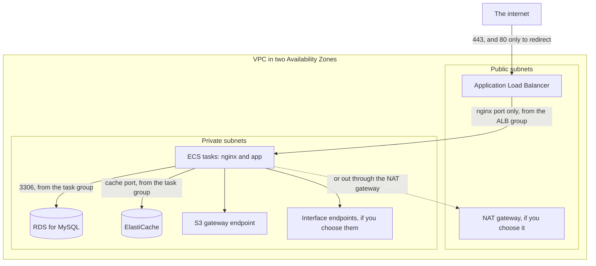
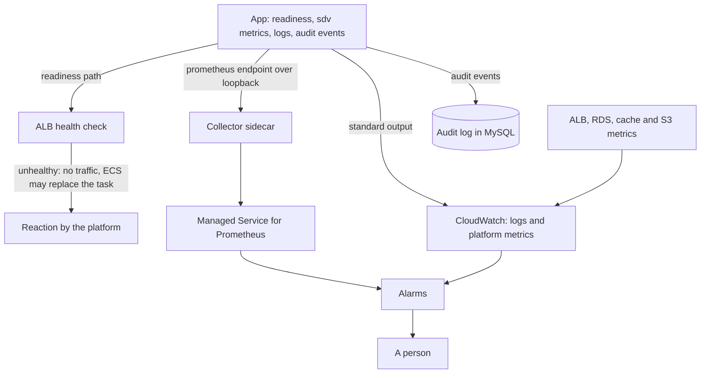
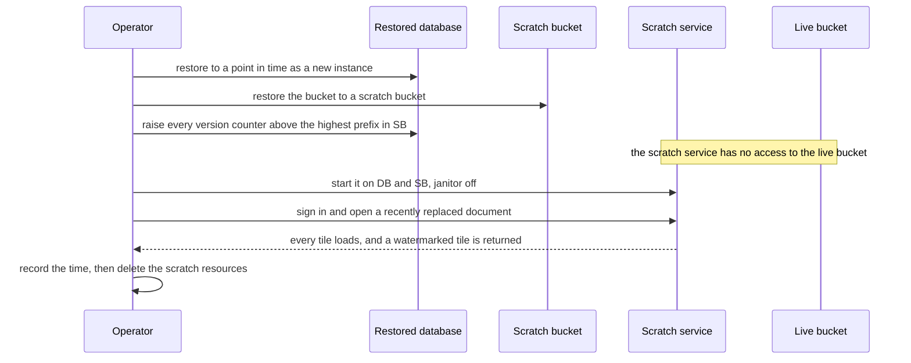
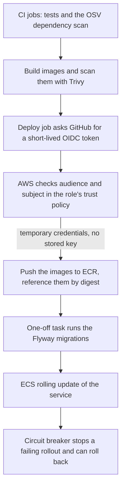
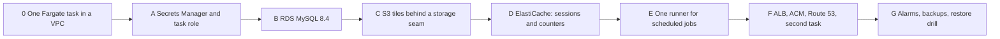

<!-- chapter: 41 | part: VII | owner: writer-production | tag: book-m6-final | status: expanded -->
# Chapter 41: Running it on AWS: secrets, operations, edge and cost

Chapter 40 designed the parts of the Secure Document Viewer that would change when it moves to AWS: compute, the client address, the database, the tiles and the shared state. This chapter is about running the result. Who may do what? How do you see what it is doing, recover it when it breaks, and ship a new version? What do the optional edge services add? What does it cost, in kinds if not in dollars? And when is the right answer to stay where you are? Keep the question of section 40.4 in mind while you read: do you need this at all?

> **This is a design, not a deployment.** As in Chapter 40, the project never ran the Secure Document Viewer on AWS. AWS statements were checked against the official documentation on September 20, 2026 (read and compared, not tried); each is tagged with a number in parentheses, such as (source 2), and the numbered list of pages is at the end of the chapter. AWS changes, so check again before you build. Code marked "illustrative" was never run. There are no prices. You do not need an AWS account to read this chapter or to do its exercises.

## Learning objectives

By the end of this chapter, you will be able to:

- Explain how secrets reach the containers, and why the task role and the task execution role are different.
- Describe the network layout that replaces "not published" ports in Compose.
- Map the alerts, backups and restore drill of Chapters 34 and 35 onto AWS services, including the rule that keeps backups consistent.
- Describe a deployment pipeline with no stored AWS key, and what a rolling deploy does to a browser.
- Explain why tiles stay served by the app, list what a CloudFront distribution in front of the whole app would change, and say what a web application firewall cannot do.
- Choose a smallest useful first move, name the kinds of cost, and say when to stay on Compose.

## Prerequisites

- Chapter 40: the whole design this chapter operates (especially Table 40.1 and section 40.4).
- Chapters 32 to 36: the security review, deployment, backups, metrics and CI that this chapter re-plans.
- Chapter 37, section 37.17: the seven-step plan, and Chapter 39: the patterns of defense in depth and infrastructure as code.

## Beginner tier: Secrets, permissions and the network

### 41.1 The analogy: keys, key cards and locked doors

In Chapter 40 the app moved from your own workshop to a serviced building. A rented building also comes with keys and locked doors, and this is where most of the mistakes are made. Think of the **secrets** (the signing secret and the database passwords) as keys kept in a safe that the building manager hands to the right person only at the door. IAM roles are key cards that open only some doors and expire by themselves. Security groups are the locks on each door, and the private network is the set of corridors that have no door to the street.

**Where the analogy breaks down:** a key card is a thing you can lose and find again. A role's credentials are issued to a program automatically and expire on their own, so there is nothing to lose and nothing to rotate by hand. And a wrong lock (a rule that says "allow everyone in") is a public door that no guard will notice unless you look, because nobody in the building is watching for it.

### 41.2 Secrets and identity

Today `SIGNING_SECRET` and the database passwords come from `.env`. On ECS they come from AWS Secrets Manager through the `secrets` field of the container definition, which sets an environment variable when the container starts (source 1)<!-- source: Pass Secrets Manager secrets through Amazon ECS environment variables, AWS documentation, checked 2026-09-20 -->.

**Example 41.1 — An illustrative task-definition fragment (not in the repository)**

```json
"secrets": [
  { "name": "SIGNING_SECRET", "valueFrom": "arn:aws:secretsmanager:REGION:ACCOUNT:secret:NAME-SUFFIX" },
  { "name": "DB_PASSWORD",    "valueFrom": "arn:aws:secretsmanager:REGION:ACCOUNT:secret:NAME2-SUFFIX" }
]
```

The property names don't change, which is the twelve-factor benefit of Chapter 39. AWS's documentation gives two caveats. The value is injected at start and isn't updated if the secret rotates, so a rotation needs a new deployment. And processes and logs in the container can see environment variables, so the app must never print them. `SIGNING_SECRET` is special: it verifies every tile token and keys the session handles and recognised-device hashes (Chapters 32 and 34), all tasks must hold the same value, and rotating it invalidates outstanding tile URLs.

ECS has two roles that beginners confuse (section 40.2 defined them). The task execution role is used by ECS itself to pull the image and read the secrets; the task role is used by *your code* to call AWS services such as S3. Task credentials are delivered to the container automatically and aren't stored keys (source 2)<!-- source: Amazon ECS task IAM role, AWS documentation, checked 2026-09-20 -->, so the app needs **no long-lived access keys anywhere**. Give the task role only what the app does.

**Example 41.2 — An illustrative least-privilege policy for the task role (not in the repository)**

```json
{
  "Version": "2012-10-17",
  "Statement": [
    { "Effect": "Allow",
      "Action": ["s3:GetObject", "s3:PutObject", "s3:DeleteObject"],
      "Resource": "arn:aws:s3:::BUCKET/tiles/*" },
    { "Effect": "Allow",
      "Action": "s3:ListBucket",
      "Resource": "arn:aws:s3:::BUCKET" }
  ]
}
```

The permission to read the two secrets goes on the execution role, not here. The object actions are limited to one prefix, and the policy grants no other buckets and no key management. `s3:ListBucket` is not optional: without it, S3 answers a request for a missing tile with `403` instead of `404` (section 40.8), and the app could no longer tell a replaced version (a designed `410`) from an access error. In a bucket that holds only tiles, listing the bucket is not a new exposure; if you add an `s3:prefix` condition anyway, test that a missing tile still returns `404`. With SSE-KMS, add the key's `kms:GenerateDataKey` and `kms:Decrypt` for this role only, and allow the role in the key policy.

### 41.3 The network

Put everything except the load balancer in **private subnets**, which have no route from the internet; the ALB lives in public subnets in two AZs (Figure 40.1 shows where each piece sits). Security groups express what Compose expressed by not publishing ports. The ALB accepts 443 from the internet; tasks accept only nginx's port from the ALB's group; the database accepts 3306 only from the task group; the cache accepts its port only from the task group. This is the go-live checklist's "keep `app:8080`, MySQL, and the metrics endpoint off the network", now enforced by the platform. Figure 41.1 draws these rules as arrows: a connection is possible only where an arrow exists.

Two more choices belong here. The hop from the ALB to nginx is plain HTTP inside the VPC, which is acceptable if you name it as a decision, and an ALB listener on port 80 should redirect to HTTPS rather than serve anything (source 3)<!-- source: Listeners for your Application Load Balancers, Elastic Load Balancing documentation, checked 2026-09-20 -->.

Tasks in private subnets still need AWS services. A **NAT gateway** lets them reach the internet and bills while it exists and per data processed; **VPC endpoints** keep traffic on AWS's network. A gateway endpoint for S3 adds no additional charge and works through route table entries (source 4)<!-- source: Gateway endpoints for Amazon S3, Amazon VPC documentation, checked 2026-09-20 -->; since tile traffic is the heavy part, add it first. Interface endpoints (Secrets Manager, ECR, logs) have hourly costs, so compare them with a NAT gateway using the Pricing Calculator.



<!-- source: docker-compose.yml (published ports) and section 41.3 of this book; AWS networking as described in the sources of this chapter; design -->
*Figure 41.1 — The network layout: the load balancer in public subnets, everything else in private subnets, and security groups as the allowed arrows*

*Text description:* The internet reaches only the Application Load Balancer, on port 443 (port 80 exists only to redirect). Inside a virtual private network spanning two Availability Zones, the load balancer sits in public subnets, together with an optional NAT gateway. The ECS tasks, the MySQL database, the cache, and the endpoints sit in private subnets. Each arrow is a rule in a security group: the load balancer may reach only nginx's port on the tasks, the tasks may reach the database on 3306 and the cache on its port, and nothing else is connected. The tasks reach AWS services through a gateway endpoint for S3, optional interface endpoints, or, as a dotted alternative, the NAT gateway.

## Intermediate tier: Observing, recovering and delivering

*Skim on a first read: read the first paragraph of each section, then come back to the sections you need.*

### 41.4 Observability

The `sdv_*` metrics and `/actuator/prometheus` are unchanged, and the address rule still applies (Chapter 35): a scraper in the same task reaches it over loopback, the default. Figure 41.2 shows what reacts to what. Amazon CloudWatch collects container logs and metrics from ECS and the ALB. For the app's counters, AWS documents an AWS Distro for OpenTelemetry collector as a sidecar (a helper container that runs beside the app container in the same task), with a Prometheus receiver and a remote-write exporter into Amazon Managed Service for Prometheus, using a task role that may write to the workspace (source 5)<!-- source: Exporting application metrics to Amazon Managed Service for Prometheus, Amazon ECS documentation, checked 2026-09-20 -->. The alternative is Micrometer's CloudWatch registry; pick one and keep the metric names so Chapter 35's alerts keep their meaning. Tile addresses carry their token in the query string, so it also lands in load balancer, CDN and firewall logs; it is valid for two minutes and bound to a session, but set log retention deliberately. Load balancer access logs also hold client addresses, which are personal data under many rules, so control who can read them.

Map the alerts to alarms. The ALB publishes `UnHealthyHostCount`, `HTTPCode_Target_5XX_Count`, `TargetResponseTime`, and `RejectedConnectionCount` (source 6)<!-- source: CloudWatch metrics for your Application Load Balancer, AWS documentation, checked 2026-09-20 -->; the app-specific alerts (`sdv_sign_in_total{outcome="locked"}`, `sdv_tiles_rate_limited_total`, `sdv_render_rejected_total`) stay as rules on whichever store holds the metrics. Add alarms for what the platform now owns: database failover, cache health, and S3 errors. This matters more than it looks: the readiness check of section 40.5 stays green while Redis or S3 is down, so ECS and the ALB will not act, and these alarms are the only thing that will. The audit log stays in MySQL with its 180-day purge; to keep it longer or unalterable, export it to S3 with Object Lock, which prevents deletion or overwriting for a set time (source 7)<!-- source: What is Amazon S3?, S3 Object Lock, AWS documentation, checked 2026-09-20 -->.



<!-- source: sections 41.4 and 40.5 of this book; ViewerMetrics, SecurityConfig and application.yml at book-m6-final; design -->
*Figure 41.2 — Observability: only the readiness check makes the platform act, and every alarm ends with a person*

*Text description:* The app sends its readiness state to the load balancer's health check, and a failing check makes the platform stop sending traffic and possibly replace the task. Separately, the app exposes its metrics over loopback to a collector sidecar, which forwards them to Managed Service for Prometheus; it writes logs to standard output for CloudWatch; and it records audit events in MySQL. Platform metrics from the load balancer, database, cache, and S3 also flow into CloudWatch. Prometheus rules and CloudWatch both raise alarms, and the alarms notify a person. Notice that readiness does not see the cache or S3, so only alarms react to their failure.

### 41.5 Backups, disaster recovery, and the restore drill

Chapter 34's two stores map onto two services. The database gets RDS automated backups and point-in-time recovery. The tiles get S3 versioning, so an overwritten or deleted object can be recovered. AWS Backup can manage both, with continuous backups and point-in-time restore for RDS (up to the most recent 5 minutes of activity) and for S3 (any point in the last 35 days, up to the most recent 15 minutes) (source 8)<!-- source: Continuous backups and point-in-time recovery (PITR), AWS Backup documentation, checked 2026-09-20 -->.

No service does the consistency work for you. A document row pointing at a tile version that no longer exists means blank pages (Chapter 34). The app's protection is that `v{n}` prefixes are immutable, so a restored database pointing at version 3 works as long as version 3 still exists, which delayed deletion makes likely. Keep the janitor's safety net in the S3 rewrite, and add a rule: never delete a superseded prefix until every database backup that references it has aged out. With S3 Versioning on, the app's delete only hides the objects, so set the noncurrent-version expiry (Example 41.4) to at least the longest RDS backup retention you configure (RDS keeps automated backups for up to 35 days), or have the app defer the delete itself.

Rehearse it as in Chapter 34, in a scratch environment, and take three precautions that the local drill did not need. Figure 41.3 shows the sequence, including the counter step and the boundary that must hold.

**Never point the drill at the production bucket with write access.** The scratch service runs the same image, which runs the storage janitor, and a database restored to an earlier moment doesn't know about the documents and versions created since. The janitor would see the newer live prefixes as orphans and could delete them, and even without it, the production task role can write. Restore the bucket to a scratch bucket with AWS Backup, or give the scratch task a read-only role and disable the janitor (the app has no flag for that today; see section 40.10).

**A restore rewinds the version counter.** The counter that reserves version numbers (section 40.8) lives in the database, so a point-in-time restore sets it back while S3 still holds the prefixes reserved after that point. Before accepting uploads, set every document's counter above the highest `v{n}` prefix that exists in the bucket, or the next replace will fail with `412` on every tile.

Then restore the database to a point in time as a new instance, point the scratch service at it and at the scratch bucket, sign in, open a recently replaced document, and confirm every tile loads and a watermarked tile is returned. Time it. The steps carry over from Chapter 34; only the commands change.



<!-- source: section 41.5 of this book; StorageJanitor and DocumentService at book-m6-final; design -->
*Figure 41.3 — The restore drill: restore both stores into scratch resources, fix the counters, and never let the scratch service write to the live bucket*

*Text description:* A sequence of operator actions. First the operator restores the database to a point in time as a new instance, and restores the bucket into a scratch bucket. Then the operator raises every document's version counter in the restored database above the highest version prefix found in the scratch bucket. A note marks the boundary: the scratch service has no access to the live bucket. The operator starts the scratch service on the restored database and scratch bucket with the janitor disabled, signs in, and opens a recently replaced document; the service answers that every tile loads and a watermarked tile is returned. Finally the operator records the time and deletes the scratch resources.

**What still takes you down.** The design survives the loss of an Availability Zone, not of a Region: nothing here copies backups or the bucket to a second Region. Requests now depend, in series, on the load balancer, at least one healthy task, the database, the cache (sessions and counters) and, for tiles, S3. A cache outage is an outage of everything that needs a signed-in user; a database failover drops connections for a while (measure how long in the drill); S3 errors show up as failed tile reads; and a bad deploy is still a bad deploy.

**Recovery objectives.** State them and measure them. The recovery point (how much recent data you can lose) is set by the backup mechanism: AWS Backup restores RDS to within the most recent 5 minutes of activity and S3 to within the most recent 15 (source 8)<!-- source: Continuous backups and point-in-time recovery (PITR), AWS Backup documentation, checked 2026-09-20 -->. The recovery time (how long you are down) is whatever the drill measures, and nothing in this chapter can promise it.

### 41.6 CI/CD: GitHub Actions, ECR, and rolling deploys

Chapter 36's pipeline (continuous integration, CI) stays, including the OSV and Trivy scans. What changes is the last mile, the continuous delivery (CD) step that puts a tested build into service. Figure 41.4 shows the whole path. A workflow can get AWS credentials with no stored key by using OpenID Connect: the job requests a short-lived token from GitHub and exchanges it for a role's temporary credentials, and the role's trust policy limits which repositories may assume it: it must check both the audience (`aud`, which should be `sts.amazonaws.com`) and the subject (`sub`, which names the organization, repository and branch or environment), or any repository could assume the role (source 9)<!-- source: Configuring OpenID Connect in Amazon Web Services, GitHub Docs, checked 2026-09-20 -->.

**Example 41.3 — An illustrative deploy-job fragment (not in the repository)**

```yaml
permissions:
  id-token: write   # lets the job request the OIDC token
  contents: read
steps:
  - uses: aws-actions/configure-aws-credentials@<full commit SHA>  # vX.Y.Z
    with:
      role-to-assume: arn:aws:iam::ACCOUNT:role/DEPLOY-ROLE
      aws-region: REGION
```

Pin the action by SHA as `ci.yml` does (Chapter 36). Push images to Amazon ECR, the AWS container registry, and reference them by digest in the task definition (`repository@sha256:...`); ECR can refuse to overwrite a tag, and AWS calls digests plus immutable tags a best practice (source 10)<!-- source: Preventing image tags from being overwritten in Amazon ECR; Using Amazon ECR images with Amazon ECS, AWS documentation, checked 2026-09-20 -->. That is Compose's digest pinning, one level up.



<!-- source: ci.yml at book-m6-final and section 41.6 of this book; design -->
*Figure 41.4 — The deployment pipeline: checks first, then a keyless sign-in to AWS, then push, migrate, and roll out*

*Text description:* A vertical chain of eight steps. The existing CI jobs run first: tests and the OSV dependency scan. Images are then built and scanned with Trivy. The deploy job asks GitHub for a short-lived OIDC token, and AWS checks the token's audience and subject against the role's trust policy and hands back temporary credentials, so no AWS key is stored anywhere. The images are pushed to ECR and referenced by digest, a one-off task runs the database migrations, and ECS performs a rolling update. A circuit breaker can stop a failing rollout and roll it back.

The deploy is a rolling update within limits you set (`minimumHealthyPercent`, `maximumPercent`), and a deployment circuit breaker can stop a failing rollout and roll back (source 11)<!-- source: Amazon ECS deployment configuration and circuit breaker documentation, checked 2026-09-20 -->. Set a health check grace period, since the app can take up to a minute to start. The pipeline order is: test and scan, build and push by digest, run the Flyway one-off task, then update the service.

Uploads are long requests: a render can run for three minutes. At `book-m6-final` Spring Boot 4.1.1 shuts down gracefully by default: on `SIGTERM` Tomcat stops accepting new connections and lets in-flight requests finish for up to `spring.lifecycle.timeout-per-shutdown-phase`, 30 seconds by default (source 12)<!-- source: Spring Boot reference, Graceful Shutdown, docs.spring.io, checked 2026-09-20 -->. On Fargate, ECS deregisters the task from the target group, sends `SIGTERM`, and sends `SIGKILL` after the container's `stopTimeout`, which is 30 seconds by default and at most 120 (source 13)<!-- source: Amazon ECS task definition parameters for Fargate; Amazon ECS task lifecycle, checked 2026-09-20 -->. So a three-minute render cannot be guaranteed to finish during a deploy, whatever Spring is set to. Choose one of three answers: keep `render-timeout` plus the queue wait below 120 seconds; accept that an upload cut by a deploy fails and let the janitor remove its staging folder; or move rendering to a durable job (for example an asynchronous upload) that can resume.

Also set the target group's deregistration delay to cover requests in flight. The readiness endpoint already refuses new traffic during shutdown, which is what lets the ALB drain the task first. A task being replaced can still answer `502` or `504` to a request in flight (the page then shows a plain failure message, and the viewer retries only on `429` and `503`).

With shared sessions, and session attributes that old and new tasks can both read (section 40.9), a rolling deploy signs nobody out: the payoff of steps 1 to 3 of section 37.17. One browser-side caveat remains: the app's lazily loaded script files are baked into each task's nginx image, so a tab opened before the deploy can ask for a file the new image no longer has and get a real `404`, and the app has no handler for that; a reload fixes it.

### 41.7 Infrastructure as code

Describe all of it in files. Terraform and AWS CDK are two popular tools that create AWS resources from files; this chapter picks Terraform. The excerpt is illustrative: it was cross-checked against the Terraform AWS provider's documentation for the resource and argument names but was not applied to an account.

**Example 41.4 — An illustrative Terraform excerpt (not in the repository; not applied)**

```hcl
resource "aws_s3_bucket" "tiles" {
  bucket = "example-sdv-tiles"
  lifecycle {
    prevent_destroy = true   # a plan that would replace the bucket now fails
  }
}

resource "aws_s3_bucket_public_access_block" "tiles" {
  bucket                  = aws_s3_bucket.tiles.id
  block_public_acls       = true
  block_public_policy     = true
  ignore_public_acls      = true
  restrict_public_buckets = true
}

resource "aws_s3_bucket_versioning" "tiles" {
  bucket = aws_s3_bucket.tiles.id
  versioning_configuration {
    status = "Enabled"
  }
}

resource "aws_s3_bucket_lifecycle_configuration" "tiles" {
  depends_on = [aws_s3_bucket_versioning.tiles]  # versioning must be enabled first
  bucket     = aws_s3_bucket.tiles.id
  rule {
    id     = "expire-noncurrent-and-abort-uploads"
    status = "Enabled"
    filter {
      prefix = "tiles/"
    }
    abort_incomplete_multipart_upload {
      days_after_initiation = 7
    }
    noncurrent_version_expiration {
      noncurrent_days = 30
    }
  }
  rule {
    id     = "clean-delete-markers"
    status = "Enabled"
    filter {
      prefix = "tiles/"
    }
    expiration {
      expired_object_delete_marker = true
    }
  }
}
```

Four notes. The values `7` and `30` are placeholders you should choose; `30` in particular must not be shorter than your longest database backup retention (section 41.5). The second rule removes delete markers left with no versions, which the app's deletes would otherwise pile up (a marker rule can't share a block with `days`, and it can't use a tag filter) (source 14)<!-- source: Examples of S3 Lifecycle configurations, AWS documentation, checked 2026-09-20 -->. When you define the load balancer's target group, set its health-check values explicitly: the load balancer service and the Terraform provider document *different defaults* (5 and 2 in the AWS documentation; 3 and 3 in the provider), so relying on defaults is how surprises happen, and use `target_type = "ip"`, which tasks in the `awsvpc` network mode need, with the readiness path from Chapter 40, section 40.5. Keep state files private, because they can contain secrets, and review every plan before applying it, as you would review a pull request. The classic data-loss incident is a plan that replaces the bucket or the database, so also turn on the database's deletion protection and a final snapshot (`deletion_protection = true` and `skip_final_snapshot = false` on the RDS resource).

## Advanced tier: The edge, the review, the cost and the decision

*Skim on a first read, and read section 41.11 in full: it holds the advice on where to start and when to stay.*

### 41.8 The optional edge: tiles, CloudFront and AWS WAF

**Serving tiles: app tokens or CloudFront.** Chapter 37, section 37.4, compared the app's HMAC tokens with cloud-signed URLs. On AWS the question becomes concrete, because S3 presigned URLs and CloudFront signed URLs exist. An S3 presigned URL is a bearer token, like the app's, but one made from an ECS task role's credentials stops working when those credentials rotate (typically in one to six hours), so it can't be made long-lived (source 15)<!-- source: Download and upload objects with presigned URLs, S3 User Guide, checked 2026-09-20 -->. CloudFront can require signed URLs or signed cookies and can restrict the bucket so that only CloudFront may read it (source 16)<!-- source: Serve private content with signed URLs and signed cookies, Amazon CloudFront documentation, checked 2026-09-20 -->. Be honest about what that changes.

A signed URL is checked by the edge, which knows nothing about your session. So three protections of Chapter 32 would be lost: the session binding (a signed URL works from any browser until it expires; a custom policy can add an IPv4 address restriction, which is weak for readers behind shared or mobile addresses and still knows nothing about sessions), the per-request access re-check (unsharing a document wouldn't cut off pages already open, only expiry would), and the per-viewer watermark, because CloudFront would serve stored bytes and the app would never stamp them. The app's per-user rate limit would also stop seeing tile traffic. In exchange you'd save the app's CPU and bandwidth for tile delivery.

**Never cache tiles at a shared edge.** The app already sends `Cache-Control: no-store` on every tile, and a code comment explains why: a shared cache holding a tile stamped for one reader could hand it to another. Each tile address (`/api/tiles?token=...`) is also unique to one session and expires after 120 seconds, so a shared cache would gain nothing. If any CDN sits in front of `/api/*`, give that path a policy that disables caching, and make sure the query string and the session cookie are part of the request it forwards.

For this app, whose central promise is per-request control and attribution, the recommendation is to keep serving tiles through the app: S3 becomes storage, the task role reads from it, and the traffic path is S3 to task to ALB to browser. That is not a verdict against CloudFront: it is a poor fit for tiles in this app, because the app's promise needs per-request control. Consider CloudFront in front of the *static frontend files* only (later in this section), where none of those protections apply. There is also a browser reason to keep tiles on the app's own address: the page's Content-Security-Policy allows images and connections only from its own origin (plus `blob:` and `data:`), so tile bytes from an S3 or CloudFront address would be blocked unless the policy were loosened.

Two edge services are optional. **Amazon CloudFront**, a content delivery network, suits the static Angular files (hashed bundles that `nginx.conf` already marks `immutable`) and can take that traffic off the app. It does not suit tiles, as the paragraphs on tiles explain.

**AWS WAF**, a web application firewall (a web ACL, called a protection pack in the current console (source 17)<!-- source: Associating or disassociating protection with an AWS resource, AWS WAF documentation, checked 2026-09-20 -->), attaches rules to an ALB or a CloudFront distribution, with managed rule groups and rate-based rules that count requests by keys such as IP address. It adds protection against common web attacks at the edge and a coarse limit before requests reach a task.

It knows addresses, not accounts, so it can't replace the per-user tile limit or the recognised-device lockout, and one office address shared by many people can trip an address rule. Treat it as a layer in front of the app's rules (section 39.14), never a replacement. (A web ACL for CloudFront must be created in `us-east-1`, a specific AWS Region in the United States, and can't be reused for other resource types.)

**CloudFront and the one-origin rule.** The Angular app calls `/api/...` with relative URLs and relies on the browser treating the page and the API as one origin: the session cookie is host-only and `SameSite=Strict`, the CSRF token travels in a cookie the script reads and a header it sets, and the Content-Security-Policy allows connections only to `'self'` (Chapter 22). Putting only the static files behind CloudFront on their own hostname would break all three. There are three consistent designs. Keep nginx serving the static files in the task, which is what the rest of this chapter assumes. Or use one distribution for everything, with `/api/*` as a second behavior whose origin is the load balancer. Or split hostnames, which means cross-origin requests with credentials, cookie domains, preflighted writes and a changed policy, and undoes a design the project chose on purpose. If you choose the single distribution, Table 41.1 lists what to check.

**Table 41.1 — Checks for one CloudFront distribution in front of the whole app**

| Check | What goes wrong | What to do |
|---|---|---|
| Timeouts | CloudFront waits 30 seconds for an origin response by default; you can set 1 to 120 seconds per origin, and more only by a quota request (source 18)<!-- source: Quotas, Amazon CloudFront Developer Guide, checked 2026-09-20 -->. An upload renders for up to three minutes without sending a byte; the reader sees "Upload failed." while the render continues, and a retry creates a duplicate | Raise the limit with a quota increase, make the upload asynchronous, or don't route uploads through CloudFront |
| Error pages | A custom error response that turns a 403 or 404 into `index.html` is set on the distribution, not on one behavior, and the app needs the API's real 401, 403, 404, 410 and 429 answers (a missing script must stay a real `404`) | Test that `/api/*` is untouched, or apply the fallback to the static behavior only (for example with a CloudFront Function) |
| Caching the API | A shared cache could hand one reader's stamped tile to another | Disable caching for `/api/*`, as the paragraph on caching tiles says, and pass on the query string and the session cookie |
| Client address | With CloudFront in front, the ALB sees the edge, not the reader, so the last-address rule of Chapter 40, section 40.6 no longer names the reader | Check which header CloudFront adds, adjust the rule, and repeat the forged-header test |
| Direct access | The ALB stays reachable directly unless you restrict it, so an attacker can skip the edge and its firewall; a client-address header from CloudFront is safe to trust only with this restriction | Restrict the ALB's security group to CloudFront's managed prefix list (source 19)<!-- source: Restrict access to Application Load Balancers, Amazon CloudFront Developer Guide, checked 2026-09-20 -->, and optionally require a secret header |
| Firewall answers | A firewall rate rule blocks with `403` by default, while the viewer counts down only on `429` and `503` | Check whether your rule can send `429` with a `Retry-After` header |
| Static file caching | S3 has no server rule: each object needs its `Cache-Control` at upload, and an `index.html` cached at the edge keeps readers on old bundle names | `no-cache` on `index.html`, one year and `immutable` on the hashed files (as `nginx.conf` does today), and invalidate at most `index.html` |
| Response headers | nginx sets the page's security headers per location today; a CloudFront response headers policy can add HSTS, a policy and framing rules, but attached to the wrong behavior it would overrule the app's stricter API headers | Attach a policy to the static behavior only, and keep `/api/*` headers from the app (`frame-ancestors` is honored only from a header, not from a `<meta>` tag) |
| Root path | `index.html` has `<base href="/">`, so the app must live at the root of a hostname | Don't serve it under a path prefix such as `/app/*` without a different build |

### 41.9 A security review of the cloud design

Apply Chapter 32's method. **What improves:** no single application host holds everything; the database, cache, and bucket are private and reachable only from the task group; no stored AWS keys; secrets from a managed store; self-renewing certificates; "not published" enforced by the platform; backups that don't need the app stopped. **What new risks appear**, each yours under the shared responsibility model:

- **IAM mistakes.** `"Action": "s3:*"` on `"Resource": "*"` undoes least privilege (Example 41.2).
- **A public bucket.** One wrong setting can expose every tile. Keep Block Public Access on, and use an access analyzer, a tool that evaluates bucket and role policies and flags access you did not intend (source 20)<!-- source: What is Amazon S3?, IAM Access Analyzer for S3, AWS documentation, checked 2026-09-20 -->.
- **Secrets in environment variables.** Visible to the process and debugging tools; never log them.
- **Unencrypted new hops.** Data now crosses the network to RDS and ElastiCache: turn on TLS to both, and use an authentication token for the cache, because sessions and counters are sensitive. The ALB-to-task hop is plain HTTP inside the VPC (section 41.3).
- **Deleted documents that are not gone.** To keep restores consistent, the design keeps superseded and deleted documents' tiles in the versioned bucket for up to 35 days, and their rows in database backups for as long. A user-visible delete therefore removes nothing for that long, and anyone with bucket access can read noncurrent versions. Decide the windows against your data-retention rules, restrict who can read noncurrent versions, and say so in the privacy notice. These are also unwatermarked copies (section 32.11); encryption protects the disk, not a reader who holds IAM access.
- **The forwarded-header trust chain**, again: the same class of bug as Chapter 32's, in a new place.
- **One shared `SIGNING_SECRET`.** A leak affects every task, as today.
- **Control-plane access.** Anyone who can change the infrastructure can bypass everything: protect the CI role, review infrastructure changes, log AWS API calls.
- **Cost as an availability risk.** A runaway resource can force a shutdown; set budgets and alerts.

The screenshot still isn't prevented, MFA is still absent, and a valid session can still fetch every tile slowly. The cloud improves availability and recoverability, not the limits in the README.

### 41.10 Cost and effort: order of magnitude only

This chapter gives no prices and no benchmarks: any number here would be invented or would date badly. Use the **AWS Pricing Calculator** with your own traffic. Qualitatively:

- **Fixed while they exist** (idle cost): a load balancer, a NAT gateway, a Multi-AZ standby, a cache cluster, and two always-on tasks.
- **Following use:** S3 storage and requests (thousands of small tile objects mean many requests, and the janitor's full listing adds more), data transfer out, data transfer between Availability Zones (load balancer to tasks, tasks to the database and cache), logs, and metrics.
- **Compared with Compose:** one bill, a machine, against a higher fixed and variable cost in return for availability, recoverability and room to grow.

Effort is the bigger cost: a storage seam and an S3 implementation, shared session and counter stores, a job runner, a reordered replace, new tests against real services, and a deployment pipeline. Expect the platform work (network, roles, infrastructure as code, alarms) to be as large as the code work.

### 41.11 A migration order, and when not to go

Figure 41.5 extends Chapter 37's Figure 37.2 with the AWS work, adding moves that improve what you have without adding instances. Do not confuse its order (move 0, then moves A to G) with the steps of section 37.17: that plan orders the work of running three copies, while this order starts with things that help even one copy.



<!-- source: Figure 37.2 and section 37.17 of this book (book-m6-final); design -->
*Figure 41.5 — A migration order (moves A to G): state first, front door and second instance last*

*Text description:* A row of eight boxes, each leading to the next. First, move 0: one Fargate task in a VPC. Then secrets and the task role, the RDS database, S3 tiles, ElastiCache, a single runner for scheduled jobs, the load balancer with certificate, DNS and the second task, and last alarms, backups, and the restore drill.

**The smallest useful first step.** You don't need all seven moves. Move 0 is the base: the one copy runs as a single Fargate task in a VPC, because a task role and injected secrets exist only for a container running on AWS. Moves A to C then improve things with *one* instance still running: Secrets Manager and a task role remove the `.env` file and stored keys; RDS gives managed backups, point-in-time recovery, and failover; S3 with versioning gives durable, multi-AZ tile storage and removes the disk-and-backup coupling of Chapter 34. A second instance (moves D to F) is a separate decision, and move F splits in two: the ALB, certificate and DNS can come early for the one task, and the second task comes with the shared state.

**When not to move.** Table 41.2 lists when the Compose setup is the right answer.

**Table 41.2 — When the Compose setup is the right answer**

| If this is true | Then |
|---|---|
| A short outage at a quiet hour is acceptable, and "one instance" is fine | Stay on Compose (Chapters 33 and 34) |
| Readers number in the tens or hundreds and one machine has headroom (`sdv_tiles_busy_total`, render metrics) | Scaling out solves a problem you don't have |
| Nobody can operate IAM, networking, and the platform's failure modes | The new surface may add more risk than it removes |
| Your rules require data on machines you control | Check the requirement before choosing a cloud |
| A restore drill on the current setup passes and meets your recovery time | Your backups are already good enough |

Move when you need availability one machine can't give, when your measured recovery time is too long, when load outgrows a bigger machine, or when your organization already runs on AWS. Even then, take moves A to C first.

## Common mistakes

- **Serving the page and the API from different hostnames.** Symptom: sign-in appears to work but every later call is a `401`, or writes fail with `403`. Fix: one hostname, as in Chapter 40's cookie notes and Table 41.1.
- **A CDN error page that turns API errors into `index.html`.** Symptom: sign-in errors and "no longer available" screens replaced by odd failures. Fix: scope the rewrite to the static behavior.
- **Deleting a superseded tile version before the backups that point at it have aged out.** Symptom: a restore gives blank pages. Fix: noncurrent-version expiry at least as long as your longest database backup retention.
- **A wildcard in an IAM policy.** Symptom: `"Action": "s3:*"` on `"Resource": "*"` quietly undoes least privilege. Fix: one prefix, the smallest set of actions (Example 41.2).
- **A rolling deploy with the single-page app baked into each task's image.** Symptom: a screen fails to open after a deploy until the reader reloads. Fix: keep the previous hashed files available for a while, or accept and document it.
- **Printing environment variables.** Symptom: a secret in a log. Fix: never log the environment; rotate by deploying again.
- **Pointing a restore drill at the live bucket.** Symptom: the scratch janitor deletes live tiles. Fix: a scratch bucket, or a read-only role and the janitor disabled (section 41.5).
- **Forgetting that a restore rewinds the version counter.** Symptom: every replace fails with `412` after a restore. Fix: raise every counter above the highest existing prefix before accepting uploads.

## In this project

The project has no AWS code. These are the places where this chapter's design would touch the repository.

| Path | Tag | Change |
|---|---|---|
| `.github/workflows/ci.yml` | `book-m6-final` | A deploy job using OpenID Connect (Example 41.3) |
| `Dockerfile` and `frontend/Dockerfile` | `book-m6-final` | Images pushed to Amazon ECR and referenced by digest |
| `docker-compose.yml` and `.env.example` | `book-m6-final` | The `.env` values become secrets injected by Secrets Manager (Example 41.1) |
| `frontend/nginx.conf` | `book-m6-final` | Only if the static files move: caching and header rules (Table 41.1) |
| `README.md` (go-live checklist and backup section) | `book-m6-final` | Replaced by infrastructure files, alarms and the restore drill (sections 41.4, 41.5 and 41.7) |

There is also new work that has no file in the repository: the infrastructure files (Example 41.4), the alarms, and the restore drill. See any repository file with `git show book-m6-final:<path>`.

## Try it

### Exercise 41.1 ★ Idle or usage cost?

*Level: one star.*

Sort these into "bills while it exists" and "follows use": a NAT gateway, a Multi-AZ database standby, S3 requests, data transfer out, two always-on tasks, and logs. Then say which group you would worry about first for an app with 80 readers.

*Hint:* section 41.10.

*Solution:* Appendix C, Exercise 41.1.

### Exercise 41.2 ★★ Order the moves

*Level: two stars.*

You want (a) the signing secret out of the `.env` file, (b) to survive the loss of a database host, and (c) three running copies of the app. Using Figure 41.5 and section 41.11, say which moves you need and in what order, and why moves A to C alone do not give you (c).

*Hint:* a second task must reach the same tiles, the same sessions and the same counters.

*Solution:* Appendix C, Exercise 41.2.

### Exercise 41.3 ★★★ Design the least-privilege role

*Level: three stars.*

The service must read and write tiles, and it also deletes superseded versions. The janitor job (rewritten over S3 listings) only lists objects and deletes them. Design two task roles, one for the service and one for the janitor, and list the actions and resources of each. Say what an attacker who compromised the service could not do.

*Hint:* Example 41.2 is the starting point, and section 41.2 says which permission is not optional.

*Solution:* Appendix C, Exercise 41.3.

### Exercise 41.4 ★★★ Argue for staying

*Level: three stars.*

Write a one-page recommendation, using Table 41.2, for a client with 80 readers who wants "to be on AWS". Include the measurements you would ask for, and the smallest change you would still recommend. Don't use an AWS term you can't explain in a sentence.

*Hint:* Table 41.2, and the metrics of Chapter 35.

*Solution:* Appendix C, Exercise 41.4.

## Summary

- This chapter is a design too: nothing here was run on AWS, and the documentation checks are dated September 20, 2026.
- Secrets reach containers as environment variables at start, from Secrets Manager; the task execution role reads them and the task role is what your code uses. There are no stored AWS keys anywhere.
- Private subnets and security groups do what "not published" did in Compose, and a gateway endpoint for S3 is the first endpoint to add.
- Backups need a consistency rule: never delete a superseded tile prefix until every database backup that points at it has aged out, and a restore must raise the version counters above the highest existing prefix. A restore drill must never write to the live bucket.
- A pipeline gets AWS access through OpenID Connect and deploys images by digest; Fargate's stop timeout (at most 120 seconds) is shorter than a three-minute render, so a deploy can cut an upload, and it can skew the static files.
- CloudFront in front of the whole app must respect the one-origin rule; a firewall knows addresses, not accounts.
- Take the smallest useful moves first (A to C), name the kinds of cost, and stay on Compose when Table 41.2 holds.

## Further reading

- AWS Secrets Manager: https://docs.aws.amazon.com/secretsmanager/latest/userguide/
- Amazon CloudWatch User Guide: https://docs.aws.amazon.com/AmazonCloudWatch/latest/monitoring/
- AWS Backup Developer Guide: https://docs.aws.amazon.com/aws-backup/latest/devguide/
- Amazon CloudFront Developer Guide: https://docs.aws.amazon.com/AmazonCloudFront/latest/DeveloperGuide/
- Configuring OpenID Connect in Amazon Web Services (GitHub Docs): https://docs.github.com/actions/security-for-github-actions/security-hardening-your-deployments/configuring-openid-connect-in-amazon-web-services
- AWS Identity and Access Management User Guide: https://docs.aws.amazon.com/IAM/latest/UserGuide/
- Amazon EventBridge Scheduler User Guide: https://docs.aws.amazon.com/scheduler/latest/UserGuide/
- Terraform AWS provider documentation: https://registry.terraform.io/providers/hashicorp/aws/latest/docs
- AWS Pricing Calculator: https://calculator.aws/

## Sources

The documentation pages behind the statements tagged (source N), read on September 20, 2026, in the order they are first cited. The publisher is Amazon Web Services unless the entry names another project.

1. Pass Secrets Manager secrets through Amazon ECS environment variables, AWS documentation.
2. Amazon ECS task IAM role, AWS documentation.
3. Listeners for your Application Load Balancers, Elastic Load Balancing documentation.
4. Gateway endpoints for Amazon S3, Amazon VPC documentation.
5. Exporting application metrics to Amazon Managed Service for Prometheus, Amazon ECS documentation.
6. CloudWatch metrics for your Application Load Balancer, AWS documentation.
7. What is Amazon S3?, S3 Object Lock, AWS documentation.
8. Continuous backups and point-in-time recovery (PITR), AWS Backup documentation.
9. Configuring OpenID Connect in Amazon Web Services, GitHub Docs.
10. Preventing image tags from being overwritten in Amazon ECR; Using Amazon ECR images with Amazon ECS, AWS documentation.
11. Amazon ECS deployment configuration and circuit breaker documentation.
12. Spring Boot reference, Graceful Shutdown, docs.spring.io.
13. Amazon ECS task definition parameters for Fargate; Amazon ECS task lifecycle.
14. Examples of S3 Lifecycle configurations, AWS documentation.
15. Download and upload objects with presigned URLs, S3 User Guide.
16. Serve private content with signed URLs and signed cookies, Amazon CloudFront documentation.
17. Associating or disassociating protection with an AWS resource, AWS WAF documentation.
18. Quotas, Amazon CloudFront Developer Guide.
19. Restrict access to Application Load Balancers, Amazon CloudFront Developer Guide.
20. What is Amazon S3?, IAM Access Analyzer for S3, AWS documentation.
