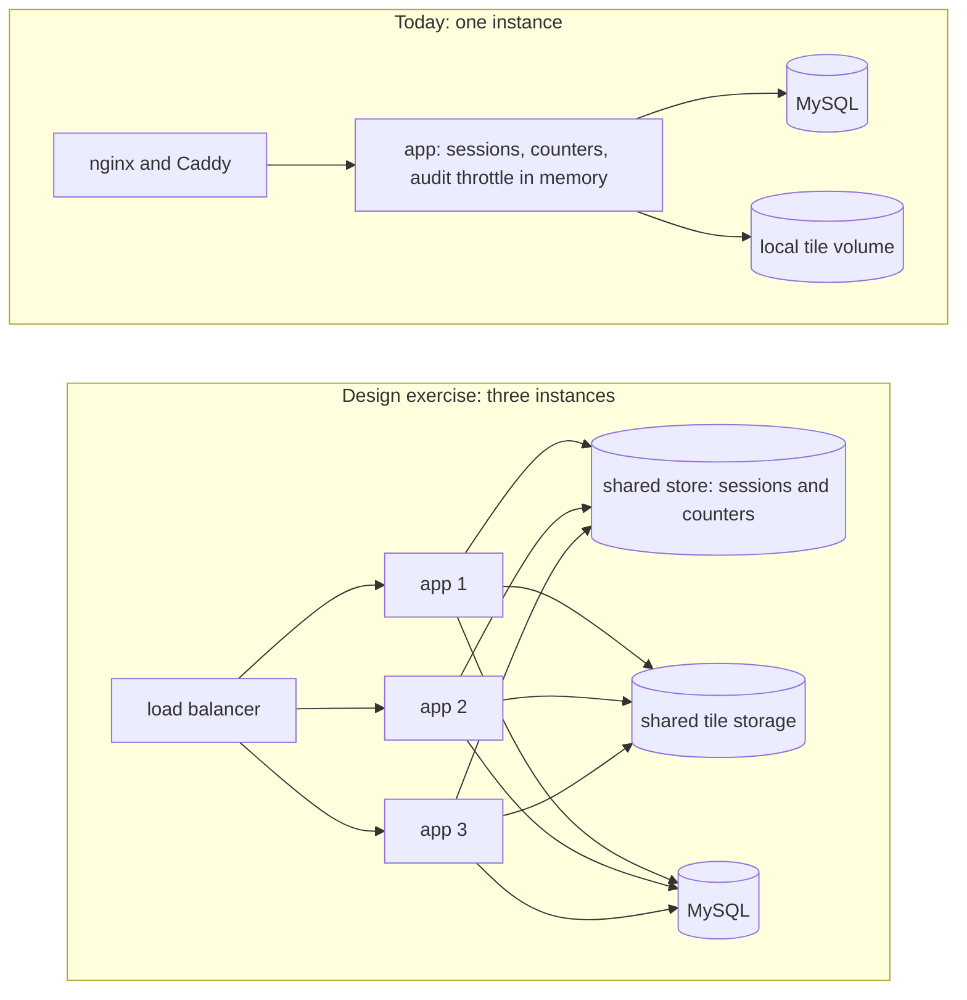
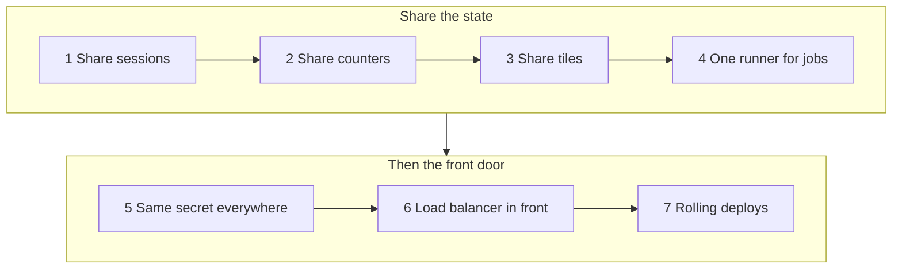

<!-- chapter: 37 | part: trade-offs | owner: writer-production | tag: book-m6-final | status: expanded -->
# Chapter 37: The engineering trade-offs

Tag: `book-m6-final`. Prerequisites: Chapters 15, 16, 25 to 31, and 32 to 36. Terms such as CDN (a network of servers that delivers files from near the reader), Redis (an in-memory data store shared between servers), and presigned URL (a temporary signed link to a stored file) are glossed where they first appear or in the chapters named.

## Learning objectives

By the end of this chapter, you can:

- explain, for each major decision in this app, what was chosen, what it bought, and what it cost;
- say which limits you will hit first as the app grows, and in what order;
- name the enterprise alternative to each choice and the trigger that would justify the move;
- separate a decision the project actually made and recorded from an opinion about it.

## Prerequisites

- Chapters 15 and 16: authentication, sessions, and the defenses around them.
- Chapters 25 to 31: the milestones the decisions were made in.
- Chapters 32 to 36: security review, deployment, backups, monitoring, and the supply chain.

## How to read this chapter

A trade-off is a decision where getting one good thing means giving up another. Each choice in this chapter was
reasonable for a small, single-server app with one team, and
each has a point where it stops being reasonable.

Sections 37.1 to 37.16 each cover one decision, using the same six headings: **The decision**, **What the project chose**,
**Pros**, **Cons**, **The enterprise alternative**, and **When you'd switch**. Statements about
what happened cite the README, a pull request (PR), or a commit. Where the record shows the
outcome but not the reasoning, the text says so and marks the reasoning as the book's reading.

## 37.1 Server-side tiles vs. sending the PDF

<!-- source: README "Why this design"; commit b6aef4e; dossier/decisions.md D4 -->

**The decision.** How do you show a document to someone without handing them the file?

**What the project chose.** The server rasterizes each page, slices it into 512-pixel PNG tiles,
and, in the README's words, the PDF "stops existing as a servable file after ingest." Only the tiles remain, and no endpoint returns a
page or document (README, "Why this design"; the ingest code deletes the staged source PDF, `TileGenerationService`).
The browser paints the tiles as absolutely positioned elements with CSS background images built from `blob:` URLs (Chapter 21). The reasoning at MVP time survives only in the
commit message of `b6aef4e`.

**Pros.**
- The protection lives on the server, where the client cannot reach it. Hiding a download button in the browser is undone with DevTools in seconds.
- There is no file to save, so "Save the PDF" has nothing to save.
- Each tile passes through checks (signature, session, access, rate limit), so every piece of the document is individually controlled.

**Cons.**
- Rendering costs CPU at upload and per tile request; the project needed a render pool, a timeout, and limits on pages, and pixels (Chapter 32).
- Pages are images, so there is no text layer: screen readers get nothing, and users cannot search or copy text (README, Limitations).
- It cannot stop screenshots or photographs, and a patient user with a valid session can fetch every tile.

**The enterprise alternative.** The README says this is "the architecture commercial e-magazine and flipbook readers use." Beyond that the project recorded no alternative. As general industry practice, not something the project recorded: a stricter requirement is often met with a digital rights management (DRM) product, and accessibility with a text layer served under policy.

**When you'd switch.** When accessibility is a hard requirement (add a controlled text layer), or when the content's value justifies a DRM vendor's cost.

## 37.2 Watermark at request time vs. at ingest

**The decision.** When do you stamp the viewer's identity on a tile?

**What the project chose.** At request time, when each tile is served (README, "Watermarking happens on the way out"; original design `b6aef4e`).

**Pros.**
- One stored tile serves every viewer. Stamping at ingest would give one identical, un-attributable copy for everyone; pre-stamping per user would store N copies of every tile.
- Every response is individually traceable: it carries the viewer, a UTC timestamp, and a trace code that leads to the exact sign-in in the audit log.

**Cons.**
- A decode, draw, and PNG encode on every tile request. The reviewer recorded this as a documented limitation on a single node.
- Tile responses must be `Cache-Control: no-store`, because a shared cache holding a tile stamped for someone else would leak it. That gives up shared caching.

**The enterprise alternative.** Watermark at a coarser granularity, or cache per (tile, viewer) with a short lifetime (both named in the README's Limitations). Anything beyond those two options is general industry practice, not something the project recorded.

**When you'd switch.** When tile CPU becomes the bottleneck. The metric that shows it first is `sdv_tiles_served_total` next to CPU use and `503` responses from the tile work cap.

## 37.3 Watermark strength: comfort vs. deterrence

**The decision.** How visible should the mark be?

**What the project chose.** Red at 20% opacity in a brick pattern with gaps of 1.5 times the text height. The default opacity was lowered from 0.28 in PR #4, because dense pages (code, tables) were hard to read through a heavier mark. The README calls it "a product decision, not a default nobody chose," and both values are configurable (`watermark-opacity` up to 0.6, `watermark-spacing` down to 0.5).

**Pros.**
- Readers can read the page. The goal is attribution, and a legible trace code achieves that.
- It can't be switched off by the reader, because it is burned into the pixels on the server.
- No code change is needed to turn it up for a sensitive deployment.

**Cons.**
- A light mark deters less than a heavy one, and a determined person can crop or retouch a fragment.
- The pattern is laid out per tile, so copies do not line up across tile boundaries (commit `f468678` states this exactly in the README).

**The enterprise alternative.** The README's own lever is turning the mark up (`watermark-opacity`, `watermark-spacing`). General industry practice, not recorded by the project: adding an invisible forensic mark alongside the visible one.

**When you'd switch.** When leaks happen and the visible trace code is not enough evidence, or when different documents need different strength (see Section 37.8).

## 37.4 App-issued HMAC tokens vs. cloud-signed URLs

<!-- source: README "Why this design", Limitations; commit f682716; dossier/decisions.md D8 -->

**The decision.** Who signs the URL that lets a browser fetch a tile?

*See also: Chapter 41, Section 41.8 works through the CloudFront option on AWS.*

**What the project chose.** The app signs it with HMAC-SHA256 over document, page, row, column, render version, session binding, and expiry, with a 120-second lifetime. `SignedUrlService` deliberately mirrors the presigned-URL pattern (README, Limitations). The render version was added to the signed payload after a probe found old URLs silently serving the new render (`f682716`).

**Pros.**
- No external service: the whole check is one class you can read and test.
- Session binding: a URL pasted into another browser or account gets `401`.
- Checking the session on every tile request means signing out kills every outstanding URL at once.

**Cons.**
- Every tile passes through the application server, so the app's CPU and network carry all the traffic. A cloud signed URL would let a CDN serve the bytes.
- One shared secret (`SIGNING_SECRET`) protects everything; outstanding URLs are signed with it, so changing it invalidates them. The README also warns that restoring a backup under a different secret still works, but every account's recognized devices are forgotten, because their hashes are keyed by it; so keep `.env` with the backup.

**The enterprise alternative.** Object storage plus a CDN, with CloudFront signed URLs, or S3 presigned URLs, so the edge serves the bytes and the app only signs. The README lists this as the production shape.

**When you'd switch.** When bandwidth, not logic, is the cost. Note the catch: at the edge, per-request watermarking and per-request session checks become harder, so the switch changes Section 37.2 as well.

## 37.5 In-memory sessions and counters vs. a shared store

**The decision.** Where do sessions and rate-limit counters live?

*See also: Shared session and counter stores on ElastiCache are covered in Chapter 40, Section 40.9.*

**What the project chose.** In the memory of the one app instance. Accounts, documents, shares, and the audit trail are in MySQL; sessions and the throttle counters are not. The README states this and lists Spring Session with Redis as a next step.

**Pros.**
- Nothing extra to run, secure, or back up.
- Fast, and straightforward to test.
- Sessions are server-side, so an administrator can list and revoke them and a role change ends the user's sessions (PR #1).

**Cons.**
- A restart signs everyone out and resets throttle counters.
- With two instances, each would have its own sessions and its own counters, so limits would multiply and a user could land on an instance that does not know them.

**The enterprise alternative.** A shared session store such as Redis through Spring Session, and rate-limiting counters held in the same store, so limits hold across instances.

**When you'd switch.** The moment you need a second instance, for capacity or for zero-downtime deploys. See Section 37.11.

## 37.6 Built-in authentication vs. an identity provider

<!-- source: PR #1 body; README Limitations; build transcript (the user's choice of built-in accounts) -->
**The decision.** Who owns accounts and passwords?

**What the project chose.** Built-in accounts: BCrypt passwords in MySQL, roles READER, PUBLISHER, and ADMIN, created by an administrator with no self-signup. Both AI reviewers (the AI product-owner reviewer and the AI technical-manager reviewer; see Chapter 32) had suggested an identity provider, a separate service that signs users in, using OpenID Connect (OIDC, a standard for that) or single sign-on (SSO, one company login that works across many apps); the project owner chose built-in accounts when asked (PR #1). The recorded outcome is sourced; the reasoning is the book's reading: a self-contained app with no external service to depend on.

**Pros.**
- Nothing outside the stack to set up, and full control of the rules: three lockout counters, recognized devices, forced first-password change, and an unlock action.
- Sessions live in an httpOnly cookie on the server, so the session id is never visible to JavaScript. The project's record shows this choice was made in PR #1 with no recorded comparison against browser-held tokens, so this book states the outcome only.

**Cons.**
- The app now owns password storage, lockout, and reset. Reviews found real defects here (the lockout that let anyone lock out any user; the 72-byte BCrypt limit).
- No MFA (multi-factor authentication: a second proof of identity beyond a password), including for admins (README, Limitations). Accounts also exist only inside this app, so there is no SSO.
- Every new user needs an administrator.

**The enterprise alternative.** An identity provider through OIDC, which is how the reviewers suggested fixing sign-in and which typically supplies SSO and MFA. Naming specific vendors is beyond what the project recorded. The app would then take identity from the verified principal and keep only roles and ownership.

**When you'd switch.** When people already have company accounts, when MFA becomes a requirement, or when administrators cannot keep up with accounts.

## 37.7 Local disk tiles vs. object storage

<!-- source: README "Backup and restore", Limitations; commits cd0f5c2, 66f7152; dossier/decisions.md D8 -->

**The decision.** Where do the tiles live?

*See also: Chapter 40, Section 40.8 shows how the tiles would move to S3.*

**What the project chose.** On local disk, in a Docker volume, laid out as `{docId}/v{version}/page-{n}/tile-{row}_{col}.png`. A `StorageJanitor` removes folders no document points to; replacing a PDF writes a new version folder and switches under a row lock (README).

**Pros.**
- No extra service; reading a tile is a file read.
- Versioned folders make replacement atomic for readers (no mixed old and new pages).

**Cons.**
- Backups are coupled: the database and the tile volume must be captured at the same moment, so the runbook stops the app during a backup. A dump taken before a replace plus an archive taken after would point documents at deleted tiles (commit `66f7152`).
- Storage is tied to one machine; a second instance cannot see it.
- The developer setup warns against synced folders (OneDrive, Dropbox) because they lock files (PR #2).

**The enterprise alternative.** Object storage (S3 or equivalent) with versioned object keys, served through a CDN with signed URLs, and storage-level versioning for backups.

**When you'd switch.** When you need more than one instance (Section 37.11), when the volume outgrows one disk, or when backups need to run without stopping the app.

## 37.8 Per-user rate limits vs. per-document sensitivity

<!-- source: README Limitations; commits a51674c, 51ea941; dossier/decisions.md D6 -->

**The decision.** How fast may a viewer pull tiles, and is the same limit right for every document?

**What the project chose.** One per-user limit: 180 tile requests per 60-second window with 512-pixel tiles, about 15 pages a minute. The history: the limit and tile size moved from 256 pixels and 120 a minute to 512 and 180 after readers saw blank pages (raised by the PO reviewer; see Chapter 32). The reviewer noted that a 500-page harvest then takes about 33 minutes instead of about 2.4 hours. The project owner accepted this on September 19, 2026 (commit `51ea941`) and asked how sensitive documents could differ; per-document sensitivity levels are listed as a possible follow-up.

**Pros.**
- Reading feels normal, and bulk harvesting is slow and boundable instead of instant.
- One number to explain, monitor (`sdv_tiles_rate_limited_total`), and tune.

**Cons.**
- The limit bounds speed, not possibility. A scripted harvest still succeeds, only slower.
- It treats a public brochure and a confidential contract the same.
- Counters are in memory (Section 37.5).

**The enterprise alternative.** The README names two follow-ups: "per-document sensitivity levels with tighter limits" (Limitations) and logging or alerting on "every tile-urls page fetched back-to-back" rather than only a flat per-minute cap (Possible next steps).

**When you'd switch.** When one deployment holds documents of very different value, or when the rate-limited counter shows readers are being hurt.

## 37.9 MySQL and Flyway vs. alternatives

**The decision.** Which database, and how does its structure change over time?

*See also: RDS for MySQL 8.4 is covered in Chapter 40, Section 40.7.*

**What the project chose.** MySQL 8.4 in Docker, with schema changes as Flyway migrations. The project owner chose MySQL over H2 and Postgres. Unit tests use H2 in MySQL mode; `MySqlIntegrationTest` runs on real MySQL 8.4 through Testcontainers because the TM reviewer asked for it (Chapter 32). Dependabot is set to stay on the 8.4 LTS line (PR #10).

**Pros.**
- A real server database from the start, with row locks that the PDF-replace design depends on.
- Migrations are versioned files in the repository, so every environment reaches the same schema.
- The real-database test found the class of problem H2 hides: timestamps are stored as UTC and verified with the server and the JVM each set to a different non-UTC zone.

**Cons.**
- H2 in MySQL mode is only similar to MySQL; two test suites are needed to cover the gap.
- A major upgrade (8.4 to the next LTS) is a deliberate project with its own migration test.
- One database server is a single point of failure until you add replication.

**The enterprise alternative.** A managed database (RDS, Cloud SQL) with automated backups, point-in-time recovery, and replicas. The project considered H2 and Postgres and chose MySQL; the record does not say why Postgres lost.

**When you'd switch.** When you can't afford the restore time of a dump (move to a managed service with point-in-time recovery), or when the team's skills favor another database.

## 37.10 Client-side blocking as friction only

**The decision.** Should the browser block right-click and drag?

**What the project chose.** Yes, on purpose. The Angular viewer blocks the context menu and native drag and paints tiles as CSS backgrounds. The README opens by dismissing exactly this trick, then says it was added anyway as a deliberate, acknowledged trade-off that provides zero extra protection.

**Pros.**
- It stops the casual "right-click, save image" path a non-technical user takes without thinking.
- It costs almost nothing.

**Cons.**
- It stops nothing for anyone who opens DevTools or calls the API directly.
- The risk is psychological: someone may mistake it for a control. The README says it must never be mistaken for one.

**The enterprise alternative.** The same friction in commercial readers, sitting on top of server-side controls, never in place of them.

**When you'd switch.** It was never meant as a control. Remove it if it harms usability, for example for assistive technology users.

## 37.11 One instance vs. scale-out

**The decision.** How many copies of the app run?

*See also: Chapters 40 and 41 map the scale-out plan onto AWS services.*

**What the project chose.** One. The go-live checklist says so, and the Limitations section explains why: sessions and throttle counters are in memory and tiles are on local disk.

**Pros.**
- The simplest deployment, and every limit, counter, and log lives in one place.
- The compose file (MySQL, app, nginx, optional Caddy) is small enough to read in one sitting.

**Cons.**
- No zero-downtime deploys; the app is a single point of failure.
- The backup runbook stops the app for its duration.
- Capacity means a bigger machine, not more machines.

**The enterprise alternative.** Several stateless instances behind a load balancer, with shared sessions (Redis), shared tile storage (S3 and a CDN), and a managed database. The README names shared sessions (Spring Session and Redis) and shared tile storage as the requirements. Container orchestration and a cloud load balancer in place of nginx and Caddy are general industry practice, not something the project recorded.

**When you'd switch.** When you need availability that one machine can't give, or capacity beyond a bigger machine. Do Sections 37.5 and 37.7 first; scaling out before them does not work.

## 37.12 Session cookies vs. tokens kept in the browser

<!-- source: dossier/decisions.md D3; PR #1 body; commit 68b4945; bugs-and-findings.md B (TM-1, TM-15) -->
**The decision.** How does the browser prove, on every request after sign-in, who it is?

**What the project chose.** A server-side HTTP session, carried in an httpOnly cookie named `SDV_SESSION` with `SameSite=Strict`, plus cross-site request forgery (CSRF) protection for anything that changes state, and a 30-minute idle timeout (PR #1). Before that, the session id lived in the browser's `sessionStorage` and travelled in an `X-Session-Id` header, which a reviewer flagged: any script injected into the page could read it, and the admin API was returning session ids too. The project's records show the outcome and the reason for leaving `sessionStorage`; they do not show a comparison with signed tokens such as JWTs, so this section describes the outcome and its consequences, not a debate.

**Pros.**
- JavaScript can't read an httpOnly cookie, so a script injected into the page can't steal the session id.
- The server owns the session, so it can end it: signing out, an idle timeout, an absolute 12-hour lifetime, an administrator's revoke, or a role change (PR #1) all take effect immediately, on the next request. Tile URLs are bound to the session (Chapter 32), so ending the session also kills every tile URL issued under it.
- The browser sends the cookie by itself, so the Angular code has no token-handling logic to get wrong.

**Cons.**
- A cookie is sent automatically, which is exactly what makes cross-site request forgery possible, so the app needs the CSRF machinery (Chapter 16) and the frontend has to echo a token.
- The session state lives in memory on one instance (Section 37.5), so scaling out needs a shared store.
- Cookies fit a browser talking to one site. The design assumes a single origin, which is why nginx serves the app and proxies `/api` (Chapter 33).

**The enterprise alternative.** Signed tokens (for example JWTs) that the client presents on each request are common where many services or non-browser clients share one sign-in, because any service can verify a token without asking a session store. That is general industry practice, not something the project evaluated. Tokens trade the immediate server-side revocation you get from sessions for statelessness, and typically need short lifetimes and a refresh mechanism to compensate.

**When you'd switch.** When a mobile app or another service needs the API from a different origin, or when an identity provider (Section 37.6) issues the tokens for you. Even then, browser-facing apps often keep a session cookie at the edge.

## 37.13 nginx and Caddy vs. a cloud load balancer

<!-- source: dossier/decisions.md D11, D12; commits 2d10e07, a51674c, 5aa0f3c; README "HTTPS", "Trust boundary" -->
**The decision.** What stands between the internet and the app, and who terminates TLS?

**What the project chose.** Two programs in the compose file. nginx (the unprivileged image, non-root) serves the Angular build, proxies `/api`, and sets headers. Caddy, in an optional `tls` profile, terminates TLS, gets certificates from Let's Encrypt (or from its own local certificate authority for trials), and adds `Strict-Transport-Security` (Chapter 33). Addresses are fixed in one Docker network so that each program can say exactly whom it trusts.

**Pros.**
- The whole deployment is a folder and one command; it runs on any machine with Docker, including a laptop for rehearsals.
- Caddy obtains and renews certificates without extra scripts.
- Everything a reader needs to audit is in three small files: `docker-compose.yml`, `frontend/nginx.conf`, and `deploy/Caddyfile`.

**Cons.**
- Two proxies mean two things to configure and to keep patched; the CI image scan covers both, but a person still has to act on it (Chapter 36).
- Trust rests on fixed addresses and on getting five settings to agree (the compose addresses, `TRUSTED_PROXY_REGEX`, `set_real_ip_from`, the header overwrite, and the profile). The failure mode is silent: if they drift apart, the app sees the wrong address (Exercise 33.3), and this was the shape of the High finding that blocked the platform pull request (Chapter 32).
- It's a single host. Nothing here spreads traffic across machines or survives losing the machine.
- Going public isn't a switch: you edit the `ports` of the `tls` service, and HTTP Strict Transport Security (HSTS) decisions such as `includeSubDomains` are hard to undo.

**The enterprise alternative.** A managed load balancer from a cloud provider or a platform, terminating TLS with certificates it manages, forwarding to several instances, and running health checks against `/actuator/health` (Chapter 40, Section 40.5, refines this: a readiness path avoids restarting healthy tasks during a database failover). That is general industry practice; the project's records don't describe a comparison. It moves the trust boundary: the app would trust forwarded headers from the load balancer's address range instead of nginx's fixed address, and the nginx overwrite rule would have to be replaced by whatever the load balancer guarantees about the header.

**When you'd switch.** When you run more than one instance (Section 37.11), or when your platform already provides certificates and load balancing and running your own is extra work.

## 37.14 Recognized-device lockout vs. simpler rules

<!-- source: dossier/decisions.md D7; PR #5 body "TM3-1"; commit 82c24b6; README "Sign-in lockout" -->
**The decision.** How do you slow down password guessing without letting an attacker lock real users out?

**What the project chose.** Three counters over 15 minutes: 5 failures for one account from one address, 20 for one address across accounts, and 20 for one account from *unrecognized* devices only. A device is recognized for an account after a successful sign-in from its address (IPv6 grouped by /64) within 30 days; only a keyed hash of the address is stored, and the list is cleared when the password changes, is reset, or the account is disabled. An administrator can press Unlock.

The path there matters. Phase 1 had only the first two counters. The first fix for the forged-address bug added an account-wide counter that counted failures from everywhere, and the next review showed that anyone could lock any user out by failing 20 times. The recognized-device rule is the replacement.

**Pros.**
- A botnet spreading guesses over many addresses is stopped by the account-wide counter, while the account's owner can still sign in from a usual device.
- Failures are counted atomically (Chapter 32), so a burst of parallel guesses gets no extra tries.
- The rule that fired is recorded in the audit event, so a person can tell guessing from an accident.

**Cons.**
- The trade-off is stated in the README: during an attack on an account, its owner can't sign in from a *new* device, such as a new laptop or a hotel network, until the window passes or an administrator unlocks it. An attacker who knows this can time an attack for when the owner travels.
- The counters are in memory (Section 37.5) while the recognized devices are in the database, so the two halves behave differently after a restart.
- Recognized-device hashes are keyed by `SIGNING_SECRET`, which ties this feature to a secret you must keep with your backups (Chapter 34).

**The enterprise alternative.** A second proof for new devices: multi-factor authentication or an emailed one-time code, ideally supplied by an identity provider (Section 37.6). Those can let a legitimate owner on a new device without a human unlocking anything. That is general industry practice, and the README lists MFA's absence as a limitation.

**When you'd switch.** When the app adds MFA or an identity provider. At that point the account-wide counter can be simplified, because a stolen password alone no longer suffices.

## 37.15 Stopping the app for backups vs. online snapshots

<!-- source: README "Backup and restore"; PR #5 body "Final-review fixes"; dossier/bugs-and-findings.md F1 -->
**The decision.** Do you keep the app running during a backup, or stop it?

**What the project chose.** Stop it for the few seconds a backup takes (Chapter 34). The database dump and the tile archive are then guaranteed to describe the same moment. The choice was a response to a reviewer's finding: a dump taken before a PDF replacement and an archive taken after it would leave documents pointing at tiles that no longer exist. The janitor also refuses to delete a document's other tile versions while its current one is missing.

**Pros.** It works with plain tools, needs no special storage, and its correctness takes one sentence to explain. A restore drill (Chapter 34) proved it.

**Cons.** Readers get errors during the window, and the approach only works because there is one instance and one machine (Section 37.11). A longer database means a longer window.

**The enterprise alternative.** Backups that don't need the app to stop: storage snapshots for the tiles, and a database with point-in-time recovery. The catch: the "current tile version" pointer in the database still has to match the tiles, so the consistency problem doesn't vanish, it moves. General industry practice; not evaluated by the project.

**When you'd switch.** When the backup window is no longer acceptable, or when Sections 37.7 and 37.9 move storage and the database to services that snapshot on their own.

## 37.16 Newest platform vs. staying on the older supported line

<!-- source: dossier/decisions.md D10, D13; PR #5 body "Platform upgrade"; PR #10 body; bugs-and-findings.md G9 -->
**The decision.** When you start a production hardening, do you upgrade the platform first, and how new?

**What the project chose.** The project owner asked to keep the technology as current as possible, as long as each choice was a standard release rather than a preview. The platform upgrade in PR #5 went from Spring Boot 3.3.4 to 4.1.1 and Java 21 to 25, bringing Spring Security 7, Jackson 3, Hibernate 7, and Flyway (11 in the pull request text, 12 as resolved by Spring Boot 4.1.1), all "the latest GA versions checked on Maven Central" (GA means generally available, a stable release rather than a preview). One motivation was that Spring Boot 3.3 had passed its open-source support window, and the migration also removed a Flyway warning that MySQL 8.4 was untested. Yet the project applies a different rule to runtimes and databases: PR #10 tells Dependabot to skip Node's odd-numbered releases, Java releases between LTS versions, and MySQL's non-LTS "Innovation" releases. So the policy is: newest release of the *framework*, long-term-support lines for the *runtime and data*.

**Pros.**
- Supported software receives security fixes, and no deprecation warnings remain after the migration.
- Doing the migration once, before go-live, is cheaper than doing it later under pressure.

**Cons.**
- The migration itself cost work: new package names for Jackson 3, a changed constructor for the authentication provider, renamed configuration methods.
- A new release can lag its own dependencies' fixes. Spring Boot 4.1.1 shipped Tomcat 11.0.24, which had three critical advisories, and the project had to pin Tomcat 11.0.26 (Chapter 36).
- Fewer people will have met the problems you meet, so fewer answers exist yet (a general observation, not a project record).

**The enterprise alternative.** Many organizations stay a step behind, on a long-term-support line, and upgrade on a schedule with a test plan. That's general practice, and the project's own LTS-only rules for the runtime and database follow the same idea.

**When you'd switch.** When staying current costs more than it saves, or when a compliance rule requires a specific supported line.

## 37.17 A worked plan: from one instance to three

The decisions in Sections 37.1 to 37.16 are linked, and the clearest way to see it is to plan a change that touches several of them. This section is the book's design exercise, not project history: a step-by-step plan for running three instances, using only facts about the app's current code and README.

*See also: Chapters 40 and 41 map each step of this plan onto AWS services (a design, not a deployment).*

<!-- source: README Limitations; LoginThrottle, TileRateLimiter, AuditLogService at book-m6-final; this is the book's design exercise -->
Figure 37.1 contrasts today's single instance with the target of the exercise. Everything shared in the second box is something that lives inside the one instance today.

*Figure 37.1 — One instance today, and what three instances would have to share*

*Text description:* Two groups, the current one first. Today: nginx and Caddy in front of one app that keeps sessions, counters, and the audit throttle in memory, with one MySQL database, and one local tile volume. Design exercise: a load balancer in front of three app copies, all sharing one store for sessions and counters, one shared tile storage, and one MySQL database.

**Step 0: list the in-memory state.** Search the code for anything that lives in a map or a field rather than the database. The README names two, sessions and rate-limit counters. Reading the code at `book-m6-final` finds more: the sign-in throttle counters (`LoginThrottle`), the tile rate limiter (`TileRateLimiter`), the audit throttle that limits how often `PAGE_VIEWED` and `ACCESS_DENIED` events are written (`AuditLogService`), and `SessionMetadata`, the per-session map behind the admin sessions list (it sits beside the in-memory session registry). Each of these is correct on one instance and wrong on three: a user could exceed a limit by up to three times merely by being spread across instances. Two more per-instance limits exist by design: `TileWorkLimiter` and the render permits. With three instances a "server-wide" cap becomes a per-instance cap, which is correct, because each one protects its own CPU.

**Step 1: share sessions.** Put sessions in a shared store (Spring Session with Redis, as the README suggests). Until this is done, a load balancer would send a signed-in user to an instance that has never heard of them.

**Step 2: share the counters.** Move the sign-in and tile counters to the same store, so a limit holds no matter which instance answers. The audit throttle needs the same treatment, or the log will show up to three times as many events.

**Step 3: share the tiles.** Local disk can't be seen by the other instances. Move tiles to object storage. This is the biggest change, because it touches several decisions at once: tile serving (Section 37.4, signed URLs), watermarking (Section 37.2), the janitor and backups (Chapter 34), and the row-lock-based atomic replace (Chapter 32), which relies on the database and the file layout agreeing.

**Step 4: one place for scheduled jobs.** Six methods use `@Scheduled` (five with the plain annotation and one, in `TileRateLimiter`, with its fully qualified name, which a plain search for the annotation misses): the storage janitor, the audit throttle sweep, the audit purge, the recognized-device purge, and the in-memory sweeps of `LoginThrottle` and `TileRateLimiter`. They all run on every instance. The purges are idempotent deletes and the in-memory sweeps belong to each instance, so running them three times is harmless. Three janitors deleting directories at the same time is the kind of thing you'd rather decide on purpose. A design has to choose one runner for the janitor (for example, a leader lock or a separate job).

**Step 5: the same secret everywhere.** `SIGNING_SECRET` verifies tile tokens and keys the recognized-device hashes and session handles. All instances must have the same value, or a URL issued by one instance would be rejected by another.

**Step 6: the front door.** Put a load balancer in front (Section 37.13), point its health check at a health path (Chapter 40, Section 40.5, explains why the readiness path, not the plain `/actuator/health` that includes the database, is the better target), and re-derive the trust boundary: the app must trust forwarded headers only from the balancer.

**Step 7: deploy without downtime.** Roll one instance at a time; with shared sessions, users no longer notice.

Notice the order. Steps 1 to 3 have to come before Step 6, or the load balancer would expose the problems the earlier steps fix. That is Exercise 37.3 in another form, and it's the reason this chapter says "do Sections 37.5 and 37.7 first".

Figure 37.2 shows the order of the seven steps as a chain.

<!-- source: the book's design exercise, built on the code named for Figure 37.1 at book-m6-final -->

*Figure 37.2 — The order of the scale-out plan: share the state first, then add the front door*

*Text description:* Seven steps in two rows, read left to right with the top row first, each leading to the next: share sessions, share counters, share tiles, one runner for scheduled jobs, the same secret everywhere, a load balancer in front, and rolling deploys. Notice that the load balancer comes sixth, after all the state has been shared.

## 37.18 Common mistakes when weighing trade-offs

- **Assuming the enterprise alternative is automatically better.** Each one has its own costs, usually complexity and money. The right question is whether you have the problem it solves.
- **Switching before measuring.** Use the metrics in Chapter 35 to see which limit you are actually hitting.
- **Ignoring coupling.** Moving one piece (tiles to S3) drags others along (watermarking, sessions, backups). List what a decision touches before you make it.
- **Deferring without a note.** "We'll add it later" is fine when the README says what "it" is and what will have to change, as this project's Limitations section does.
- **Mixing evidence and opinion.** When you write a design document, label which statements come from your records and which are general industry practice, as this chapter does.
- **Treating a mitigation as a control.** Client-side blocking (Section 37.10) and a light watermark (Section 37.3) are friction and attribution, not prevention. Say so where readers will see it.
- **Forgetting the human cost.** Every extra system (a Redis, an identity provider) needs someone to patch it, back it up, and be woken when it fails.

## 37.19 Decision table

**Table 37.1 — The decisions at a glance**

| Decision | Project chose | First limit you'll hit | Enterprise alternative |
|---|---|---|---|
| Section 37.1 Delivery | Tiles, no PDF | No text layer; CPU for rendering | Controlled text layer, DRM |
| Section 37.2 Watermark timing | At request time | CPU per tile; no shared cache | Coarser or cached per (tile, viewer) |
| Section 37.3 Watermark strength | 20% opacity, configurable | Weak deterrence | Visible plus forensic marks |
| Section 37.4 URL signing | App-issued HMAC | App carries all traffic | CDN signed URLs |
| Section 37.5 Sessions | In memory | Restarts, one instance | Redis session store |
| Section 37.6 Authentication | Built-in accounts | No MFA or SSO | OIDC identity provider |
| Section 37.7 Tile storage | Local disk volume | One machine; coupled backups | S3 and CDN |
| Section 37.8 Rate limit | One per-user limit | Same rule for all documents | Sensitivity levels; back-to-back alerting (README) |
| Section 37.9 Database | MySQL 8.4 and Flyway | Single server | Managed database with replicas |
| Section 37.10 Client blocking | Right-click blocked | Bypassed with DevTools | Friction only, on top of controls |
| Section 37.11 Instances | One | Availability and capacity | Load-balanced stateless instances |
| Section 37.12 Sessions vs. tokens | Server session in httpOnly cookie | CSRF machinery; shared store to scale | Signed tokens for cross-origin or service clients |
| Section 37.13 Front door | nginx plus Caddy | Two proxies; silent trust drift | Managed load balancer |
| Section 37.14 Lockout | Recognized-device rule | New device locked out during an attack | MFA or one-time codes |
| Section 37.15 Backups | Stop the app briefly | Outage window; single instance only | Snapshots and point-in-time recovery |
| Section 37.16 Platform | Newest framework, LTS runtime, and data | Migration work; lagging dependency fixes | Stay on an LTS line, upgrade on schedule |

## Try it

### Exercise 37.1 ★ Where is the choice?

Pick three rows of Table 37.1. For each, name the file or README section that shows the project's choice.

### Exercise 37.2 ★★ Why S3 forces a rethink

Explain why moving tiles to S3 (Section 37.7) forces you to revisit per-request watermarking (Section 37.2) and session checks (Section 37.4).

### Exercise 37.3 ★★ Order of change

Order the decisions in the sequence you would change them for a first scale-out, and defend the order.

### Exercise 37.4 ★★★ A switch trigger as an alert

Choose one decision and write the "When you'd switch" trigger as a measurable alert, using metrics from Chapter 35 (for example `sdv_tiles_rate_limited_total`).

### Exercise 37.5 ★★ Cookie or token?

A mobile app must call the same API from outside the browser. Using Section 37.12, list what changes about sessions, CSRF, and revocation if it uses tokens, and what the project would have to build or give up.

### Exercise 37.6 ★★★ Critique the plan

Section 37.17 lists seven steps to three instances. Find one step that hides more work than it shows, say what the extra work is, and propose an ordering change that would let you ship two instances earlier than three.

## Summary

- Each choice in this app bought speed of building and simplicity, and each has a named limit.
- Several limits are linked: sessions, counters, and tiles must all become shared before a second instance is safe.
- The project recorded some reasoning and only outcomes for others; this chapter says which.
- Friction that is not a control is acceptable only when it is labeled honestly.
- Sixteen decisions form a web, not a list: a plan for three instances (Section 37.17) touches sessions, counters, tiles, jobs, secrets, and the front door in a fixed order.
- Enterprise alternatives are answers to problems you may not have yet; measure first (Chapter 35), then switch.

## Further reading

- Spring Session reference: https://docs.spring.io/spring-session/reference/
- Spring Security reference: https://docs.spring.io/spring-security/reference/
- Amazon S3, presigned URLs: https://docs.aws.amazon.com/AmazonS3/latest/userguide/using-presigned-url.html
- Amazon CloudFront, signed URLs: https://docs.aws.amazon.com/AmazonCloudFront/latest/DeveloperGuide/private-content-signed-urls.html
- Flyway documentation: https://documentation.red-gate.com/flyway
- MySQL 8.4 reference manual: https://dev.mysql.com/doc/refman/8.4/en/
- OpenID Connect Core specification: https://openid.net/specs/openid-connect-core-1_0.html
